# RTL Module Connection Diagram

**Top module candidates:** `LFSR`, `alt_fifo_tmp`, `alt_iobuf_out_delay`, `alt_pll_125_to_multi`, `altera_eth_tse_std_synchronizer_bundle`, `altera_std_synchronizer_nocut`, `altera_tse_false_path_marker`, `altera_tse_reset_synchronizer`, `altera_tse_rgmii_module`, `altera_tse_rgmii_out4`, `altera_up_rs232_counters`, `bit_synchronizer`, `bpf_control`, `bpf_mult`, `clk_src`, `ethgenerator`, `ethgenerator32`, `ethmonitor`, `ethmonitor_32`, `falling_edge_detector`, `gmac_0002`, `gmac_non_aligned_0002`, `gmac_rgmii`, `loopback_adapter`, `m_delay_line`, `nf_phyip_reset_model`, `one_shot_ex`, `reset_counter`, `rom_1p_1024x48`, `tb`, `tb_bc`, `tb_bc_filter`, `tb_bc_pma`, `tb_bpf`, `tb_bpf_u2u`, `tb_cmd_filter`, `tb_div`, `tb_frame_fifo`, `tb_gpio`, `tb_lcd`, `tb_pcap`, `tb_shift`, `tb_u2u`, `tb_u2u_bc_filter`, `tb_u2u_bc_pma_filter`, `tb_u2u_fpga_mii`, `tb_u2u_fpga_rgmii`, `timing_adapter_32`, `timing_adapter_8`, `top_ethgenerator32`, `top_ethgenerator_8`, `top_ethmonitor32`, `u2u_cmd_filter`, `u2u_eth_bpf`, `u2u_eth_clks`, `u2u_fpga_mii`, `u2u_reg_config_tb`, `u2u_s2u_mux`, `u2u_stat2uart`, `u2u_top_gm`, `u2u_top_tb`, `uart_115kb_8_1_np_rs232_0`

```mermaid
flowchart TD
    LFSR["LFSR"]
    alt_fifo_256x9["alt_fifo_256x9"]
    alt_fifo_tmp["alt_fifo_tmp"]
    alt_iobuf_inout["alt_iobuf_inout"]
    alt_iobuf_inout_iobuf_bidir_loo["alt_iobuf_inout_iobuf_bidir_loo"]
    alt_iobuf_out_delay["alt_iobuf_out_delay"]
    alt_iobuf_out_delay_iobuf_out_cg61["alt_iobuf_out_delay_iobuf_out_cg61"]
    alt_pll_125_to_multi["alt_pll_125_to_multi"]
    alt_pll_125_to_multi_0002["alt_pll_125_to_multi_0002"]
    alt_pll_125mhz["alt_pll_125mhz"]
    alt_pll_125mhz_0002["alt_pll_125mhz_0002"]
    alt_pll_50_to_125["alt_pll_50_to_125"]
    alt_pll_50_to_125_0002["alt_pll_50_to_125_0002"]
    alt_pll_rgmii["alt_pll_rgmii"]
    alt_pll_rgmii_0002["alt_pll_rgmii_0002"]
    altchip_id["altchip_id"]
    altera_eth_tse_ptp_std_synchronizer["altera_eth_tse_ptp_std_synchronizer"]
    altera_eth_tse_std_synchronizer["altera_eth_tse_std_synchronizer"]
    altera_eth_tse_std_synchronizer_bundle["altera_eth_tse_std_synchronizer_bundle"]
    altera_std_synchronizer_nocut["altera_std_synchronizer_nocut"]
    altera_tse_false_path_marker["altera_tse_false_path_marker"]
    altera_tse_reset_synchronizer["altera_tse_reset_synchronizer"]
    altera_tse_rgmii_in1["altera_tse_rgmii_in1"]
    altera_tse_rgmii_in4["altera_tse_rgmii_in4"]
    altera_tse_rgmii_module["altera_tse_rgmii_module"]
    altera_tse_rgmii_out1["altera_tse_rgmii_out1"]
    altera_tse_rgmii_out4["altera_tse_rgmii_out4"]
    altera_up_rs232_counters["altera_up_rs232_counters"]
    altera_up_rs232_in_deserializer["altera_up_rs232_in_deserializer"]
    altera_up_rs232_out_serializer["altera_up_rs232_out_serializer"]
    altera_up_sync_fifo["altera_up_sync_fifo"]
    bit_synchronizer["bit_synchronizer"]
    bpf_control["bpf_control"]
    bpf_div["bpf_div"]
    bpf_dp["bpf_dp"]
    bpf_env["bpf_env"]
    bpf_iram["bpf_iram"]
    bpf_mult["bpf_mult"]
    bpf_npu["bpf_npu"]
    bpf_pram["bpf_pram"]
    bpf_shifter["bpf_shifter"]
    bpf_sram["bpf_sram"]
    button_filter["button_filter"]
    cfg_filter_mem["cfg_filter_mem"]
    clk_mux_pll["clk_mux_pll"]
    clk_mux_pll_altclkctrl_0["clk_mux_pll_altclkctrl_0"]
    clk_mux_pll_altclkctrl_0_sub["clk_mux_pll_altclkctrl_0_sub"]
    clk_src["clk_src"]
    clk_src_altclkctrl_0["clk_src_altclkctrl_0"]
    clk_src_altclkctrl_0_sub["clk_src_altclkctrl_0_sub"]
    crc["crc"]
    crc_gen_verify["crc_gen_verify"]
    ethgenerator["ethgenerator"]
    ethgenerator2["ethgenerator2"]
    ethgenerator32["ethgenerator32"]
    ethmonitor["ethmonitor"]
    ethmonitor2["ethmonitor2"]
    ethmonitor_32["ethmonitor_32"]
    falling_edge_detector["falling_edge_detector"]
    fifo_sclk_36x16["fifo_sclk_36x16"]
    fpga_id["fpga_id"]
    global_reset_generator["global_reset_generator"]
    gmac["gmac"]
    gmac_0002["gmac_0002"]
    gmac_conf_rom["gmac_conf_rom"]
    gmac_non_aligned["gmac_non_aligned"]
    gmac_non_aligned_0002["gmac_non_aligned_0002"]
    gmac_rgmii["gmac_rgmii"]
    lcd_env["lcd_env"]
    lcd_i2c_master["lcd_i2c_master"]
    lcd_iram["lcd_iram"]
    lcd_mpu["lcd_mpu"]
    lcd_mpu_env["lcd_mpu_env"]
    lcd_sequencer["lcd_sequencer"]
    loopback_adapter["loopback_adapter"]
    loopback_adapter_fifo["loopback_adapter_fifo"]
    m_delay_line["m_delay_line"]
    m_i2c_slave["m_i2c_slave"]
    m_mdio_reg_sim["m_mdio_reg_sim"]
    m_top_mdio_slave["m_top_mdio_slave"]
    mdio_reg_sim["mdio_reg_sim"]
    mdio_slave["mdio_slave"]
    mslip["mslip"]
    nf_phyip_reset_model["nf_phyip_reset_model"]
    obuf_delay["obuf_delay"]
    one_shot["one_shot"]
    one_shot_ex["one_shot_ex"]
    pcap2rgmii["pcap2rgmii"]
    reset_counter["reset_counter"]
    rom_1p_1024x48["rom_1p_1024x48"]
    rom_1p_1024x48_altsyncram["rom_1p_1024x48_altsyncram"]
    tb["tb"]
    tb_bc["tb_bc"]
    tb_bc_filter["tb_bc_filter"]
    tb_bc_pma["tb_bc_pma"]
    tb_bpf["tb_bpf"]
    tb_bpf_u2u["tb_bpf_u2u"]
    tb_cmd_filter["tb_cmd_filter"]
    tb_decode_cfg_uart["tb_decode_cfg_uart"]
    tb_div["tb_div"]
    tb_frame_fifo["tb_frame_fifo"]
    tb_gpio["tb_gpio"]
    tb_lcd["tb_lcd"]
    tb_pcap["tb_pcap"]
    tb_shift["tb_shift"]
    tb_u2u["tb_u2u"]
    tb_u2u_bc_filter["tb_u2u_bc_filter"]
    tb_u2u_bc_pma_filter["tb_u2u_bc_pma_filter"]
    tb_u2u_fpga_mii["tb_u2u_fpga_mii"]
    tb_u2u_fpga_rgmii["tb_u2u_fpga_rgmii"]
    timing_adapter_32["timing_adapter_32"]
    timing_adapter_8["timing_adapter_8"]
    timing_adapter_fifo_32["timing_adapter_fifo_32"]
    timing_adapter_fifo_8["timing_adapter_fifo_8"]
    top_ethgenerator32["top_ethgenerator32"]
    top_ethgenerator_8["top_ethgenerator_8"]
    top_ethmonitor32["top_ethmonitor32"]
    top_mdio_slave["top_mdio_slave"]
    u2u_bc["u2u_bc"]
    u2u_bc_access["u2u_bc_access"]
    u2u_bc_filter["u2u_bc_filter"]
    u2u_bc_frame_fifo["u2u_bc_frame_fifo"]
    u2u_bc_pma2tbl["u2u_bc_pma2tbl"]
    u2u_bc_pma_rx["u2u_bc_pma_rx"]
    u2u_bc_pma_tx["u2u_bc_pma_tx"]
    u2u_bc_pmd_uart["u2u_bc_pmd_uart"]
    u2u_bc_tbl2pma["u2u_bc_tbl2pma"]
    u2u_bcp_mux["u2u_bcp_mux"]
    u2u_bcp_stat["u2u_bcp_stat"]
    u2u_bcp_stat_data["u2u_bcp_stat_data"]
    u2u_bist["u2u_bist"]
    u2u_bist_gen["u2u_bist_gen"]
    u2u_bist_rec["u2u_bist_rec"]
    u2u_cmd_filter["u2u_cmd_filter"]
    u2u_eth_bpf["u2u_eth_bpf"]
    u2u_eth_clks["u2u_eth_clks"]
    u2u_fpga_mii["u2u_fpga_mii"]
    u2u_fpga_rgmii["u2u_fpga_rgmii"]
    u2u_gpio_async_rx["u2u_gpio_async_rx"]
    u2u_gpio_async_tx["u2u_gpio_async_tx"]
    u2u_gpio_rx["u2u_gpio_rx"]
    u2u_gpio_rx_pma["u2u_gpio_rx_pma"]
    u2u_gpio_tx["u2u_gpio_tx"]
    u2u_gpio_tx_pma["u2u_gpio_tx_pma"]
    u2u_reg_config_tb["u2u_reg_config_tb"]
    u2u_reg_file["u2u_reg_file"]
    u2u_s2u_mux["u2u_s2u_mux"]
    u2u_stat2uart["u2u_stat2uart"]
    u2u_top["u2u_top"]
    u2u_top_bpf_on_b["u2u_top_bpf_on_b"]
    u2u_top_dual_bpf["u2u_top_dual_bpf"]
    u2u_top_gm["u2u_top_gm"]
    u2u_top_rgmii["u2u_top_rgmii"]
    u2u_top_tb["u2u_top_tb"]
    u2u_vwm["u2u_vwm"]
    uart_115kb_8_1_np["uart_115kb_8_1_np"]
    uart_115kb_8_1_np_rs232_0["uart_115kb_8_1_np_rs232_0"]
    alt_iobuf_inout -->|"alt_iobuf_inout_iobuf_bidir_loo_component"| alt_iobuf_inout_iobuf_bidir_loo
    alt_pll_125_to_multi -->|"alt_pll_125_to_multi_inst"| alt_pll_125_to_multi_0002
    alt_pll_125mhz -->|"alt_pll_125mhz_inst"| alt_pll_125mhz_0002
    alt_pll_50_to_125 -->|"alt_pll_50_to_125_inst"| alt_pll_50_to_125_0002
    alt_pll_rgmii -->|"alt_pll_rgmii_inst"| alt_pll_rgmii_0002
    clk_mux_pll -->|"altclkctrl_0"| clk_mux_pll_altclkctrl_0
    clk_mux_pll_altclkctrl_0 -->|"clk_mux_pll_altclkctrl_0_sub_component"| clk_mux_pll_altclkctrl_0_sub
    clk_src -->|"altclkctrl_0"| clk_src_altclkctrl_0
    clk_src_altclkctrl_0 -->|"clk_src_altclkctrl_0_sub_component"| clk_src_altclkctrl_0_sub
    fpga_id -->|"fpga_id_inst"| altchip_id
    altera_eth_tse_std_synchronizer -->|"std_sync_no_cut"| altera_eth_tse_std_synchronizer
    altera_eth_tse_std_synchronizer_bundle -->|"u"| altera_eth_tse_std_synchronizer
    altera_tse_rgmii_module -->|"the_rgmii_in4"| altera_tse_rgmii_in4
    altera_tse_rgmii_module -->|"the_rgmii_in1"| altera_tse_rgmii_in1
    altera_tse_rgmii_module -->|"U_SYNC_2"| altera_eth_tse_std_synchronizer
    altera_tse_rgmii_module -->|"the_rgmii_out1"| altera_tse_rgmii_out1
    altera_eth_tse_ptp_std_synchronizer -->|"std_sync_nocut"| altera_eth_tse_ptp_std_synchronizer
    tb -->|"mdio_1"| top_mdio_slave
    tb -->|"mii_gen"| ethgenerator2
    tb -->|"rgmii_gen"| ethgenerator2
    tb -->|"mii_mon"| ethmonitor2
    tb -->|"rgmii_mon"| ethmonitor2
    loopback_adapter -->|"u_loopback_adapter_fifo"| loopback_adapter_fifo
    timing_adapter_32 -->|"timing_adapter_fifo"| timing_adapter_fifo_32
    timing_adapter_8 -->|"u_timing_adapter_fifo"| timing_adapter_fifo_8
    top_mdio_slave -->|"mdio_c"| mdio_slave
    top_mdio_slave -->|"reg_c"| mdio_reg_sim
    rom_1p_1024x48 -->|"rom_1p_1024x48_altsyncram_component"| rom_1p_1024x48_altsyncram
    altera_up_rs232_in_deserializer -->|"RS232_In_FIFO"| altera_up_sync_fifo
    altera_up_rs232_out_serializer -->|"RS232_Out_FIFO"| altera_up_sync_fifo
    uart_115kb_8_1_np_rs232_0 -->|"RS232_In_Deserializer"| altera_up_rs232_in_deserializer
    uart_115kb_8_1_np_rs232_0 -->|"RS232_Out_Serializer"| altera_up_rs232_out_serializer
    alt_iobuf_out_delay -->|"alt_iobuf_out_delay_iobuf_out_cg61_component"| alt_iobuf_out_delay_iobuf_out_cg61
    global_reset_generator -->|"reset_counter_inst"| global_reset_generator
    u2u_bc -->|"u2u_bc_pma_rx"| u2u_bc_pma_rx
    u2u_bc -->|"u2u_pb_uart"| u2u_bc_pmd_uart
    u2u_bc -->|"u2u_bc_pma_tx"| u2u_bc_pma_tx
    u2u_bc -->|"u2u_pa_uart"| u2u_bc_pmd_uart
    u2u_bc -->|"u2u_bc_filter"| u2u_bc_filter
    u2u_bc -->|"u2u_bc_access"| u2u_bc_access
    u2u_bc -->|"u2u_bc_pma_ctrl_rx"| u2u_bc_pma_rx
    u2u_bc -->|"u2u_bc_pma_ctrl_tx"| u2u_bc_pma_tx
    u2u_bc -->|"pmd_ctrl_uart"| u2u_bc_pmd_uart
    u2u_bc -->|"u2u_bc_tbl2pma"| u2u_bc_tbl2pma
    u2u_bc -->|"u2u_bcp_mux"| u2u_bcp_mux
    u2u_bc -->|"u2u_bcp_stat"| u2u_bcp_stat
    u2u_bc -->|"u2u_bcp_stat_data"| u2u_bcp_stat_data
    u2u_bc_filter -->|"cfg_filter_mem_u"| cfg_filter_mem
    u2u_bc_pma_rx -->|"crc"| crc
    u2u_bc_pma_tx -->|"mslip"| mslip
    u2u_bist -->|"u2u_bist_gen_u"| u2u_bist
    u2u_bist -->|"u2u_bist_rec_u0"| u2u_bist_rec
    u2u_bist -->|"u2u_bist_rec_u1"| u2u_bist_rec
    u2u_bist_gen -->|"LFSR_gen_u"| u2u_bist_gen
    u2u_bist_rec -->|"LFSR_rec_u"| u2u_bist_rec
    u2u_eth_bpf -->|"bpf_env"| bpf_env
    u2u_eth_bpf -->|"gmac_non_aligned"| gmac_non_aligned
    u2u_eth_clks -->|"alt_pll_rgmii_1"| alt_pll_rgmii
    u2u_eth_clks -->|"alt_pll_50_to_125"| alt_pll_50_to_125
    u2u_eth_clks -->|"enet0_gtx_clk_obuf"| obuf_delay
    u2u_eth_clks -->|"enet0_gtx_clk_obuf"| obuf_delay
    u2u_eth_clks -->|"alt_iobuf_inout"| alt_iobuf_inout
    u2u_eth_clks -->|"alt_pll_125mhz_enet1"| alt_pll_125mhz
    u2u_eth_clks -->|"clk_mux_tx_clk_0"| clk_mux_pll
    u2u_eth_clks -->|"enet0_gtx_clk_obuf"| obuf_delay
    u2u_eth_clks -->|"clk_mux_tx_clk_1"| clk_mux_pll
    u2u_fpga_mii -->|"global_reset_generator_inst"| global_reset_generator
    u2u_fpga_mii -->|"u2u_top"| u2u_top
    u2u_fpga_rgmii -->|"global_reset_generator_main"| u2u_fpga_rgmii
    u2u_fpga_rgmii -->|"u2u_top_dual_bpf"| u2u_top_dual_bpf
    u2u_fpga_rgmii -->|"u2u_vwm"| u2u_vwm
    u2u_fpga_rgmii -->|"bist_one_shot"| one_shot
    u2u_fpga_rgmii -->|"u2u_bc"| u2u_bc
    u2u_fpga_rgmii -->|"lcd_mpu_env"| lcd_mpu_env
    u2u_gpio_rx_pma -->|"u2u_gpio_rx"| u2u_gpio_rx_pma
    u2u_gpio_rx_pma -->|"crc_gen_verify"| crc_gen_verify
    u2u_gpio_rx_pma -->|"fifo_sclk_36x16"| fifo_sclk_36x16
    u2u_gpio_tx_pma -->|"crc_gen_verify"| u2u_gpio_tx_pma
    u2u_gpio_tx_pma -->|"u2u_gpio_tx"| u2u_gpio_tx
    u2u_reg_file -->|"CONF_ROM"| u2u_reg_file
    u2u_reg_config_tb -->|"U2U_REG_CONFIG"| u2u_reg_file
    u2u_s2u_mux -->|"fpga_id"| fpga_id
    u2u_top_bpf_on_b -->|"U2U_REG_FILE_CONFIG"| u2u_top_bpf_on_b
    u2u_top_dual_bpf -->|"U2U_REG_FILE_CONFIG"| u2u_top_dual_bpf
    u2u_top_dual_bpf -->|"u2u_bist_u"| u2u_bist
    u2u_top_gm -->|"gmac_0"| gmac
    u2u_top_gm -->|"gmac_1"| gmac
    u2u_top_gm -->|"U2U_REG_FILE_CONFIG"| u2u_reg_file
    u2u_top -->|"gmac_0"| gmac
    u2u_top -->|"gmac_1"| gmac
    u2u_top -->|"U2U_REG_FILE_CONFIG"| u2u_reg_file
    u2u_top_rgmii -->|"U2U_REG_FILE_CONFIG"| u2u_top_rgmii
    u2u_vwm -->|"button_filter_val_press"| u2u_vwm
    u2u_vwm -->|"valid_press_of_4sec"| button_filter
    u2u_vwm -->|"one_shot_press_ind_time"| one_shot
    uart_115kb_8_1_np -->|"rs232_0"| uart_115kb_8_1_np
    m_top_mdio_slave -->|"mdio_c"| mdio_slave
    m_top_mdio_slave -->|"reg_c"| m_mdio_reg_sim
    tb_bc -->|"uart1"| uart_115kb_8_1_np
    tb_bc -->|"access_pma_rx"| u2u_bc_pma_rx
    tb_bc -->|"uart2"| uart_115kb_8_1_np
    tb_bc -->|"cfg_pma_rx"| u2u_bc_pma_rx
    tb_bc_filter -->|"u2u_bc_filter"| u2u_bc_filter
    tb_bc_pma -->|"uart1"| uart_115kb_8_1_np
    tb_bc_pma -->|"u2u_bc"| u2u_bc
    tb_bc_pma -->|"dut_u2u_bc_pma_tx"| u2u_bc_pma_tx
    tb_bc_pma -->|"pma_tx2rx_fifo"| alt_fifo_256x9
    tb_bc_pma -->|"dut_u2u_bc_pma_rx"| u2u_bc_pma_rx
    tb_bpf_u2u -->|"mdio_slave_1"| m_top_mdio_slave
    tb_bpf_u2u -->|"pcap2rgmii"| pcap2rgmii
    tb_bpf_u2u -->|"mii_gen_0"| ethgenerator2
    tb_bpf_u2u -->|"mii_gen_1"| ethgenerator2
    tb_bpf_u2u -->|"mii_mon_1"| ethmonitor2
    tb_bpf_u2u -->|"tb_uart2"| uart_115kb_8_1_np
    tb_bpf_u2u -->|"pma_rx"| u2u_bc_pma_rx
    tb_bpf_u2u -->|"pma_tx"| u2u_bc_pma_tx
    tb_bpf_u2u -->|"decode_cfg_uart"| tb_decode_cfg_uart
    tb_bpf_u2u -->|"lcd_i2c_slave"| m_i2c_slave
    tb_frame_fifo -->|"u2u_bc_frame_fifo"| u2u_bc_frame_fifo
    tb_gpio -->|"u2u_gpio_async_tx"| u2u_gpio_async_tx
    tb_gpio -->|"u2u_gpio_async_rx"| u2u_gpio_async_rx
    tb_gpio -->|"uart_tx"| uart_115kb_8_1_np
    tb_gpio -->|"uart_rx"| uart_115kb_8_1_np
    tb_gpio -->|"u2u_gpio_tx"| u2u_gpio_tx
    tb_gpio -->|"u2u_gpio_rx"| u2u_gpio_rx
    tb_gpio -->|"u2u_gpio_tx_pma"| u2u_gpio_tx_pma
    tb_gpio -->|"u2u_gpio_rx_pma"| u2u_gpio_rx_pma
    tb_gpio -->|"crc_gen"| crc_gen_verify
    tb_gpio -->|"crc_gen16"| crc_gen_verify
    tb_gpio -->|"crc_gen32gv"| crc_gen_verify
    tb_gpio -->|"crc_gen32"| crc
    tb_gpio -->|"crc_gen16_8"| crc
    tb_gpio -->|"crc_gen32_8"| crc
    tb_gpio -->|"crc_check"| crc_gen_verify
    tb_gpio -->|"crc_check16"| crc_gen_verify
    tb_gpio -->|"crc_check32gv"| crc_gen_verify
    tb_gpio -->|"crc_check32"| crc
    tb_gpio -->|"crc_check16_8"| crc
    tb_gpio -->|"crc_check32_8"| crc
    tb_u2u -->|"mdio_1"| top_mdio_slave
    tb_u2u -->|"mii_gen_0"| ethgenerator2
    tb_u2u -->|"mii_gen_1"| ethgenerator2
    tb_u2u -->|"mii_mon_1"| ethmonitor2
    tb_u2u -->|"u2u_top"| u2u_top
    tb_u2u -->|"gmac_conf_rom"| gmac_conf_rom
    tb_u2u_bc_filter -->|"u2u_bc_filter"| u2u_bc_filter
    tb_u2u_bc_pma_filter -->|"u2u_bc_filter_u"| u2u_bc_filter
    tb_u2u_bc_pma_filter -->|"u2u_bc_pma2tbl_u"| u2u_bc_pma2tbl
    tb_u2u_fpga_mii -->|"mdio_1"| top_mdio_slave
    tb_u2u_fpga_mii -->|"mii_gen_0"| ethgenerator2
    tb_u2u_fpga_mii -->|"mii_gen_1"| ethgenerator2
    tb_u2u_fpga_mii -->|"mii_mon_1"| ethmonitor2
    tb_u2u_fpga_rgmii -->|"mdio_slave_1"| top_mdio_slave
    tb_u2u_fpga_rgmii -->|"mii_gen_0"| ethgenerator2
    tb_u2u_fpga_rgmii -->|"mii_gen_1"| ethgenerator2
    tb_u2u_fpga_rgmii -->|"mii_mon_1"| ethmonitor2
    bpf_dp -->|"bpf_shifter"| bpf_dp
    bpf_env -->|"bpf_npu"| bpf_env
    bpf_npu -->|"bpf_control"| bpf_npu
    bpf_npu -->|"bpf_dp"| bpf_dp
    bpf_npu -->|"bpf_iram"| bpf_iram
    bpf_npu -->|"bpf_sram"| bpf_sram
    bpf_npu -->|"bpf_pram_b0"| bpf_pram
    bpf_npu -->|"bpf_pram_b1"| bpf_pram
    bpf_npu -->|"bpf_pram_b2"| bpf_pram
    lcd_env -->|"lcd_sequencer"| lcd_env
    lcd_mpu -->|"bpf_control"| lcd_mpu
    lcd_mpu -->|"bpf_dp"| bpf_dp
    lcd_mpu -->|"lcd_iram"| lcd_iram
    lcd_mpu -->|"bpf_sram"| bpf_sram
    lcd_mpu -->|"u2u_s2u_ram"| bpf_sram
    lcd_mpu -->|"lcd_i2c_master"| lcd_i2c_master
    lcd_mpu_env -->|"lcd_mpu"| lcd_mpu_env
    lcd_sequencer -->|"lcd_i2c_master"| lcd_sequencer
    lcd_sequencer -->|"bpf_div"| bpf_div
    tb_div -->|"bpf_div1"| bpf_div
    tb_div -->|"bpf_div2"| bpf_div
    tb_div -->|"bpf_div4"| bpf_div
    tb_div -->|"bpf_div8"| bpf_div
    tb_div -->|"bpf_div16"| bpf_div
    tb_div -->|"bpf_div32"| bpf_div
    tb_lcd -->|"tb_i2c_slave_27"| m_i2c_slave
    tb_lcd -->|"tb_i2c_slave_78"| m_i2c_slave
    tb_lcd -->|"tb_i2c_master"| lcd_i2c_master
    tb_lcd -->|"seq_lcd_i2c_slave"| m_i2c_slave
    tb_lcd -->|"lcd_env"| lcd_env
    tb_lcd -->|"lcd_i2c_slave"| m_i2c_slave
    tb_lcd -->|"lcd_mpu_env"| lcd_mpu_env
    tb_pcap -->|"pcap2rgmii"| pcap2rgmii
    tb_pcap -->|"ethmonitor2"| ethmonitor2
    tb_pcap -->|"ethgenerator2"| ethgenerator2
    tb_shift -->|"bpf_shifter_l_1"| bpf_shifter
    tb_shift -->|"bpf_shifter_r_1"| bpf_shifter
    tb_shift -->|"bpf_shifter_l_32"| bpf_shifter
    tb_shift -->|"bpf_shifter_r_32"| bpf_shifter
```

## Instance Connection Details

### alt_iobuf_inout -> alt_iobuf_inout_iobuf_bidir_loo (instance `alt_iobuf_inout_iobuf_bidir_loo_component`)

| Child Port | Connected Signal |
|---|---|
| `datain` | `datain` |
| `oe` | `oe` |
| `dataio` | `dataio` |
| `dataout` | `sub_wire0` |

### alt_pll_125_to_multi -> alt_pll_125_to_multi_0002 (instance `alt_pll_125_to_multi_inst`)

| Child Port | Connected Signal |
|---|---|
| `refclk` | `refclk` |
| `rst` | `rst` |
| `outclk_0` | `outclk_0` |
| `outclk_1` | `outclk_1` |
| `outclk_2` | `outclk_2` |
| `outclk_3` | `outclk_3` |
| `outclk_4` | `outclk_4` |
| `outclk_5` | `outclk_5` |
| `outclk_6` | `outclk_6` |
| `locked` | `locked` |

### alt_pll_125mhz -> alt_pll_125mhz_0002 (instance `alt_pll_125mhz_inst`)

| Child Port | Connected Signal |
|---|---|
| `refclk` | `refclk` |
| `rst` | `rst` |
| `outclk_0` | `outclk_0` |
| `outclk_1` | `outclk_1` |
| `outclk_2` | `outclk_2` |
| `outclk_3` | `outclk_3` |
| `outclk_4` | `outclk_4` |
| `outclk_5` | `outclk_5` |
| `locked` | `locked` |

### alt_pll_50_to_125 -> alt_pll_50_to_125_0002 (instance `alt_pll_50_to_125_inst`)

| Child Port | Connected Signal |
|---|---|
| `refclk` | `refclk` |
| `rst` | `rst` |
| `outclk_0` | `outclk_0` |
| `outclk_1` | `outclk_1` |
| `outclk_2` | `outclk_2` |
| `outclk_3` | `outclk_3` |
| `outclk_4` | `outclk_4` |
| `outclk_5` | `outclk_5` |
| `locked` | `locked` |

### alt_pll_rgmii -> alt_pll_rgmii_0002 (instance `alt_pll_rgmii_inst`)

| Child Port | Connected Signal |
|---|---|
| `refclk` | `refclk` |
| `rst` | `rst` |
| `outclk_0` | `outclk_0` |

### clk_mux_pll -> clk_mux_pll_altclkctrl_0 (instance `altclkctrl_0`)

| Child Port | Connected Signal |
|---|---|
| `inclk3x` | `inclk3x` |
| `inclk2x` | `inclk2x` |
| `inclk1x` | `inclk1x` |
| `inclk0x` | `inclk0x` |
| `clkselect` | `clkselect` |
| `ena` | `ena` |
| `outclk` | `outclk` |

### clk_mux_pll_altclkctrl_0 -> clk_mux_pll_altclkctrl_0_sub (instance `clk_mux_pll_altclkctrl_0_sub_component`)

| Child Port | Connected Signal |
|---|---|
| `clkselect` | `clkselect` |
| `ena` | `ena` |
| `inclk` | `sub_wire2` |
| `outclk` | `sub_wire0` |

### clk_src -> clk_src_altclkctrl_0 (instance `altclkctrl_0`)

| Child Port | Connected Signal |
|---|---|
| `inclk` | `inclk` |
| `outclk` | `outclk` |

### clk_src_altclkctrl_0 -> clk_src_altclkctrl_0_sub (instance `clk_src_altclkctrl_0_sub_component`)

| Child Port | Connected Signal |
|---|---|
| `ena` | `sub_wire1` |
| `inclk` | `sub_wire3` |
| `outclk` | `sub_wire0` |

### fpga_id -> altchip_id (instance `fpga_id_inst`)

| Child Port | Connected Signal |
|---|---|
| `clkin` | `clkin` |
| `reset` | `reset` |
| `data_valid` | `data_valid` |
| `chip_id` | `chip_id` |

### altera_eth_tse_std_synchronizer -> altera_eth_tse_std_synchronizer (instance `std_sync_no_cut`)

| Child Port | Connected Signal |
|---|---|
| `clk` | `clk` |
| `reset_n` | `reset_n` |
| `din` | `din` |
| `dout` | `dout` |

### altera_eth_tse_std_synchronizer_bundle -> altera_eth_tse_std_synchronizer (instance `u`)

| Child Port | Connected Signal |
|---|---|
| `clk` | `clk` |
| `reset_n` | `reset_n` |
| `din` | `din[i]` |
| `dout` | `dout[i]` |

### altera_tse_rgmii_module -> altera_tse_rgmii_in4 (instance `the_rgmii_in4`)

| Child Port | Connected Signal |
|---|---|
| `datain` | `rgmii_in` |
| `dataout_h` | `rgmii_in_4_wire[7 : 4]` |
| `dataout_l` | `rgmii_in_4_wire[3 : 0]` |
| `inclock` | `rx_clk` |

### altera_tse_rgmii_module -> altera_tse_rgmii_in1 (instance `the_rgmii_in1`)

| Child Port | Connected Signal |
|---|---|
| `datain` | `rx_control` |
| `dataout_h` | `rgmii_in_1_wire[1]` |
| `dataout_l` | `rgmii_in_1_wire[0]` |
| `inclock` | `rx_clk` |

### altera_tse_rgmii_module -> altera_eth_tse_std_synchronizer (instance `U_SYNC_2`)

| Child Port | Connected Signal |
|---|---|
| `clk` | `tx_clk` |
| `reset_n` | `~reset_tx_clk` |
| `din` | `speed` |
| `dout` | `speed_reg` |

### altera_tse_rgmii_module -> altera_tse_rgmii_out1 (instance `the_rgmii_out1`)

| Child Port | Connected Signal |
|---|---|
| `aclr` | `reset_tx_clk` |
| `datain_h` | `rgmii_out_1_wire_inp1` |
| `datain_l` | `rgmii_out_1_wire_inp2` |
| `dataout` | `tx_control` |
| `outclock` | `tx_clk` |

### altera_eth_tse_ptp_std_synchronizer -> altera_eth_tse_ptp_std_synchronizer (instance `std_sync_nocut`)

| Child Port | Connected Signal |
|---|---|
| `clk` | `clk` |
| `reset_n` | `reset_n` |
| `din` | `din[i]` |
| `dout` | `dout[i]` |

### tb -> top_mdio_slave (instance `mdio_1`)

| Child Port | Connected Signal |
|---|---|
| `reset` | `reset` |
| `mdc` | `mdc` |
| `mdio` | `mdio` |
| `dev_addr` | `phy_addr1` |
| `conf_done` | `mdio1_done` |

### tb -> ethgenerator2 (instance `mii_gen`)

| Child Port | Connected Signal |
|---|---|
| `reset` | `reset` |
| `rx_clk` | `rx_clk_tb` |
| `rxd` | `m_rxgen_rx_d` |
| `rx_dv` | `m_rxgen_rx_en` |
| `rx_er` | `m_rxgen_rx_err` |
| `sop` | `m_gm_sop` |
| `eop` | `m_gm_eop` |
| `ethernet_speed` | `ethernet_mode` |
| `mii_mode` | `1'b 1` |
| `rgmii_mode` | `1'b 0` |
| `mac_reverse` | `gm_mac_reverse` |
| `dst` | `gm_dst` |
| `src` | `gm_src` |
| `prmble_len` | `gm_prmble_len` |
| `pquant` | `gm_pquant` |
| `vlan_ctl` | `gm_vlan_ctl` |
| `len` | `gm_len` |
| `frmtype` | `gm_frmtype` |
| `cntstart` | `gm_cntstart` |
| `cntstep` | `gm_cntstep` |
| `ipg_len` | `gm_ipg_len` |
| `payload_err` | `gm_payload_err` |
| `prmbl_err` | `gm_prmbl_err` |
| `crc_err` | `gm_crc_err` |
| `vlan_en` | `gm_vlan_en` |
| `stack_vlan` | `gm_stack_vlan_en` |
| `pause_gen` | `gm_pause_gen` |
| `pad_en` | `gm_pad_en` |
| `phy_err` | `gm_phy_err` |
| `end_err` | `gm_end_err` |
| `data_only` | `1'b 0` |
| `carrier_sense` | `gm_carrier_sense` |
| `false_carrier` | `gm_false_carrier` |
| `carrier_extend` | `gm_carrier_extend` |
| `carrier_extend_error` | `gm_carrier_extend_error` |
| `start` | `m_start_ether_gen` |
| `done` | `m_gm_ether_gen_done` |

### tb -> ethgenerator2 (instance `rgmii_gen`)

| Child Port | Connected Signal |
|---|---|
| `reset` | `reset` |
| `rx_clk` | `rx_clk_tb` |
| `rxd` | `rgm_rxgen_rx_d` |
| `rx_dv` | `rgm_rxgen_rx_en` |
| `rx_er` | `rgm_rxgen_rx_err` |
| `sop` | `rgm_gm_sop` |
| `eop` | `rgm_gm_eop` |
| `ethernet_speed` | `ethernet_mode` |
| `mii_mode` | `1'b 0` |
| `rgmii_mode` | `1'b 1` |
| `mac_reverse` | `gm_mac_reverse` |
| `dst` | `gm_dst` |
| `src` | `gm_src` |
| `prmble_len` | `gm_prmble_len` |
| `pquant` | `gm_pquant` |
| `vlan_ctl` | `gm_vlan_ctl` |
| `len` | `gm_len` |
| `frmtype` | `gm_frmtype` |
| `cntstart` | `gm_cntstart` |
| `cntstep` | `gm_cntstep` |
| `ipg_len` | `gm_ipg_len` |
| `payload_err` | `gm_payload_err` |
| `prmbl_err` | `gm_prmbl_err` |
| `crc_err` | `gm_crc_err` |
| `vlan_en` | `gm_vlan_en` |
| `stack_vlan` | `gm_stack_vlan_en` |
| `pause_gen` | `gm_pause_gen` |
| `pad_en` | `gm_pad_en` |
| `phy_err` | `gm_phy_err` |
| `end_err` | `gm_end_err` |
| `data_only` | `1'b 0` |
| `carrier_sense` | `gm_carrier_sense` |
| `false_carrier` | `gm_false_carrier` |
| `carrier_extend` | `gm_carrier_extend` |
| `carrier_extend_error` | `gm_carrier_extend_error` |
| `start` | `rgm_start_ether_gen` |
| `done` | `rgm_gm_ether_gen_done` |

### tb -> ethmonitor2 (instance `mii_mon`)

| Child Port | Connected Signal |
|---|---|
| `reset` | `reset` |
| `tx_clk` | `tx_clk` |
| `txd` | `m_tx_data_tmp` |
| `tx_dv` | `m_tx_en` |
| `tx_er` | `m_tx_err` |
| `tx_sop` | `1'b 0` |
| `tx_eop` | `1'b 0` |
| `ethernet_speed` | `ethernet_mode` |
| `mii_mode` | `1'b 1` |
| `rgmii_mode` | `1'b 0` |
| `dst` | `m_mgm_dst` |
| `src` | `m_mgm_src` |
| `prmble_len` | `m_mgm_prmble_len` |
| `pquant` | `m_mgm_pquant` |
| `vlan_ctl` | `m_mgm_vlan_ctl` |
| `len` | `m_mgm_len` |
| `frmtype` | `m_mgm_frmtype` |
| `payload` | `m_mgm_payload` |
| `payload_vld` | `m_mgm_payload_vld` |
| `is_vlan` | `m_mgm_is_vlan` |
| `is_stack_vlan` | `m_mgm_is_stack_vlan` |
| `is_pause` | `m_mgm_is_pause` |
| `crc_err` | `m_mgm_crc_err` |
| `prmbl_err` | `m_mgm_prmbl_err` |
| `len_err` | `m_mgm_len_err` |
| `payload_err` | `m_mgm_payload_err` |
| `frame_err` | `m_mgm_frame_err` |
| `pause_op_err` | `m_mgm_pause_op_err` |
| `pause_dst_err` | `m_mgm_pause_dst_err` |
| `mac_err` | `m_mgm_mac_err` |
| `end_err` | `m_mgm_end_err` |
| `jumbo_en` | `jumbo_enable` |
| `data_only` | `1'b 0` |
| `frm_rcvd` | `m_mgm_frm_rcvd` |

### tb -> ethmonitor2 (instance `rgmii_mon`)

| Child Port | Connected Signal |
|---|---|
| `reset` | `reset` |
| `tx_clk` | `tx_clk_shifted` |
| `txd` | `rgm_tx_data_tmp` |
| `tx_dv` | `rgmii_tx_ctnl_tmp` |
| `tx_er` | `1'b 0` |
| `tx_sop` | `1'b 0` |
| `tx_eop` | `1'b 0` |
| `ethernet_speed` | `ethernet_mode` |
| `mii_mode` | `1'b 0` |
| `rgmii_mode` | `1'b 1` |
| `dst` | `rgm_mgm_dst` |
| `src` | `rgm_mgm_src` |
| `prmble_len` | `rgm_mgm_prmble_len` |
| `pquant` | `rgm_mgm_pquant` |
| `vlan_ctl` | `rgm_mgm_vlan_ctl` |
| `len` | `rgm_mgm_len` |
| `frmtype` | `rgm_mgm_frmtype` |
| `payload` | `rgm_mgm_payload` |
| `payload_vld` | `rgm_mgm_payload_vld` |
| `is_vlan` | `rgm_mgm_is_vlan` |
| `is_stack_vlan` | `rgm_mgm_is_stack_vlan` |
| `is_pause` | `rgm_mgm_is_pause` |
| `crc_err` | `rgm_mgm_crc_err` |
| `prmbl_err` | `rgm_mgm_prmbl_err` |
| `len_err` | `rgm_mgm_len_err` |
| `payload_err` | `rgm_mgm_payload_err` |
| `frame_err` | `rgm_mgm_frame_err` |
| `pause_op_err` | `rgm_mgm_pause_op_err` |
| `pause_dst_err` | `rgm_mgm_pause_dst_err` |
| `mac_err` | `rgm_mgm_mac_err` |
| `end_err` | `rgm_mgm_end_err` |
| `jumbo_en` | `jumbo_enable` |
| `data_only` | `1'b 0` |
| `frm_rcvd` | `rgm_mgm_frm_rcvd` |

### loopback_adapter -> loopback_adapter_fifo (instance `u_loopback_adapter_fifo`)

| Child Port | Connected Signal |
|---|---|
| `clk` | `clk` |
| `reset` | `reset` |
| `in_valid` | `in_valid` |
| `in_data` | `in_payload` |
| `out_ready` | `ready` |
| `out_valid` | `out_valid_wire` |
| `out_data` | `out_payload` |
| `fill_level` | `fifo_fill` |

### timing_adapter_32 -> timing_adapter_fifo_32 (instance `timing_adapter_fifo`)

| Child Port | Connected Signal |
|---|---|
| `clk` | `clk` |
| `reset` | `reset` |
| `in_valid` | `in_valid` |
| `in_data` | `in_payload` |
| `out_ready` | `ready` |
| `out_valid` | `out_valid_wire` |
| `out_data` | `out_payload` |
| `fill_level` | `fifo_fill` |

### timing_adapter_8 -> timing_adapter_fifo_8 (instance `u_timing_adapter_fifo`)

| Child Port | Connected Signal |
|---|---|
| `clk` | `clk` |
| `reset` | `reset` |
| `in_valid` | `in_valid` |
| `in_data` | `in_payload` |
| `out_ready` | `ready` |
| `out_valid` | `out_valid_wire` |
| `out_data` | `out_payload` |
| `fill_level` | `fifo_fill` |

### top_mdio_slave -> mdio_slave (instance `mdio_c`)

| Child Port | Connected Signal |
|---|---|
| `reset` | `reset` |
| `mdc` | `mdc` |
| `mdio` | `mdio` |
| `dev_addr` | `dev_addr` |
| `reg_addr` | `reg_addr` |
| `reg_read` | `reg_read` |
| `reg_write` | `reg_write` |
| `reg_dout` | `reg_din` |
| `reg_din` | `reg_dout` |

### top_mdio_slave -> mdio_reg_sim (instance `reg_c`)

| Child Port | Connected Signal |
|---|---|
| `reset` | `reset` |
| `clk` | `mdc` |
| `reg_addr` | `reg_addr` |
| `reg_write` | `reg_write` |
| `reg_read` | `reg_read` |
| `reg_dout` | `reg_dout` |
| `reg_din` | `reg_din` |
| `conf_done` | `conf_done` |

### rom_1p_1024x48 -> rom_1p_1024x48_altsyncram (instance `rom_1p_1024x48_altsyncram_component`)

| Child Port | Connected Signal |
|---|---|
| `address_a` | `address` |
| `clock0` | `clock` |
| `q_a` | `sub_wire0` |

### altera_up_rs232_in_deserializer -> altera_up_sync_fifo (instance `RS232_In_FIFO`)

| Child Port | Connected Signal |
|---|---|
| `clk` | `clk` |
| `reset` | `reset` |
| `write_en` | `all_bits_received & ~fifo_is_full` |
| `write_data` | `data_in_shift_reg[(DW + 1` |
| `read_en` | `receive_data_en & ~fifo_is_empty` |
| `fifo_is_empty` | `fifo_is_empty` |
| `fifo_is_full` | `fifo_is_full` |
| `words_used` | `fifo_used` |
| `read_data` | `received_data` |

### altera_up_rs232_out_serializer -> altera_up_sync_fifo (instance `RS232_Out_FIFO`)

| Child Port | Connected Signal |
|---|---|
| `clk` | `clk` |
| `reset` | `reset` |
| `write_en` | `transmit_data_en & ~fifo_is_full` |
| `write_data` | `transmit_data` |
| `read_en` | `read_fifo_en` |
| `fifo_is_empty` | `fifo_is_empty` |
| `fifo_is_full` | `fifo_is_full` |
| `words_used` | `fifo_used` |
| `read_data` | `data_from_fifo` |

### uart_115kb_8_1_np_rs232_0 -> altera_up_rs232_in_deserializer (instance `RS232_In_Deserializer`)

| Child Port | Connected Signal |
|---|---|
| `clk` | `clk` |
| `reset` | `reset` |
| `serial_data_in` | `UART_RXD` |
| `receive_data_en` | `from_uart_ready` |
| `received_data_valid` | `from_uart_valid` |
| `received_data` | `read_data` |

### uart_115kb_8_1_np_rs232_0 -> altera_up_rs232_out_serializer (instance `RS232_Out_Serializer`)

| Child Port | Connected Signal |
|---|---|
| `clk` | `clk` |
| `reset` | `reset` |
| `transmit_data` | `to_uart_data` |
| `transmit_data_en` | `to_uart_valid & to_uart_ready_internal` |
| `fifo_write_space` | `write_space` |
| `serial_data_out` | `UART_TXD` |

### alt_iobuf_out_delay -> alt_iobuf_out_delay_iobuf_out_cg61 (instance `alt_iobuf_out_delay_iobuf_out_cg61_component`)

| Child Port | Connected Signal |
|---|---|
| `datain` | `datain` |
| `io_config_clk` | `io_config_clk` |
| `io_config_clkena` | `io_config_clkena` |
| `io_config_datain` | `io_config_datain` |
| `io_config_update` | `io_config_update` |
| `dataout` | `sub_wire0` |

### global_reset_generator -> global_reset_generator (instance `reset_counter_inst`)

| Child Port | Connected Signal |
|---|---|
| `clk` | `clk` |
| `reset_in` | `\|edge_detect` |
| `resetn_out` | `internal_global_resetn` |

### u2u_bc -> u2u_bc_pma_rx (instance `u2u_bc_pma_rx`)

| Child Port | Connected Signal |
|---|---|
| `clk` | `clk` |
| `reset` | `reset` |
| `pma_rx_din` | `pma_rx_din` |
| `pma_rx_din_valid` | `pma_rx_din_valid` |
| `pma_rx_din_ready` | `pma_rx_din_ready` |
| `pma_rx_din_error` | `pma_rx_din_error` |
| `pma_rx_dout` | `pma_rx_dout` |
| `pma_rx_dout_sof` | `pma_rx_dout_sof` |
| `pma_rx_dout_valid` | `pma_rx_dout_valid` |
| `pma_rx_dout_ready` | `pma_rx_dout_ready` |
| `pma_rx_dout_error` | `pma_rx_dout_error` |
| `pma_rx_error_clr` | `pma_rx_error_clr` |
| `pma_rx_error_framing` | `pma_rx_error_framing` |
| `pma_rx_error_mslip` | `pma_rx_error_mslip` |
| `pma_rx_error_length` | `pma_rx_error_length` |
| `pma_rx_error_crc` | `pma_rx_error_crc` |
| `pma_rx_error_sof_ignored` | `pma_rx_error_sof_ignored` |

### u2u_bc -> u2u_bc_pmd_uart (instance `u2u_pb_uart`)

| Child Port | Connected Signal |
|---|---|
| `clk` | `clk` |
| `reset` | `reset` |
| `pmd_din` | `pmd_pb_din` |
| `pmd_din_valid` | `pmd_pb_din_valid` |
| `pmd_din_ready` | `pmd_pb_din_ready` |
| `pmd_din_error` | `pmd_pb_din_error` |
| `pmd_dout` | `pmd_pb_dout` |
| `pmd_dout_valid` | `pmd_pb_dout_valid` |
| `pmd_dout_ready` | `pmd_pb_dout_ready` |
| `pmd_dout_error` | `pmd_pb_dout_error` |
| `uart_rx` | `pmd_pb_uart_rx` |
| `uart_tx` | `pmd_pb_uart_tx` |
| `uart_loopback` | `bc_test_uart` |
| `uart_loopback_mode` | `bc_uart_loopback_mode` |

### u2u_bc -> u2u_bc_pma_tx (instance `u2u_bc_pma_tx`)

| Child Port | Connected Signal |
|---|---|
| `clk` | `clk` |
| `reset` | `reset` |
| `pma_tx_din` | `pma_tx_din` |
| `pma_tx_din_sof` | `pma_tx_din_sof` |
| `pma_tx_din_valid` | `pma_tx_din_valid` |
| `pma_tx_din_ready` | `pma_tx_din_ready` |
| `pma_tx_din_error` | `pma_tx_din_error` |
| `pma_tx_dout` | `pma_tx_dout` |
| `pma_tx_dout_valid` | `pma_tx_dout_valid` |
| `pma_tx_dout_ready` | `pma_tx_dout_ready` |

### u2u_bc -> u2u_bc_pmd_uart (instance `u2u_pa_uart`)

| Child Port | Connected Signal |
|---|---|
| `clk` | `clk` |
| `reset` | `reset` |
| `pmd_din` | `pmd_pa_din` |
| `pmd_din_valid` | `pmd_pa_din_valid` |
| `pmd_din_ready` | `pmd_pa_din_ready` |
| `pmd_din_error` | `pmd_pa_din_error` |
| `pmd_dout` | `pmd_pa_dout` |
| `pmd_dout_valid` | `pmd_pa_dout_valid` |
| `pmd_dout_ready` | `pmd_pa_dout_ready` |
| `pmd_dout_error` | `pmd_pa_dout_error` |
| `uart_rx` | `pmd_pa_uart_rx` |
| `uart_tx` | `pmd_pa_uart_tx` |
| `uart_loopback` | `bc_test_uart` |
| `uart_loopback_mode` | `bc_uart_loopback_mode` |

### u2u_bc -> u2u_bc_filter (instance `u2u_bc_filter`)

| Child Port | Connected Signal |
|---|---|
| `clk` | `clk` |
| `rstn` | `rstn` |
| `bc_tbls_wr_code_req` | `bc_tbls_wr_code_req` |
| `bc_tbls_wr_code` | `bc_tbls_wr_code` |
| `bc_tbls_wr_code_typ` | `bc_tbls_wr_code_typ` |
| `bc_tbls_wr_din` | `bc_tbls_wr_din` |
| `bc_tbls_wr_code_ack` | `bc_tbls_wr_code_ack` |
| `bc_tbls_wr_code_rdy` | `bc_tbls_wr_code_rdy` |
| `bc_tbls_rd_code_req` | `bc_tbls_rd_code_req` |
| `bc_tbls_rd_code` | `bc_tbls_rd_code` |
| `bc_tbls_rd_code_typ` | `bc_tbls_rd_code_typ` |
| `bc_tbls_rd_code_ack` | `bc_tbls_rd_code_ack` |
| `bc_tbls_rd_code_rdy` | `bc_tbls_rd_code_rdy` |
| `bc_tbls_rd_code_dout` | `bc_tbls_rd_code_dout` |
| `bc_access_code_req` | `bc_access_code_req` |
| `bc_access_code` | `bc_access_code[CODE_W-1:0]` |
| `bc_access_code_pyd_size` | `bc_access_code_pyd_size` |
| `bc_access_code_pyd` | `bc_access_code_pyd` |
| `bc_access_code_ack` | `bc_access_code_ack` |
| `bc_access_code_rdy` | `bc_access_code_rdy` |
| `bc_access_code_is_ok` | `bc_access_code_is_ok` |
| `bc_access_replaced_pyd` | `bc_access_replaced_pyd` |
| `bc_access_replaced_pyd_val` | `bc_access_replaced_pyd_val` |
| `bc_statistic_cnts_clr` | `bc_statistic_cnts_clr` |
| `bc_access_pass_cnt` | `bc_access_pass_cnt` |
| `bc_access_stop_cnt` | `bc_access_stop_cnt` |
| `bc_access_timers_stop_cnt` | `bc_access_timers_stop_cnt` |
| `bc_access_t0_stop_cnt` | `bc_access_t0_stop_cnt` |
| `bc_access_t1_stop_cnt` | `bc_access_t1_stop_cnt` |
| `bc_access_t2_stop_cnt` | `bc_access_t2_stop_cnt` |
| `bc_access_t3_stop_cnt` | `bc_access_t3_stop_cnt` |

### u2u_bc -> u2u_bc_access (instance `u2u_bc_access`)

| Child Port | Connected Signal |
|---|---|
| `clk` | `clk` |
| `reset` | `reset` |
| `pma_rx_dout` | `pma_rx_dout` |
| `pma_rx_dout_sof` | `pma_rx_dout_sof` |
| `pma_rx_dout_valid` | `pma_rx_dout_valid` |
| `pma_rx_dout_ready` | `bca_pma_rx_dout_ready` |
| `pma_rx_dout_error` | `pma_rx_dout_error` |
| `pma_tx_din` | `bca_pma_tx_din` |
| `pma_tx_din_sof` | `bca_pma_tx_din_sof` |
| `pma_tx_din_valid` | `bca_pma_tx_din_valid` |
| `pma_tx_din_ready` | `pma_tx_din_ready` |
| `pma_tx_din_error` | `pma_tx_din_error` |
| `bc_access_code_req` | `bc_access_code_req` |
| `bc_access_code` | `bc_access_code` |
| `bc_access_code_pyd_size` | `bc_access_code_pyd_size` |
| `bc_access_code_pyd` | `bc_access_code_pyd` |
| `bc_access_code_ack` | `bc_access_code_ack` |
| `bc_access_code_rdy` | `bc_access_code_rdy` |
| `bc_access_code_is_ok` | `bc_access_code_is_ok` |
| `bc_access_code_pd_param` | `bc_access_code_pd_param` |
| `bc_access_da_sa_filter_enb` | `bc_access_da_sa_filter_enb` |
| `bc_access_sa_filter` | `bc_access_sa_filter` |
| `bc_access_da_filter` | `bc_access_da_filter` |
| `bc_access_ftype_filter_enb` | `bc_access_ftype_filter_enb` |
| `bc_access_da_sa_mismatch` | `bc_access_da_sa_mismatch` |
| `bc_access_ftype_mismatch` | `bc_access_ftype_mismatch` |
| `bc_access_gen_id_frame` | `bc_access_gen_id_frame` |

### u2u_bc -> u2u_bc_pma_rx (instance `u2u_bc_pma_ctrl_rx`)

| Child Port | Connected Signal |
|---|---|
| `clk` | `clk` |
| `reset` | `reset` |
| `pma_rx_din` | `pma_ctrl_rx_din` |
| `pma_rx_din_valid` | `pma_ctrl_rx_din_valid` |
| `pma_rx_din_ready` | `pma_ctrl_rx_din_ready` |
| `pma_rx_din_error` | `pma_ctrl_rx_din_error` |
| `pma_rx_dout` | `pma_ctrl_rx_dout` |
| `pma_rx_dout_sof` | `pma_ctrl_rx_dout_sof` |
| `pma_rx_dout_valid` | `pma_ctrl_rx_dout_valid` |
| `pma_rx_dout_ready` | `pma_ctrl_rx_dout_ready` |
| `pma_rx_dout_error` | `pma_ctrl_rx_dout_error` |
| `pma_rx_error_clr` | `pma_ctrl_rx_error_clr` |
| `pma_rx_error_framing` | `pma_ctrl_rx_error_framing` |
| `pma_rx_error_mslip` | `pma_ctrl_rx_error_mslip` |
| `pma_rx_error_length` | `pma_ctrl_rx_error_length` |
| `pma_rx_error_crc` | `pma_ctrl_rx_error_crc` |
| `pma_rx_error_sof_ignored` | `pma_ctrl_rx_error_sof_ignored` |

### u2u_bc -> u2u_bc_pma_tx (instance `u2u_bc_pma_ctrl_tx`)

| Child Port | Connected Signal |
|---|---|
| `clk` | `clk` |
| `reset` | `reset` |
| `pma_tx_din` | `pma_ctrl_tx_din` |
| `pma_tx_din_sof` | `pma_ctrl_tx_din_sof` |
| `pma_tx_din_valid` | `pma_ctrl_tx_din_valid` |
| `pma_tx_din_ready` | `pma_ctrl_tx_din_ready` |
| `pma_tx_din_error` | `pma_ctrl_tx_din_error` |
| `pma_tx_dout` | `pma_ctrl_tx_dout` |
| `pma_tx_dout_valid` | `pma_ctrl_tx_dout_valid` |
| `pma_tx_dout_ready` | `pma_ctrl_tx_dout_ready` |

### u2u_bc -> u2u_bc_pmd_uart (instance `pmd_ctrl_uart`)

| Child Port | Connected Signal |
|---|---|
| `clk` | `clk` |
| `reset` | `reset` |
| `pmd_din` | `pmd_ctrl_din` |
| `pmd_din_valid` | `pmd_ctrl_din_valid` |
| `pmd_din_ready` | `pmd_ctrl_din_ready` |
| `pmd_din_error` | `pmd_ctrl_din_error` |
| `pmd_dout` | `pmd_ctrl_dout` |
| `pmd_dout_valid` | `pmd_ctrl_dout_valid` |
| `pmd_dout_ready` | `pmd_ctrl_dout_ready` |
| `pmd_dout_error` | `pmd_ctrl_dout_error` |
| `uart_rx` | `pmd_ctrl_uart_rx` |
| `uart_tx` | `pmd_ctrl_uart_tx` |
| `uart_loopback` | `bc_test_uart` |
| `uart_loopback_mode` | `bc_uart_loopback_mode` |

### u2u_bc -> u2u_bc_tbl2pma (instance `u2u_bc_tbl2pma`)

| Child Port | Connected Signal |
|---|---|
| `clk` | `clk` |
| `reset` | `reset` |
| `tbl2pma_dout` | `tbl2pma_dout` |
| `tbl2pma_dout_sof` | `tbl2pma_dout_sof` |
| `tbl2pma_dout_valid` | `tbl2pma_dout_valid` |
| `tbl2pma_dout_ready` | `tbl2pma_dout_ready` |
| `tbl2pma_dout_error` | `tbl2pma_dout_error` |
| `tbl2pma_ctrl_addr` | `tbl2pma_ctrl_addr` |
| `bc_tbl2pma_code` | `bc_tbl2pma_code` |
| `bc_tbl2pma_ack` | `bc_tbl2pma_ack` |
| `bc_tbl2pma_dout` | `bc_tbl2pma_dout` |
| `tbl2pma_rts` | `tbl2pma_rts` |

### u2u_bc -> u2u_bcp_mux (instance `u2u_bcp_mux`)

| Child Port | Connected Signal |
|---|---|
| `clk` | `clk` |
| `reset` | `reset` |
| `pma_ctrl_rx_dout` | `pma_ctrl_rx_dout` |
| `pma_ctrl_rx_dout_sof` | `pma_ctrl_rx_dout_sof` |
| `pma_ctrl_rx_dout_valid` | `pma_ctrl_rx_dout_valid` |
| `pma_ctrl_rx_dout_ready` | `pma_ctrl_rx_dout_ready` |
| `pma_ctrl_tx_din` | `pma_ctrl_tx_din` |
| `pma_ctrl_tx_din_sof` | `pma_ctrl_tx_din_sof` |
| `pma_ctrl_tx_din_valid` | `pma_ctrl_tx_din_valid` |
| `pma_ctrl_tx_din_ready` | `pma_ctrl_tx_din_ready` |
| `pma_ctrl_tx_din_error` | `pma_ctrl_tx_din_error` |
| `pma2tbl_din` | `pma2tbl_din` |
| `pma2tbl_din_valid` | `pma2tbl_din_valid` |
| `pma2tbl_din_sof` | `pma2tbl_din_sof` |
| `pma2tbl_din_ready` | `pma2tbl_din_ready` |
| `tbl2pma_dout` | `tbl2pma_dout` |
| `tbl2pma_dout_sof` | `tbl2pma_dout_sof` |
| `tbl2pma_dout_valid` | `tbl2pma_dout_valid` |
| `tbl2pma_dout_ready` | `tbl2pma_dout_ready` |
| `tbl2pma_dout_error` | `tbl2pma_dout_error` |
| `tbl2pma_ctrl_addr` | `tbl2pma_ctrl_addr` |
| `tbl2pma_rts` | `tbl2pma_rts` |
| `status_din` | `status_din` |
| `status_din_valid` | `status_din_valid` |
| `status_din_sof` | `status_din_sof` |
| `status_din_ready` | `status_din_ready` |
| `status_dout` | `status_dout` |
| `status_dout_sof` | `status_dout_sof` |
| `status_dout_valid` | `status_dout_valid` |
| `status_dout_ready` | `status_dout_ready` |
| `status_rts` | `status_rts` |
| `status_addr` | `status_addr` |
| `config_addr` | `config_addr` |

### u2u_bc -> u2u_bcp_stat (instance `u2u_bcp_stat`)

| Child Port | Connected Signal |
|---|---|
| `clk` | `clk` |
| `reset` | `reset` |
| `status_din` | `status_din` |
| `status_din_valid` | `status_din_valid` |
| `status_din_sof` | `status_din_sof` |
| `status_din_ready` | `status_din_ready` |
| `status_dout` | `status_dout` |
| `status_dout_sof` | `status_dout_sof` |
| `status_dout_valid` | `status_dout_valid` |
| `status_dout_ready` | `status_dout_ready` |
| `status_rts` | `status_rts` |
| `status_addr` | `status_addr` |
| `config_addr` | `config_addr` |
| `status_push_d` | `status_push_d` |
| `status_push_tms` | `status_push_tms` |
| `status_push_go` | `status_push_go` |
| `status_pull_addr` | `status_pull_addr` |
| `status_pull_rd` | `status_pull_rd` |
| `status_pull_d` | `status_pull_d` |
| `status_pull_valid` | `status_pull_valid` |
| `status_clr_errors` | `status_clr_errors` |
| `bc_statistic_cnts_clr` | `bc_statistic_cnts_clr` |
| `status_push_en` | `status_push_en` |
| `status_pull_en` | `status_pull_en` |
| `bc_mmap_addr` | `bc_mmap_addr` |
| `bc_mmap_wdata` | `bc_mmap_wdata` |
| `bc_mmap_wr` | `bc_mmap_wr` |
| `bc_mmap_rdata` | `bc_mmap_rdata` |
| `bc_mmap_rd` | `bc_mmap_rd` |
| `bc_mmap_ack` | `bc_mmap_ack` |

### u2u_bc -> u2u_bcp_stat_data (instance `u2u_bcp_stat_data`)

| Child Port | Connected Signal |
|---|---|
| `clk` | `clk` |
| `reset` | `reset` |
| `status_pull_addr` | `status_pull_addr` |
| `status_pull_rd` | `status_pull_rd` |
| `status_pull_d` | `status_pull_d` |
| `status_pull_valid` | `status_pull_valid` |
| `s2u_wr` | `s2u_wr` |
| `s2u_addr` | `s2u_addr` |
| `s2u_din` | `s2u_din` |
| `status_pull_en` | `status_pull_en` |

### u2u_bc_filter -> cfg_filter_mem (instance `cfg_filter_mem_u`)

| Child Port | Connected Signal |
|---|---|
| `q` | `cfg_tbl_dout[95:0]` |
| `aclr` | `~rstn` |
| `byteena_a` | `cfg_tbl_byteena_a[11:0]` |
| `clock` | `clk` |
| `data` | `cfg_tbl_din[95:0]` |
| `rdaddress` | `cfg_tbl_rdaddress[7:0]` |
| `wraddress` | `cfg_tbl_wraddress[7:0]` |
| `wren` | `cfg_tbl_wren` |

### u2u_bc_pma_rx -> crc (instance `crc`)

| Child Port | Connected Signal |
|---|---|
| `clk` | `clk` |
| `reset` | `reset` |
| `din` | `crc_din` |
| `din_valid` | `crc_din_valid` |
| `din_start` | `crc_din_start` |
| `din_last` | `crc_din_last` |
| `dout` | `crc_dout` |
| `dout_eq_zero` | `crc_dout_eq_zero` |
| `dout_valid` | `crc_dout_valid` |

### u2u_bc_pma_tx -> mslip (instance `mslip`)

| Child Port | Connected Signal |
|---|---|
| `clk` | `clk` |
| `reset` | `reset` |
| `mslip_din` | `mslip_din` |
| `mslip_din_aux` | `mslip_din_aux` |
| `mslip_din_reset` | `mslip_din_reset` |
| `mslip_din_ignore` | `mslip_din_ignore` |
| `mslip_din_valid` | `mslip_din_valid` |
| `mslip_din_ready` | `mslip_din_ready` |
| `mslip_dout` | `mslip_dout` |
| `mslip_dout_aux` | `mslip_dout_aux` |
| `mslip_dout_valid` | `mslip_dout_valid` |
| `mslip_dout_ready` | `mslip_dout_ready` |
| `mslip_dout_error` | `mslip_dout_error` |
| `mslip_dout_dec_state` | `mslip_dout_dec_state` |

### u2u_bist -> u2u_bist (instance `u2u_bist_gen_u`)

| Child Port | Connected Signal |
|---|---|
| `u2u_bist_gen_done` | `u2u_bist_gen_done` |
| `u2u_bist_tx_data` | `u2u_bist_tx_data[31:0]` |
| `u2u_bist_tx_sop` | `u2u_bist_tx_sop` |
| `u2u_bist_tx_eop` | `u2u_bist_tx_eop` |
| `u2u_bist_tx_val` | `u2u_bist_tx_val` |
| `clk` | `clk` |
| `rstn` | `rstn` |
| `u2u_bist_gen_en` | `u2u_bist_gen_en` |
| `u2u_bist_rate` | `u2u_bist_rate[2:0]` |
| `u2u_bist_tx_rdy` | `u2u_bist_tx_rdy` |
| `u2u_bist_tx_a_full` | `u2u_bist_tx_a_full` |

### u2u_bist -> u2u_bist_rec (instance `u2u_bist_rec_u0`)

| Child Port | Connected Signal |
|---|---|
| `u2u_bist_rx_rdy` | `u2u_bist_rx_rdy_0` |
| `u2u_bist_rx_all_data_match` | `u2u_bist_rx_all_data_match_0` |
| `u2u_bist_rx_fr_num_match` | `u2u_bist_rx_fr_num_match_0` |
| `u2u_bist_rx_fr_size_match` | `u2u_bist_rx_fr_size_match_0` |
| `u2u_bist_rx_fr_num_cnt` | `u2u_bist_rx_fr_num_cnt_0[31:0]` |
| `u2u_bist_rx_data_err_cnt` | `u2u_bist_rx_data_err_cnt_0[31:0]` |
| `u2u_bist_rx_data_all_cnt` | `u2u_bist_rx_data_all_cnt_0[31:0]` |
| `clk` | `clk` |
| `rstn` | `rstn` |
| `u2u_bist_rec_en` | `u2u_bist_rec_en` |
| `u2u_bist_rx_clear` | `u2u_bist_rx_clear` |
| `u2u_bist_rate` | `u2u_bist_rate[2:0]` |
| `u2u_bist_rx_data` | `u2u_bist_rx_data_0[31:0]` |
| `u2u_bist_rx_sop` | `u2u_bist_rx_sop_0` |
| `u2u_bist_rx_eop` | `u2u_bist_rx_eop_0` |
| `u2u_bist_rx_val` | `u2u_bist_rx_val_0` |

### u2u_bist -> u2u_bist_rec (instance `u2u_bist_rec_u1`)

| Child Port | Connected Signal |
|---|---|
| `u2u_bist_rx_rdy` | `u2u_bist_rx_rdy_1` |
| `u2u_bist_rx_all_data_match` | `u2u_bist_rx_all_data_match_1` |
| `u2u_bist_rx_fr_num_match` | `u2u_bist_rx_fr_num_match_1` |
| `u2u_bist_rx_fr_size_match` | `u2u_bist_rx_fr_size_match_1` |
| `u2u_bist_rx_fr_num_cnt` | `u2u_bist_rx_fr_num_cnt_1[31:0]` |
| `u2u_bist_rx_data_err_cnt` | `u2u_bist_rx_data_err_cnt_1[31:0]` |
| `u2u_bist_rx_data_all_cnt` | `u2u_bist_rx_data_all_cnt_1[31:0]` |
| `clk` | `clk` |
| `rstn` | `rstn` |
| `u2u_bist_rec_en` | `u2u_bist_rec_en` |
| `u2u_bist_rx_clear` | `u2u_bist_rx_clear` |
| `u2u_bist_rate` | `u2u_bist_rate[2:0]` |
| `u2u_bist_rx_data` | `u2u_bist_rx_data_1[31:0]` |
| `u2u_bist_rx_sop` | `u2u_bist_rx_sop_1` |
| `u2u_bist_rx_eop` | `u2u_bist_rx_eop_1` |
| `u2u_bist_rx_val` | `u2u_bist_rx_val_1` |

### u2u_bist_gen -> u2u_bist_gen (instance `LFSR_gen_u`)

| Child Port | Connected Signal |
|---|---|
| `i_Clk` | `clk` |
| `i_Enable` | `(u2u_bist_lfsr_en & u2u_bist_tx_rdy` |
| `i_Seed_DV` | `u2u_bist_lfsr_reload` |
| `i_Seed_Data` | `{NUM_BITS{1'b0}}` |
| `o_LFSR_Data` | `u2u_bist_lfsr_data` |
| `o_LFSR_Done` | `u2u_bist_lfsr_done` |

### u2u_bist_rec -> u2u_bist_rec (instance `LFSR_rec_u`)

| Child Port | Connected Signal |
|---|---|
| `i_Clk` | `clk` |
| `i_Enable` | `u2u_bist_rx_lfsr_en_ex \| u2u_bist_rx_lfsr_reload` |
| `i_Seed_DV` | `u2u_bist_rx_lfsr_reload` |
| `i_Seed_Data` | `{NUM_BITS{1'b0}}` |
| `o_LFSR_Data` | `u2u_bist_rx_lfsr_data` |
| `o_LFSR_Done` | `u2u_bist_rx_lfsr_done` |

### u2u_eth_bpf -> bpf_env (instance `bpf_env`)

| Child Port | Connected Signal |
|---|---|
| `clk` | `bclk` |
| `reset` | `reset` |
| `bpf_enb` | `bpf_enb` |
| `bpf_start` | `bpf_start` |
| `bpf_packet_len` | `bpf_packet_len` |
| `bpf_return` | `bpf_return` |
| `bpf_accept` | `bpf_accept` |
| `bpf_reject` | `bpf_reject` |
| `bpf_packet_loss` | `bpf_packet_loss` |
| `bpf_ret_value` | `bpf_ret_value` |
| `bpf_active` | `bpf_active` |
| `bpf_mmap_addr` | `bpf_mmap_addr` |
| `bpf_mmap_wdata` | `bpf_mmap_wdata` |
| `bpf_mmap_wr` | `bpf_mmap_wr` |
| `bpf_mmap_rdata` | `bpf_mmap_rdata` |
| `bpf_mmap_rd` | `bpf_mmap_rd` |
| `bpf_mmap_ack` | `bpf_mmap_ack` |
| `bpf_pram_waddr` | `bpf_pram_waddr` |
| `bpf_pram_wdata` | `bpf_pram_wdata` |
| `bpf_pram_wr` | `bpf_pram_wr` |
| `bpf_pram_raddr` | `bpf_pram_raddr` |
| `bpf_pram_rdata` | `bpf_pram_rdata` |
| `bpf_pram_bank_rx` | `bpf_pram_bank_rx` |
| `bpf_pram_bank_bpf` | `bpf_pram_bank_bpf` |
| `bpf_pram_bank_tx` | `bpf_pram_bank_tx` |

### u2u_eth_bpf -> gmac_non_aligned (instance `gmac_non_aligned`)

| Child Port | Connected Signal |
|---|---|
| `clk` | `clk` |
| `reset` | `reset` |
| `reg_addr` | `reg_addr` |
| `reg_data_out` | `reg_data_out` |
| `reg_rd` | `reg_rd` |
| `reg_data_in` | `reg_data_in` |
| `reg_wr` | `reg_wr` |
| `reg_busy` | `reg_busy` |
| `tx_clk` | `tx_clk` |
| `rx_clk` | `rx_clk` |
| `set_10` | `set_10` |
| `set_1000` | `set_1000` |
| `eth_mode` | `eth_mode` |
| `ena_10` | `ena_10` |
| `rgmii_in` | `rgmii_in` |
| `rgmii_out` | `rgmii_out` |
| `rx_control` | `rx_control` |
| `tx_control` | `tx_control` |
| `ff_rx_clk` | `ff_rx_clk` |
| `ff_rx_data` | `gmac_rx_data` |
| `ff_rx_eop` | `gmac_rx_eop` |
| `rx_err` | `gmac_rx_err` |
| `ff_rx_mod` | `gmac_rx_mod` |
| `ff_rx_rdy` | `gmac_rx_rdy` |
| `ff_rx_sop` | `gmac_rx_sop` |
| `ff_rx_dval` | `gmac_rx_dval` |
| `rx_err_stat` | `gmac_rx_err_stat` |
| `rx_frm_type` | `gmac_rx_frm_type` |
| `ff_rx_dsav` | `gmac_rx_dsav` |
| `ff_rx_a_full` | `gmac_rx_a_full` |
| `ff_rx_a_empty` | `gmac_rx_a_empty` |
| `ff_tx_clk` | `ff_tx_clk` |
| `ff_tx_data` | `gmac_tx_data` |
| `ff_tx_eop` | `gmac_tx_eop` |
| `ff_tx_err` | `gmac_tx_err` |
| `ff_tx_mod` | `gmac_tx_mod` |
| `ff_tx_rdy` | `gmac_tx_rdy` |
| `ff_tx_sop` | `gmac_tx_sop` |
| `ff_tx_wren` | `gmac_tx_wren` |
| `ff_tx_crc_fwd` | `gmac_tx_crc_fwd` |
| `ff_tx_septy` | `gmac_tx_septy` |
| `tx_ff_uflow` | `tx_gmac_uflow` |
| `ff_tx_a_full` | `gmac_tx_a_full` |
| `ff_tx_a_empty` | `gmac_tx_a_empty` |
| `mdc` | `mdc` |
| `mdio_in` | `mdio_in` |
| `mdio_out` | `mdio_out` |
| `mdio_oen` | `mdio_oen` |
| `xon_gen` | `xon_gen` |
| `xoff_gen` | `xoff_gen` |
| `magic_wakeup` | `magic_wakeup` |
| `magic_sleep_n` | `magic_sleep_n` |

### u2u_eth_clks -> alt_pll_rgmii (instance `alt_pll_rgmii_1`)

| Child Port | Connected Signal |
|---|---|
| `refclk` | `enet1_rx_clk` |
| `rst` | `alt_pll_rgmii1_rst` |
| `outclk_0` | `rx_clk_1` |

### u2u_eth_clks -> alt_pll_50_to_125 (instance `alt_pll_50_to_125`)

| Child Port | Connected Signal |
|---|---|
| `refclk` | `clk_50mhz` |
| `rst` | `!pll_resetn` |
| `outclk_0` | `clk125` |
| `outclk_1` | `clk125_45deg` |
| `outclk_2` | `clk25` |
| `outclk_3` | `clk25_90deg` |
| `outclk_4` | `clk2_5` |
| `outclk_5` | `clk2_5_90deg` |
| `locked` | `alt_pll_50_to_125_locked` |

### u2u_eth_clks -> obuf_delay (instance `enet0_gtx_clk_obuf`)

| Child Port | Connected Signal |
|---|---|
| `clk` | `clk_50mhz` |
| `reset` | `reset` |
| `datain` | `mac_tx_clk_0` |
| `dataout` | `enet0_gtx_clk` |
| `reconfig` | `1'b0` |
| `delay` | `enet0_gtx_clk_obuf_delay` |

### u2u_eth_clks -> obuf_delay (instance `enet0_gtx_clk_obuf`)

| Child Port | Connected Signal |
|---|---|
| `clk` | `clk_50mhz` |
| `reset` | `reset` |
| `datain` | `mac_tx_clk_0` |
| `dataout` | `enet0_gtx_clk` |
| `reconfig` | `1'b0` |
| `delay` | `enet0_gtx_clk_obuf_delay` |

### u2u_eth_clks -> alt_iobuf_inout (instance `alt_iobuf_inout`)

| Child Port | Connected Signal |
|---|---|
| `datain` | `enet1_clk_125mhz` |
| `oe` | `1'b1` |
| `dataio` | `clk_p_port` |
| `dataout` | `tp_enet1_clk125` |

### u2u_eth_clks -> alt_pll_125mhz (instance `alt_pll_125mhz_enet1`)

| Child Port | Connected Signal |
|---|---|
| `refclk` | `tp_enet1_clk125` |
| `rst` | `!pll_resetn` |
| `outclk_0` | `clk1_125` |
| `outclk_1` | `clk1_125_45deg` |
| `outclk_2` | `clk1_25` |
| `outclk_3` | `clk1_25_90deg` |
| `outclk_4` | `clk1_2_5` |
| `outclk_5` | `clk1_2_5_90deg` |
| `locked` | `alt_pll_125mhz_locked1` |

### u2u_eth_clks -> clk_mux_pll (instance `clk_mux_tx_clk_0`)

| Child Port | Connected Signal |
|---|---|
| `inclk3x` | `clk2_5` |
| `inclk2x` | `clk25` |
| `inclk1x` | `1'b0` |
| `inclk0x` | `enet0_clk_125mhz` |
| `ena` | `1'b1` |
| `clkselect` | `clkselect_tx_clk_0` |
| `outclk` | `tx_clk_0` |

### u2u_eth_clks -> obuf_delay (instance `enet0_gtx_clk_obuf`)

| Child Port | Connected Signal |
|---|---|
| `clk` | `clk_50mhz` |
| `reset` | `reset` |
| `datain` | `mac_tx_clk_0` |
| `dataout` | `enet0_gtx_clk` |
| `reconfig` | `1'b0` |
| `delay` | `enet0_gtx_clk_obuf_delay` |

### u2u_eth_clks -> clk_mux_pll (instance `clk_mux_tx_clk_1`)

| Child Port | Connected Signal |
|---|---|
| `inclk3x` | `clk2_5` |
| `inclk2x` | `clk25` |
| `inclk1x` | `1'b0` |
| `inclk0x` | `enet0_clk_125mhz` |
| `ena` | `1'b1` |
| `clkselect` | `clkselect_tx_clk_1` |
| `outclk` | `tx_clk_1` |

### u2u_fpga_mii -> global_reset_generator (instance `global_reset_generator_inst`)

| Child Port | Connected Signal |
|---|---|
| `clk` | `clk_50m_fpga` |
| `resetn_sources` | `resetn_sources` |
| `global_resetn` | `global_resetn` |
| `pll_resetn` | `pll_resetn` |

### u2u_fpga_mii -> u2u_top (instance `u2u_top`)

| Child Port | Connected Signal |
|---|---|
| `clk` | `clk` |
| `reset` | `reset` |
| `reg_rd_all_done` | `reg_rd_all_done` |
| `tx_clk_0` | `tx_clk_0` |
| `rx_clk_0` | `rx_clk_0` |
| `tx_clk_1` | `tx_clk_1` |
| `rx_clk_1` | `rx_clk_1` |
| `eth_mode_0` | `eth_mode_0` |
| `eth_mode_1` | `eth_mode_1` |
| `ena_10_0` | `ena_10_0` |
| `ena_10_1` | `ena_10_1` |
| `m_rx_d_0` | `m_rx_d_0` |
| `m_rx_d_1` | `m_rx_d_1` |
| `m_rx_en_0` | `m_rx_en_0` |
| `m_rx_en_1` | `m_rx_en_1` |
| `m_rx_err_0` | `m_rx_err_0` |
| `m_rx_err_1` | `m_rx_err_1` |
| `m_tx_d_0` | `m_tx_d_0` |
| `m_tx_d_1` | `m_tx_d_1` |
| `m_tx_en_0` | `m_tx_en_0` |
| `m_tx_en_1` | `m_tx_en_1` |
| `m_tx_err_0` | `m_tx_err_0` |
| `m_tx_err_1` | `m_tx_err_1` |
| `mdc` | `mdc` |
| `mdio_in` | `mdio_in` |
| `mdio_out` | `mdio_out` |
| `mdio_oen` | `mdio_oen` |
| `data_dir_0to1` | `data_dir_0to1` |
| `data_dir_1to0` | `data_dir_1to0` |
| `tx_ff_uflow_0` | `tx_ff_uflow_0` |
| `tx_ff_uflow_1` | `tx_ff_uflow_1` |
| `data_flow_0to1_ind_os` | `data_flow_0to1_ind_os` |
| `data_flow_1to0_ind_os` | `data_flow_1to0_ind_os` |
| `config_done_ind` | `config_done_ind` |

### u2u_fpga_rgmii -> u2u_fpga_rgmii (instance `global_reset_generator_main`)

| Child Port | Connected Signal |
|---|---|
| `clk` | `clk_50mhz` |
| `resetn_sources` | `resetn_sources` |
| `global_resetn` | `global_resetn` |
| `pll_resetn` | `pll_resetn` |

### u2u_fpga_rgmii -> u2u_top_dual_bpf (instance `u2u_top_dual_bpf`)

| Child Port | Connected Signal |
|---|---|
| `clk` | `clk` |
| `reset` | `reset` |
| `eth_mode_0` | `eth_mode_0` |
| `eth_mode_1` | `eth_mode_1` |
| `ena_10_0` | `ena_10_0` |
| `ena_10_1` | `ena_10_1` |
| `tx_clk_0` | `tx_clk_0` |
| `rx_clk_0` | `rx_clk_0` |
| `rgmii_in_0` | `rgmii_in_0` |
| `rgmii_out_0` | `rgmii_out_0` |
| `rx_control_0` | `rx_control_0` |
| `tx_control_0` | `tx_control_0` |
| `tx_clk_1` | `tx_clk_1` |
| `rx_clk_1` | `rx_clk_1` |
| `rgmii_in_1` | `rgmii_in_1` |
| `rgmii_out_1` | `rgmii_out_1` |
| `rx_control_1` | `rx_control_1` |
| `tx_control_1` | `tx_control_1` |
| `mdc_0` | `mdc_0` |
| `mdio_in_0` | `mdio_in_0` |
| `mdio_out_0` | `mdio_out_0` |
| `mdio_oen_0` | `mdio_oen_0` |
| `mdc_1` | `mdc_1` |
| `mdio_in_1` | `mdio_in_1` |
| `mdio_out_1` | `mdio_out_1` |
| `mdio_oen_1` | `mdio_oen_1` |
| `xon_gen_0` | `xon_gen_0` |
| `xoff_gen_0` | `xoff_gen_0` |
| `magic_wakeup_0` | `magic_wakeup_0` |
| `magic_sleep_n_0` | `magic_sleep_n_0` |
| `xon_gen_1` | `xon_gen_1` |
| `xoff_gen_1` | `xoff_gen_1` |
| `magic_wakeup_1` | `magic_wakeup_1` |
| `magic_sleep_n_1` | `magic_sleep_n_1` |
| `data_dir_0to1` | `data_dir_0to1` |
| `data_dir_1to0` | `data_dir_1to0` |
| `data_flow_0to1_ind_os` | `data_flow_0to1_ind_os` |
| `data_flow_1to0_ind_os` | `data_flow_1to0_ind_os` |
| `tx_clk_0_ind` | `tx_clk_0_ind` |
| `rx_clk_0_ind` | `rx_clk_0_ind` |
| `tx_clk_1_ind` | `tx_clk_1_ind` |
| `rx_clk_1_ind` | `rx_clk_1_ind` |
| `rx_err_0_all_sticky` | `rx_err_0_all_sticky` |
| `rx_err_1_all_sticky` | `rx_err_1_all_sticky` |
| `rgmii_tx_0_act` | `rgmii_tx_0_act` |
| `rgmii_tx_1_act` | `rgmii_tx_1_act` |
| `rx_err_all_sticky_clr` | `rx_err_all_sticky_clr` |
| `tx_err_all_sticky_clr` | `tx_err_all_sticky_clr` |
| `end_of_init` | `end_of_init` |
| `reg_iow_out` | `reg_iow_out` |
| `reg_ior_in` | `reg_ior_in` |
| `set_10` | `set_10` |
| `set_1000` | `set_1000` |
| `s2u_wr` | `s2u_wr` |
| `s2u_addr` | `s2u_addr` |
| `s2u_din` | `s2u_din` |
| `u2u_bist_run_forever` | `u2u_bist_run_forever` |
| `u2u_bist_stop_at_err` | `u2u_bist_stop_at_err` |
| `u2u_bist_en` | `u2u_bist_en` |
| `u2u_bist_rate` | `u2u_bist_rate` |
| `u2u_bist_busy` | `u2u_bist_busy` |
| `u2u_bist_rx_adv` | `u2u_bist_rx_adv[7:0]` |
| `u2u_bist_pass` | `u2u_bist_pass` |
| `u2u_bist_fail` | `u2u_bist_fail` |
| `u2u_bist_pass_forever` | `u2u_bist_pass_forever` |
| `u2u_bist_fail_forever` | `u2u_bist_fail_forever` |
| `u2u_bist_stat` | `u2u_bist_stat` |
| `bc_access_timers_stop_cnt` | `bc_access_timers_stop_cnt` |
| `bc_access_t0_stop_cnt` | `bc_access_t0_stop_cnt` |
| `bc_access_t1_stop_cnt` | `bc_access_t1_stop_cnt` |
| `bc_access_t2_stop_cnt` | `bc_access_t2_stop_cnt` |
| `bc_access_t3_stop_cnt` | `bc_access_t3_stop_cnt` |
| `bc_access_pass_cnt` | `bc_access_pass_cnt` |
| `bc_access_stop_cnt` | `bc_access_stop_cnt` |
| `bc_pma_rx_errors` | `bc_pma_rx_errors` |
| `clk_gmac_fifo` | `clk_gmac_fifo` |
| `bpf_bypass` | `bpf_bypass` |
| `bpf_mmap_addr` | `bpf_mmap_addr` |
| `bpf_mmap_wdata` | `bpf_mmap_wdata` |
| `bpf_mmap_wr` | `bpf_mmap_wr` |
| `bpf_mmap_rdata` | `bpf_mmap_rdata` |
| `bpf_mmap_rd` | `bpf_mmap_rd` |
| `bpf_mmap_ack` | `bpf_mmap_ack` |

### u2u_fpga_rgmii -> u2u_vwm (instance `u2u_vwm`)

| Child Port | Connected Signal |
|---|---|
| `clk` | `clk` |
| `reset` | `reset` |
| `wire_mode_button` | `wire_mode_button` |
| `test_mode` | `test_mode` |
| `wire_mode_is_active` | `wire_mode_is_active` |
| `wire_mode_in_last_10sec` | `wire_mode_in_last_10sec` |
| `wire_mode_in_last_5min` | `wire_mode_in_last_5min` |
| `wire_mode_in_last_10min` | `wire_mode_in_last_10min` |
| `vwm_sw_status_msg` | `vwm_sw_status_msg` |
| `wire_mode_time_left` | `wire_mode_time_left` |
| `wire_mode_led` | `wire_mode_led` |

### u2u_fpga_rgmii -> one_shot (instance `bist_one_shot`)

| Child Port | Connected Signal |
|---|---|
| `clk` | `clk` |
| `reset` | `reset` |
| `mode_1024` | `1'b1` |
| `d` | `test_eth_bist` |
| `terminate` | `1'b0` |
| `q` | `u2u_bist_en` |

### u2u_fpga_rgmii -> u2u_bc (instance `u2u_bc`)

| Child Port | Connected Signal |
|---|---|
| `clk` | `clk` |
| `reset` | `reset` |
| `uart0_rx` | `uart0_rx` |
| `uart0_tx` | `uart0_tx` |
| `uart1_rx` | `uart1_rx` |
| `uart1_tx` | `uart1_tx` |
| `uart2_rx` | `uart2_rx` |
| `uart2_tx` | `uart2_tx` |
| `uart2_cts` | `uart2_cts` |
| `uart2_rts` | `uart2_rts` |
| `bc_rx2tx_bypass` | `bc_rx2tx_bypass` |
| `bc_test_uart` | `bc_test_uart` |
| `bc_uart_loopback_mode` | `bc_uart_loopback_mode` |
| `bc_gen_id_frame_enb` | `bc_gen_id_frame_enb` |
| `bc_access_pass_cnt` | `bc_access_pass_cnt` |
| `bc_access_stop_cnt` | `bc_access_stop_cnt` |
| `bc_access_timers_stop_cnt` | `bc_access_timers_stop_cnt` |
| `bc_access_t0_stop_cnt` | `bc_access_t0_stop_cnt` |
| `bc_access_t1_stop_cnt` | `bc_access_t1_stop_cnt` |
| `bc_access_t2_stop_cnt` | `bc_access_t2_stop_cnt` |
| `bc_access_t3_stop_cnt` | `bc_access_t3_stop_cnt` |
| `bcp_u2u_status` | `bcp_u2u_status` |
| `bcp_status_push_go` | `bcp_status_push_go` |
| `bcp_status_push_en` | `bcp_status_push_en` |
| `bcp_status_pull_en` | `bcp_status_pull_en` |
| `bc_pma_rx_errors` | `bc_pma_rx_errors` |
| `bc_pma_rx_errors_clr` | `bc_pma_rx_errors_clr` |
| `status_clr_errors` | `status_clr_errors` |
| `s2u_wr` | `s2u_wr` |
| `s2u_addr` | `s2u_addr` |
| `s2u_din` | `s2u_din` |
| `bc_mmap_addr` | `bc_mmap_addr` |
| `bc_mmap_wdata` | `bc_mmap_wdata` |
| `bc_mmap_wr` | `bc_mmap_wr` |
| `bc_mmap_rdata` | `bc_mmap_rdata` |
| `bc_mmap_rd` | `bc_mmap_rd` |
| `bc_mmap_ack` | `bc_mmap_ack` |

### u2u_fpga_rgmii -> lcd_mpu_env (instance `lcd_mpu_env`)

| Child Port | Connected Signal |
|---|---|
| `clk` | `lclk` |
| `reset` | `reset` |
| `lcd_scl` | `i2c_scl` |
| `lcd_sda` | `i2c_sda` |
| `bcp_u2u_status` | `bcp_u2u_status` |
| `lcd_search` | `lcd_search` |
| `lcd_update` | `lcd_update` |
| `lcd_enable` | `lcd_enable` |
| `lcd_active` | `lcd_active` |
| `lcd_return` | `lcd_return` |
| `lcd_ret_value` | `lcd_ret_value` |
| `lcd_mmap_addr` | `lcd_mmap_addr` |
| `lcd_mmap_wdata` | `lcd_mmap_wdata` |
| `lcd_mmap_wr` | `lcd_mmap_wr` |
| `lcd_mmap_rdata` | `lcd_mmap_rdata` |
| `lcd_mmap_rd` | `lcd_mmap_rd` |
| `lcd_mmap_ack` | `lcd_mmap_ack` |
| `s2u_wr` | `s2u_wr` |
| `s2u_addr` | `s2u_addr` |
| `s2u_din` | `s2u_din` |

### u2u_gpio_rx_pma -> u2u_gpio_rx_pma (instance `u2u_gpio_rx`)

| Child Port | Connected Signal |
|---|---|
| `clk` | `clk` |
| `rstn` | `rstn` |
| `dclk` | `rx_ser_dclk` |
| `din` | `rx_ser_din` |
| `dout` | `rx_dout` |
| `dout_valid` | `rx_dout_valid` |

### u2u_gpio_rx_pma -> crc_gen_verify (instance `crc_gen_verify`)

| Child Port | Connected Signal |
|---|---|
| `clk` | `clk` |
| `rstn` | `rstn` |
| `din` | `crc_din` |
| `din_valid` | `crc_din_valid` |
| `din_start` | `crc_din_start` |
| `din_last` | `crc_din_last` |
| `dout` | `crc_dout` |
| `dout_valid` | `crc_dout_valid` |

### u2u_gpio_rx_pma -> fifo_sclk_36x16 (instance `fifo_sclk_36x16`)

| Child Port | Connected Signal |
|---|---|
| `clock` | `clk` |
| `data` | `fifo_data` |
| `rdreq` | `fifo_rdreq` |
| `wrreq` | `fifo_wrreq` |
| `empty` | `fifo_empty` |
| `full` | `fifo_full` |
| `q` | `fifo_q` |
| `usedw` | `fifo_usedw` |

### u2u_gpio_tx_pma -> u2u_gpio_tx_pma (instance `crc_gen_verify`)

| Child Port | Connected Signal |
|---|---|
| `clk` | `clk` |
| `rstn` | `rstn` |
| `din` | `crc_din` |
| `din_valid` | `crc_din_valid` |
| `din_start` | `crc_din_start` |
| `din_last` | `crc_din_last` |
| `dout` | `crc_dout` |
| `dout_valid` | `crc_dout_valid` |

### u2u_gpio_tx_pma -> u2u_gpio_tx (instance `u2u_gpio_tx`)

| Child Port | Connected Signal |
|---|---|
| `clk` | `clk` |
| `rstn` | `rstn` |
| `din` | `tx_din` |
| `din_valid` | `tx_din_valid` |
| `done_tx` | `tx_done_tx` |
| `dclk` | `tx_dclk` |
| `dout` | `tx_dout` |

### u2u_reg_file -> u2u_reg_file (instance `CONF_ROM`)

| Child Port | Connected Signal |
|---|---|
| `reg_params_rom_dout` | `reg_params_rom_dout` |
| `clk` | `clk` |
| `reg_params_rom_addr` | `reg_params_rom_addr` |
| `interupt_start_addr` | `interupt_start_addr` |

### u2u_reg_config_tb -> u2u_reg_file (instance `U2U_REG_CONFIG`)

| Child Port | Connected Signal |
|---|---|
| `reg_addr` | `reg_addr[7:0]` |
| `reg_data_in` | `reg_data_in[31:0]` |
| `reg_wr_0` | `reg_wr_0` |
| `reg_wr_1` | `reg_wr_1` |
| `clk` | `clk` |
| `rstn` | `rstn` |
| `reg_busy_0` | `reg_busy_0` |
| `reg_busy_1` | `reg_busy_1` |

### u2u_s2u_mux -> fpga_id (instance `fpga_id`)

| Child Port | Connected Signal |
|---|---|
| `clkin` | `clk` |
| `reset` | `reset` |
| `data_valid` | `chip_id_data_valid` |
| `chip_id` | `chip_id` |

### u2u_top_bpf_on_b -> u2u_top_bpf_on_b (instance `U2U_REG_FILE_CONFIG`)

| Child Port | Connected Signal |
|---|---|
| `reg_addr` | `reg_addr[7:0]` |
| `reg_data_out_0` | `reg_data_out_0[31:0]` |
| `reg_data_out_1` | `reg_data_out_1[31:0]` |
| `reg_data_in` | `reg_data_in[31:0]` |
| `reg_wr_0` | `reg_wr_0` |
| `reg_wr_1` | `reg_wr_1` |
| `reg_rd_0` | `reg_rd_0` |
| `reg_rd_1` | `reg_rd_1` |
| `reg_iow_out` | `reg_iow_out[31:0]` |
| `routine_all_done` | `routine_all_done` |
| `interrupt_go_ack` | `interrupt_go_ack` |
| `addr_change` | `addr_change` |
| `params_rom_addr_l` | `params_rom_addr_l` |
| `u2u_error_unrecognized_cmd` | `u2u_error_unrecognized_cmd` |
| `u2u_error_wrong_nesting` | `u2u_error_wrong_nesting` |
| `clk` | `clk` |
| `rstn` | `rstn` |
| `reg_busy_0` | `reg_busy_0` |
| `reg_busy_1` | `reg_busy_1` |
| `clk_skew` | `clk_skew` |
| `interrupt_go` | `interrupt_go` |
| `reg_ior_in` | `reg_ior_in[31:0]` |

### u2u_top_dual_bpf -> u2u_top_dual_bpf (instance `U2U_REG_FILE_CONFIG`)

| Child Port | Connected Signal |
|---|---|
| `reg_addr` | `reg_addr[7:0]` |
| `reg_data_out_0` | `reg_data_out_0[31:0]` |
| `reg_data_out_1` | `reg_data_out_1[31:0]` |
| `reg_data_in` | `reg_data_in[31:0]` |
| `reg_wr_0` | `reg_wr_0` |
| `reg_wr_1` | `reg_wr_1` |
| `reg_rd_0` | `reg_rd_0` |
| `reg_rd_1` | `reg_rd_1` |
| `reg_iow_out` | `reg_iow_out[31:0]` |
| `routine_all_done` | `routine_all_done` |
| `interrupt_go_ack` | `interrupt_go_ack` |
| `addr_change` | `addr_change` |
| `params_rom_addr_l` | `params_rom_addr_l` |
| `u2u_error_unrecognized_cmd` | `u2u_error_unrecognized_cmd` |
| `u2u_error_wrong_nesting` | `u2u_error_wrong_nesting` |
| `clk` | `clk` |
| `rstn` | `rstn` |
| `reg_busy_0` | `reg_busy_0` |
| `reg_busy_1` | `reg_busy_1` |
| `interrupt_go` | `interrupt_go` |
| `reg_ior_in` | `reg_ior_in[31:0]` |

### u2u_top_dual_bpf -> u2u_bist (instance `u2u_bist_u`)

| Child Port | Connected Signal |
|---|---|
| `u2u_bist_gen_done` | `u2u_bist_gen_done` |
| `u2u_bist_tx_data` | `u2u_bist_tx_data[31:0]` |
| `u2u_bist_tx_sop` | `u2u_bist_tx_sop` |
| `u2u_bist_tx_eop` | `u2u_bist_tx_eop` |
| `u2u_bist_tx_val` | `u2u_bist_tx_val` |
| `u2u_bist_rx_rdy_0` | `u2u_bist_rx_rdy_0` |
| `u2u_bist_rx_rdy_1` | `u2u_bist_rx_rdy_1` |
| `u2u_bist_busy` | `u2u_bist_busy` |
| `u2u_bist_pass` | `u2u_bist_pass` |
| `u2u_bist_fail` | `u2u_bist_fail` |
| `u2u_bist_pass_forever` | `u2u_bist_pass_forever` |
| `u2u_bist_fail_forever` | `u2u_bist_fail_forever` |
| `u2u_bist_rx_adv` | `u2u_bist_rx_adv[7:0]` |
| `u2u_bist_rx_clear` | `u2u_bist_rx_clear` |
| `u2u_bist_stat` | `u2u_bist_stat[15:0]` |
| `u2u_bist_rx_fr_num_cnt_0` | `u2u_bist_rx_fr_num_cnt_0[31:0]` |
| `u2u_bist_rx_data_err_cnt_0` | `u2u_bist_rx_data_err_cnt_0[31:0]` |
| `u2u_bist_rx_data_all_cnt_0` | `u2u_bist_rx_data_all_cnt_0[31:0]` |
| `u2u_bist_rx_fr_num_cnt_1` | `u2u_bist_rx_fr_num_cnt_1[31:0]` |
| `u2u_bist_rx_data_err_cnt_1` | `u2u_bist_rx_data_err_cnt_1[31:0]` |
| `u2u_bist_rx_data_all_cnt_1` | `u2u_bist_rx_data_all_cnt_1[31:0]` |
| `clk` | `ff_tx_clk` |
| `rstn` | `rstn` |
| `u2u_bist_en` | `u2u_bist_en` |
| `u2u_bist_rate` | `u2u_bist_rate[2:0]` |
| `u2u_bist_run_forever` | `u2u_bist_run_forever` |
| `u2u_bist_stop_at_err` | `u2u_bist_stop_at_err` |
| `u2u_bist_tx_rdy` | `u2u_bist_tx_rdy` |
| `u2u_bist_tx_a_full` | `u2u_bist_tx_a_full` |
| `u2u_bist_rx_data_0` | `u2u_bist_rx_data_0[31:0]` |
| `u2u_bist_rx_sop_0` | `u2u_bist_rx_sop_0` |
| `u2u_bist_rx_eop_0` | `u2u_bist_rx_eop_0` |
| `u2u_bist_rx_val_0` | `u2u_bist_rx_val_0` |
| `u2u_bist_rx_data_1` | `u2u_bist_rx_data_1[31:0]` |
| `u2u_bist_rx_sop_1` | `u2u_bist_rx_sop_1` |
| `u2u_bist_rx_eop_1` | `u2u_bist_rx_eop_1` |
| `u2u_bist_rx_val_1` | `u2u_bist_rx_val_1` |
| `tx_ff_uflow_0_sticky` | `tx_ff_uflow_0_sticky` |
| `tx_ff_uflow_1_sticky` | `tx_ff_uflow_1_sticky` |
| `rx_err_0_all_sticky` | `rx_err_0_all_sticky` |
| `rx_err_1_all_sticky` | `rx_err_1_all_sticky` |

### u2u_top_gm -> gmac (instance `gmac_0`)

| Child Port | Connected Signal |
|---|---|
| `clk` | `clk` |
| `reset` | `reset` |
| `reg_addr` | `{1'b0,reg_addr}` |
| `reg_data_out` | `reg_data_out_0` |
| `reg_rd` | `reg_rd` |
| `reg_data_in` | `reg_data_in` |
| `reg_wr` | `reg_wr_0` |
| `reg_busy` | `reg_busy_0` |
| `tx_clk` | `tx_clk` |
| `rx_clk` | `rx_clk` |
| `set_10` | `set_10` |
| `set_1000` | `set_1000` |
| `eth_mode` | `eth_mode_0` |
| `ena_10` | `ena_10_0` |
| `gm_rx_d` | `gm_rx_d_0` |
| `gm_rx_dv` | `gm_rx_dv_0` |
| `gm_rx_err` | `gm_rx_err_0` |
| `gm_tx_d` | `gm_tx_d_0` |
| `gm_tx_en` | `gm_tx_en_0` |
| `gm_tx_err` | `gm_tx_err_0` |
| `m_rx_d` | `m_rx_d_0` |
| `m_rx_en` | `m_rx_en_0` |
| `m_rx_err` | `m_rx_err_0` |
| `m_tx_d` | `m_tx_d_0` |
| `m_tx_en` | `m_tx_en_0` |
| `m_tx_err` | `m_tx_err_0` |
| `m_rx_crs` | `m_rx_crs_0` |
| `m_rx_col` | `m_rx_col_0` |
| `ff_rx_clk` | `ff_rx_clk` |
| `ff_tx_clk` | `ff_tx_clk` |
| `ff_rx_data` | `ff_rx_data_0` |
| `ff_rx_eop` | `ff_rx_eop_0` |
| `rx_err` | `rx_err_0` |
| `ff_rx_mod` | `ff_rx_mod_0` |
| `ff_rx_rdy` | `ff_rx_rdy_0` |
| `ff_rx_sop` | `ff_rx_sop_0` |
| `ff_rx_dval` | `ff_rx_dval_0` |
| `ff_tx_data` | `ff_tx_data_0` |
| `ff_tx_eop` | `ff_tx_eop_0` |
| `ff_tx_err` | `ff_tx_err_0` |
| `ff_tx_mod` | `ff_tx_mod_0` |
| `ff_tx_rdy` | `ff_tx_rdy_0` |
| `ff_tx_sop` | `ff_tx_sop_0` |
| `ff_tx_wren` | `ff_tx_wren_0` |
| `mdc` | `mdc` |
| `mdio_in` | `mdio_in` |
| `mdio_out` | `mdio_out` |
| `mdio_oen` | `mdio_oen` |
| `ff_tx_crc_fwd` | `ff_tx_crc_fwd_0` |
| `ff_tx_septy` | `ff_tx_septy_0` |
| `tx_ff_uflow` | `tx_ff_uflow_0` |
| `ff_tx_a_full` | `ff_tx_a_full_0` |
| `ff_tx_a_empty` | `ff_tx_a_empty_0` |
| `rx_err_stat` | `rx_err_stat_0` |
| `rx_frm_type` | `rx_frm_type_0` |
| `ff_rx_dsav` | `ff_rx_dsav_0` |
| `ff_rx_a_full` | `ff_rx_a_full_0` |
| `ff_rx_a_empty` | `ff_rx_a_empty_0` |

### u2u_top_gm -> gmac (instance `gmac_1`)

| Child Port | Connected Signal |
|---|---|
| `clk` | `clk` |
| `reset` | `reset` |
| `reg_addr` | `{1'b0,reg_addr}` |
| `reg_data_out` | `reg_data_out_1` |
| `reg_rd` | `reg_rd` |
| `reg_data_in` | `reg_data_in` |
| `reg_wr` | `reg_wr_1` |
| `reg_busy` | `reg_busy_1` |
| `tx_clk` | `tx_clk` |
| `rx_clk` | `rx_clk` |
| `set_10` | `set_10` |
| `set_1000` | `set_1000` |
| `eth_mode` | `eth_mode_1` |
| `ena_10` | `ena_10_1` |
| `gm_rx_d` | `gm_rx_d_1` |
| `gm_rx_dv` | `gm_rx_dv_1` |
| `gm_rx_err` | `gm_rx_err_1` |
| `gm_tx_d` | `gm_tx_d_1` |
| `gm_tx_en` | `gm_tx_en_1` |
| `gm_tx_err` | `gm_tx_err_1` |
| `m_rx_d` | `m_rx_d_1` |
| `m_rx_en` | `m_rx_en_1` |
| `m_rx_err` | `m_rx_err_1` |
| `m_tx_d` | `m_tx_d_1` |
| `m_tx_en` | `m_tx_en_1` |
| `m_tx_err` | `m_tx_err_1` |
| `m_rx_crs` | `m_rx_crs_1` |
| `m_rx_col` | `m_rx_col_1` |
| `ff_rx_clk` | `ff_rx_clk` |
| `ff_tx_clk` | `ff_tx_clk` |
| `ff_rx_data` | `ff_rx_data_1` |
| `ff_rx_eop` | `ff_rx_eop_1` |
| `rx_err` | `rx_err_1` |
| `ff_rx_mod` | `ff_rx_mod_1` |
| `ff_rx_rdy` | `ff_rx_rdy_1` |
| `ff_rx_sop` | `ff_rx_sop_1` |
| `ff_rx_dval` | `ff_rx_dval_1` |
| `ff_tx_data` | `ff_tx_data_1` |
| `ff_tx_eop` | `ff_tx_eop_1` |
| `ff_tx_err` | `ff_tx_err_1` |
| `ff_tx_mod` | `ff_tx_mod_1` |
| `ff_tx_rdy` | `ff_tx_rdy_1` |
| `ff_tx_sop` | `ff_tx_sop_1` |
| `ff_tx_wren` | `ff_tx_wren_1` |
| `mdc` | `mdc_1` |
| `mdio_in` | `mdio_in_1` |
| `mdio_out` | `mdio_out_1` |
| `mdio_oen` | `mdio_oen_1` |
| `ff_tx_crc_fwd` | `ff_tx_crc_fwd_1` |
| `ff_tx_septy` | `ff_tx_septy_1` |
| `tx_ff_uflow` | `tx_ff_uflow_1` |
| `ff_tx_a_full` | `ff_tx_a_full_1` |
| `ff_tx_a_empty` | `ff_tx_a_empty_1` |
| `rx_err_stat` | `rx_err_stat_1` |
| `rx_frm_type` | `rx_frm_type_1` |
| `ff_rx_dsav` | `ff_rx_dsav_1` |
| `ff_rx_a_full` | `ff_rx_a_full_1` |
| `ff_rx_a_empty` | `ff_rx_a_empty_1` |

### u2u_top_gm -> u2u_reg_file (instance `U2U_REG_FILE_CONFIG`)

| Child Port | Connected Signal |
|---|---|
| `reg_addr` | `reg_addr[6:0]` |
| `reg_data_in` | `reg_data_in[31:0]` |
| `reg_wr_0` | `reg_wr_0` |
| `reg_wr_1` | `reg_wr_1` |
| `reg_rd` | `reg_rd` |
| `clk` | `clk` |
| `rstn` | `rstn` |
| `reg_busy_0` | `reg_busy_0` |
| `reg_busy_1` | `reg_busy_1` |

### u2u_top -> gmac (instance `gmac_0`)

| Child Port | Connected Signal |
|---|---|
| `clk` | `clk` |
| `reset` | `reset` |
| `reg_addr` | `{1'b0,reg_addr}` |
| `reg_data_out` | `reg_data_out_0` |
| `reg_rd` | `reg_rd` |
| `reg_data_in` | `reg_data_in` |
| `reg_wr` | `reg_wr_0` |
| `reg_busy` | `reg_busy_0` |
| `tx_clk` | `tx_clk_0` |
| `rx_clk` | `rx_clk_0` |
| `set_10` | `set_10` |
| `set_1000` | `set_1000` |
| `eth_mode` | `eth_mode_0` |
| `ena_10` | `ena_10_0` |
| `gm_rx_d` | `gm_rx_d_0` |
| `gm_rx_dv` | `gm_rx_dv_0` |
| `gm_rx_err` | `gm_rx_err_0` |
| `gm_tx_d` | `gm_tx_d_0` |
| `gm_tx_en` | `gm_tx_en_0` |
| `gm_tx_err` | `gm_tx_err_0` |
| `m_rx_d` | `m_rx_d_0` |
| `m_rx_en` | `m_rx_en_0` |
| `m_rx_err` | `m_rx_err_0` |
| `m_tx_d` | `m_tx_d_0` |
| `m_tx_en` | `m_tx_en_0` |
| `m_tx_err` | `m_tx_err_0` |
| `m_rx_crs` | `m_rx_crs_0` |
| `m_rx_col` | `m_rx_col_0` |
| `ff_rx_clk` | `ff_rx_clk` |
| `ff_tx_clk` | `ff_tx_clk` |
| `ff_rx_data` | `ff_rx_data_0` |
| `ff_rx_eop` | `ff_rx_eop_0` |
| `rx_err` | `rx_err_0` |
| `ff_rx_mod` | `ff_rx_mod_0` |
| `ff_rx_rdy` | `ff_rx_rdy_0` |
| `ff_rx_sop` | `ff_rx_sop_0` |
| `ff_rx_dval` | `ff_rx_dval_0` |
| `ff_tx_data` | `ff_tx_data_0` |
| `ff_tx_eop` | `ff_tx_eop_0` |
| `ff_tx_err` | `ff_tx_err_0` |
| `ff_tx_mod` | `ff_tx_mod_0` |
| `ff_tx_rdy` | `ff_tx_rdy_0` |
| `ff_tx_sop` | `ff_tx_sop_0` |
| `ff_tx_wren` | `ff_tx_wren_0` |
| `mdc` | `mdc` |
| `mdio_in` | `mdio_in` |
| `mdio_out` | `mdio_out` |
| `mdio_oen` | `mdio_oen` |
| `ff_tx_crc_fwd` | `ff_tx_crc_fwd_0` |
| `ff_tx_septy` | `ff_tx_septy_0` |
| `tx_ff_uflow` | `tx_ff_uflow_0` |
| `ff_tx_a_full` | `ff_tx_a_full_0` |
| `ff_tx_a_empty` | `ff_tx_a_empty_0` |
| `rx_err_stat` | `rx_err_stat_0` |
| `rx_frm_type` | `rx_frm_type_0` |
| `ff_rx_dsav` | `ff_rx_dsav_0` |
| `ff_rx_a_full` | `ff_rx_a_full_0` |
| `ff_rx_a_empty` | `ff_rx_a_empty_0` |

### u2u_top -> gmac (instance `gmac_1`)

| Child Port | Connected Signal |
|---|---|
| `clk` | `clk` |
| `reset` | `reset` |
| `reg_addr` | `{1'b0,reg_addr}` |
| `reg_data_out` | `reg_data_out_1` |
| `reg_rd` | `reg_rd` |
| `reg_data_in` | `reg_data_in` |
| `reg_wr` | `reg_wr_1` |
| `reg_busy` | `reg_busy_1` |
| `tx_clk` | `tx_clk_1` |
| `rx_clk` | `rx_clk_1` |
| `set_10` | `set_10` |
| `set_1000` | `set_1000` |
| `eth_mode` | `eth_mode_1` |
| `ena_10` | `ena_10_1` |
| `gm_rx_d` | `gm_rx_d_1` |
| `gm_rx_dv` | `gm_rx_dv_1` |
| `gm_rx_err` | `gm_rx_err_1` |
| `gm_tx_d` | `gm_tx_d_1` |
| `gm_tx_en` | `gm_tx_en_1` |
| `gm_tx_err` | `gm_tx_err_1` |
| `m_rx_d` | `m_rx_d_1` |
| `m_rx_en` | `m_rx_en_1` |
| `m_rx_err` | `m_rx_err_1` |
| `m_tx_d` | `m_tx_d_1` |
| `m_tx_en` | `m_tx_en_1` |
| `m_tx_err` | `m_tx_err_1` |
| `m_rx_crs` | `m_rx_crs_1` |
| `m_rx_col` | `m_rx_col_1` |
| `ff_rx_clk` | `ff_rx_clk` |
| `ff_tx_clk` | `ff_tx_clk` |
| `ff_rx_data` | `ff_rx_data_1` |
| `ff_rx_eop` | `ff_rx_eop_1` |
| `rx_err` | `rx_err_1` |
| `ff_rx_mod` | `ff_rx_mod_1` |
| `ff_rx_rdy` | `ff_rx_rdy_1` |
| `ff_rx_sop` | `ff_rx_sop_1` |
| `ff_rx_dval` | `ff_rx_dval_1` |
| `ff_tx_data` | `ff_tx_data_1` |
| `ff_tx_eop` | `ff_tx_eop_1` |
| `ff_tx_err` | `ff_tx_err_1` |
| `ff_tx_mod` | `ff_tx_mod_1` |
| `ff_tx_rdy` | `ff_tx_rdy_1` |
| `ff_tx_sop` | `ff_tx_sop_1` |
| `ff_tx_wren` | `ff_tx_wren_1` |
| `mdc` | `mdc_1` |
| `mdio_in` | `mdio_in_1` |
| `mdio_out` | `mdio_out_1` |
| `mdio_oen` | `mdio_oen_1` |
| `ff_tx_crc_fwd` | `ff_tx_crc_fwd_1` |
| `ff_tx_septy` | `ff_tx_septy_1` |
| `tx_ff_uflow` | `tx_ff_uflow_1` |
| `ff_tx_a_full` | `ff_tx_a_full_1` |
| `ff_tx_a_empty` | `ff_tx_a_empty_1` |
| `rx_err_stat` | `rx_err_stat_1` |
| `rx_frm_type` | `rx_frm_type_1` |
| `ff_rx_dsav` | `ff_rx_dsav_1` |
| `ff_rx_a_full` | `ff_rx_a_full_1` |
| `ff_rx_a_empty` | `ff_rx_a_empty_1` |

### u2u_top -> u2u_reg_file (instance `U2U_REG_FILE_CONFIG`)

| Child Port | Connected Signal |
|---|---|
| `reg_addr` | `reg_addr[6:0]` |
| `reg_data_in` | `reg_data_in[31:0]` |
| `reg_wr_0` | `reg_wr_0` |
| `reg_wr_1` | `reg_wr_1` |
| `reg_rd_all_done` | `reg_rd_all_done` |
| `reg_rd` | `reg_rd` |
| `clk` | `clk` |
| `rstn` | `rstn` |
| `reg_busy_0` | `reg_busy_0` |
| `reg_busy_1` | `reg_busy_1` |

### u2u_top_rgmii -> u2u_top_rgmii (instance `U2U_REG_FILE_CONFIG`)

| Child Port | Connected Signal |
|---|---|
| `reg_addr` | `reg_addr[7:0]` |
| `reg_data_out_0` | `reg_data_out_0[31:0]` |
| `reg_data_out_1` | `reg_data_out_1[31:0]` |
| `reg_data_in` | `reg_data_in[31:0]` |
| `reg_wr_0` | `reg_wr_0` |
| `reg_wr_1` | `reg_wr_1` |
| `reg_rd_0` | `reg_rd_0` |
| `reg_rd_1` | `reg_rd_1` |
| `reg_iow_out` | `reg_iow_out[31:0]` |
| `routine_all_done` | `routine_all_done` |
| `interrupt_go_ack` | `interrupt_go_ack` |
| `addr_change` | `addr_change` |
| `params_rom_addr_l` | `params_rom_addr_l` |
| `u2u_error_unrecognized_cmd` | `u2u_error_unrecognized_cmd` |
| `u2u_error_wrong_nesting` | `u2u_error_wrong_nesting` |
| `clk` | `clk` |
| `rstn` | `rstn` |
| `reg_busy_0` | `reg_busy_0` |
| `reg_busy_1` | `reg_busy_1` |
| `clk_skew` | `clk_skew` |
| `interrupt_go` | `interrupt_go` |
| `reg_ior_in` | `reg_ior_in[31:0]` |

### u2u_vwm -> u2u_vwm (instance `button_filter_val_press`)

| Child Port | Connected Signal |
|---|---|
| `clk` | `clk` |
| `reset` | `reset` |
| `button_in` | `wire_mode_button` |
| `terminate` | `1'b0` |
| `button_out` | `wire_mode_valid_press_p` |

### u2u_vwm -> button_filter (instance `valid_press_of_4sec`)

| Child Port | Connected Signal |
|---|---|
| `clk` | `clk` |
| `reset` | `reset` |
| `button_in` | `wire_mode_button` |
| `terminate` | `1'b0` |
| `button_out` | `wire_mode_4sec_press_p` |

### u2u_vwm -> one_shot (instance `one_shot_press_ind_time`)

| Child Port | Connected Signal |
|---|---|
| `clk` | `clk` |
| `reset` | `reset` |
| `mode_1024` | `1'b0` |
| `d` | `wire_mode_valid_press_p` |
| `terminate` | `1'b0` |
| `q` | `wire_mode_press_ind` |

### uart_115kb_8_1_np -> uart_115kb_8_1_np (instance `rs232_0`)

| Child Port | Connected Signal |
|---|---|
| `clk` | `clk` |
| `reset` | `reset` |
| `from_uart_ready` | `from_uart_ready` |
| `from_uart_data` | `from_uart_data` |
| `from_uart_error` | `from_uart_error` |
| `from_uart_valid` | `from_uart_valid` |
| `to_uart_data` | `to_uart_data` |
| `to_uart_error` | `to_uart_error` |
| `to_uart_valid` | `to_uart_valid` |
| `to_uart_ready` | `to_uart_ready` |
| `UART_RXD` | `UART_RXD` |
| `UART_TXD` | `UART_TXD` |

### m_top_mdio_slave -> mdio_slave (instance `mdio_c`)

| Child Port | Connected Signal |
|---|---|
| `reset` | `reset` |
| `mdc` | `mdc` |
| `mdio` | `mdio` |
| `dev_addr` | `dev_addr` |
| `reg_addr` | `reg_addr` |
| `reg_read` | `reg_read` |
| `reg_write` | `reg_write` |
| `reg_dout` | `reg_din` |
| `reg_din` | `reg_dout` |

### m_top_mdio_slave -> m_mdio_reg_sim (instance `reg_c`)

| Child Port | Connected Signal |
|---|---|
| `reset` | `reset` |
| `clk` | `mdc` |
| `reg_addr` | `reg_addr` |
| `reg_write` | `reg_write` |
| `reg_read` | `reg_read` |
| `reg_dout` | `reg_dout` |
| `reg_din` | `reg_din` |
| `conf_done` | `conf_done` |
| `mdio_wr` | `mdio_wr` |
| `mdio_addr` | `mdio_addr` |
| `mdio_d` | `mdio_d` |
| `mdio_reg_wr` | `mdio_reg_wr` |
| `mdio_reg_addr` | `mdio_reg_addr` |
| `mdio_reg_d` | `mdio_reg_d` |

### tb_bc -> uart_115kb_8_1_np (instance `uart1`)

| Child Port | Connected Signal |
|---|---|
| `from_uart_ready` | `uart1_rx_ready` |
| `from_uart_data` | `uart1_rx_data` |
| `from_uart_error` | `uart1_rx_error` |
| `from_uart_valid` | `uart1_rx_valid` |
| `to_uart_data` | `uart1_tx_data` |
| `to_uart_error` | `uart1_tx_error` |
| `to_uart_valid` | `uart1_tx_valid` |
| `to_uart_ready` | `uart1_tx_ready` |
| `clk` | `eclk` |
| `UART_RXD` | `uart1_rx` |
| `UART_TXD` | `uart1_tx` |
| `reset` | `!rstn` |

### tb_bc -> u2u_bc_pma_rx (instance `access_pma_rx`)

| Child Port | Connected Signal |
|---|---|
| `clk` | `clk` |
| `reset` | `reset` |
| `pma_rx_din` | `access_pma_rx_din` |
| `pma_rx_din_valid` | `access_pma_rx_din_valid` |
| `pma_rx_din_ready` | `access_pma_rx_din_ready` |
| `pma_rx_din_error` | `access_pma_rx_din_error` |
| `pma_rx_dout` | `access_pma_rx_dout` |
| `pma_rx_dout_sof` | `access_pma_rx_dout_sof` |
| `pma_rx_dout_valid` | `access_pma_rx_dout_valid` |
| `pma_rx_dout_ready` | `access_pma_rx_dout_ready` |
| `pma_rx_dout_error` | `access_pma_rx_dout_error` |
| `pma_rx_error_clr` | `access_pma_rx_error_clr` |
| `pma_rx_error_framing` | `access_pma_rx_error_framing` |
| `pma_rx_error_mslip` | `access_pma_rx_error_mslip` |
| `pma_rx_error_length` | `access_pma_rx_error_length` |
| `pma_rx_error_crc` | `access_pma_rx_error_crc` |
| `pma_rx_error_sof_ignored` | `access_pma_rx_error_sof_ignored` |

### tb_bc -> uart_115kb_8_1_np (instance `uart2`)

| Child Port | Connected Signal |
|---|---|
| `from_uart_ready` | `uart2_rx_ready` |
| `from_uart_data` | `uart2_rx_data` |
| `from_uart_error` | `uart2_rx_error` |
| `from_uart_valid` | `uart2_rx_valid` |
| `to_uart_data` | `uart2_tx_data` |
| `to_uart_error` | `uart2_tx_error` |
| `to_uart_valid` | `uart2_tx_valid` |
| `to_uart_ready` | `uart2_tx_ready` |
| `clk` | `eclk` |
| `UART_RXD` | `uart2_rx` |
| `UART_TXD` | `uart2_tx` |
| `reset` | `!rstn` |

### tb_bc -> u2u_bc_pma_rx (instance `cfg_pma_rx`)

| Child Port | Connected Signal |
|---|---|
| `clk` | `clk` |
| `reset` | `reset` |
| `pma_rx_din` | `cfg_pma_rx_din` |
| `pma_rx_din_valid` | `cfg_pma_rx_din_valid` |
| `pma_rx_din_ready` | `cfg_pma_rx_din_ready` |
| `pma_rx_din_error` | `cfg_pma_rx_din_error` |
| `pma_rx_dout` | `cfg_pma_rx_dout` |
| `pma_rx_dout_sof` | `cfg_pma_rx_dout_sof` |
| `pma_rx_dout_valid` | `cfg_pma_rx_dout_valid` |
| `pma_rx_dout_ready` | `cfg_pma_rx_dout_ready` |
| `pma_rx_dout_error` | `cfg_pma_rx_dout_error` |
| `pma_rx_error_clr` | `cfg_pma_rx_error_clr` |
| `pma_rx_error_framing` | `cfg_pma_rx_error_framing` |
| `pma_rx_error_mslip` | `cfg_pma_rx_error_mslip` |
| `pma_rx_error_length` | `cfg_pma_rx_error_length` |
| `pma_rx_error_crc` | `cfg_pma_rx_error_crc` |
| `pma_rx_error_sof_ignored` | `cfg_pma_rx_error_sof_ignored` |

### tb_bc_filter -> u2u_bc_filter (instance `u2u_bc_filter`)

| Child Port | Connected Signal |
|---|---|
| `bc_tbls_rd_code_ack` | `bc_tbls_rd_code_ack` |
| `bc_tbls_rd_code_rdy` | `bc_tbls_rd_code_rdy` |
| `bc_tbls_rd_code_dout` | `bc_tbls_rd_code_dout[CFG_TBL_W-1:0]` |
| `bc_access_code_ack` | `bc_access_code_ack` |
| `bc_access_code_rdy` | `bc_access_code_rdy` |
| `bc_access_code_is_ok` | `bc_access_code_is_ok` |
| `bc_access_replaced_pyd` | `bc_access_replaced_pyd[PARAM_W-1:0]` |
| `bc_access_replaced_pyd_val` | `bc_access_replaced_pyd_val` |
| `bc_access_pass_cnt` | `bc_access_pass_cnt[31:0]` |
| `bc_access_stop_cnt` | `bc_access_stop_cnt[31:0]` |
| `bc_access_timers_stop_cnt` | `bc_access_timers_stop_cnt[31:0]` |
| `bc_access_t0_stop_cnt` | `bc_access_t0_stop_cnt[31:0]` |
| `bc_access_t1_stop_cnt` | `bc_access_t1_stop_cnt[31:0]` |
| `bc_access_t2_stop_cnt` | `bc_access_t2_stop_cnt[31:0]` |
| `bc_access_t3_stop_cnt` | `bc_access_t3_stop_cnt[31:0]` |
| `bc_pma2din_len_err` | `bc_pma2din_len_err` |
| `clk` | `clk` |
| `rstn` | `rstn` |
| `bc_tbls_wr_din` | `bc_tbls_wr_din[CFG_TBL_W-1:0]` |
| `bc_tbls_wr_din_val` | `bc_tbls_wr_din_val` |
| `bc_tbls_wr_code` | `bc_tbls_wr_code[CODE_W-1:0]` |
| `bc_tbls_wr_typ` | `bc_tbls_wr_typ[3:0]` |
| `bc_tbls_rd_code` | `bc_tbls_rd_code[CODE_W-1:0]` |
| `bc_tbls_rd_code_req` | `bc_tbls_rd_code_req` |
| `bc_tbls_rd_typ` | `bc_tbls_rd_typ[3:0]` |
| `bc_access_code` | `bc_access_code[CODE_W-1:0]` |
| `bc_access_code_pyd_size` | `bc_access_code_pyd_size[1:0]` |
| `bc_access_code_pyd` | `bc_access_code_pyd[PARAM_W-1:0]` |
| `bc_access_code_req` | `bc_access_code_req` |

### tb_bc_pma -> uart_115kb_8_1_np (instance `uart1`)

| Child Port | Connected Signal |
|---|---|
| `from_uart_ready` | `uart1_rx_ready` |
| `from_uart_data` | `uart1_rx_data` |
| `from_uart_error` | `uart1_rx_error` |
| `from_uart_valid` | `uart1_rx_valid` |
| `to_uart_data` | `uart1_tx_data` |
| `to_uart_error` | `uart1_tx_error` |
| `to_uart_valid` | `uart1_tx_valid` |
| `to_uart_ready` | `uart1_tx_ready` |
| `clk` | `eclk` |
| `UART_RXD` | `uart1_rx` |
| `UART_TXD` | `uart1_tx` |
| `reset` | `!rstn` |

### tb_bc_pma -> u2u_bc (instance `u2u_bc`)

| Child Port | Connected Signal |
|---|---|
| `clk` | `eclk` |
| `reset` | `reset` |
| `uart0_rx` | `uart0_bc_rx` |
| `uart0_tx` | `uart0_bc_tx` |
| `uart1_rx` | `uart1_bc_rx` |
| `uart1_tx` | `uart1_bc_tx` |
| `uart2_rx` | `uart2_bc_rx` |
| `uart2_tx` | `uart2_bc_tx` |
| `uart2_cts` | `uart2_cts` |
| `uart2_rts` | `uart2_rts` |
| `bc_rx2tx_bypass` | `bc_rx2tx_bypass` |

### tb_bc_pma -> u2u_bc_pma_tx (instance `dut_u2u_bc_pma_tx`)

| Child Port | Connected Signal |
|---|---|
| `clk` | `eclk` |
| `reset` | `reset` |
| `pma_tx_din` | `pma_tx_din` |
| `pma_tx_din_sof` | `pma_tx_din_sof` |
| `pma_tx_din_valid` | `pma_tx_din_valid` |
| `pma_tx_din_ready` | `pma_tx_din_ready` |
| `pma_tx_din_error` | `pma_tx_din_error` |
| `pma_tx_dout` | `pma_tx_dout` |
| `pma_tx_dout_valid` | `pma_tx_dout_valid` |
| `pma_tx_dout_ready` | `pma_tx_dout_ready` |

### tb_bc_pma -> alt_fifo_256x9 (instance `pma_tx2rx_fifo`)

| Child Port | Connected Signal |
|---|---|
| `aclr` | `1'b0` |
| `clock` | `eclk` |
| `data` | `{1'b0, pma_tx_dout}` |
| `wrreq` | `pma_tx_dout_valid` |
| `rdreq` | `pma_tx2rx_rdreq` |
| `empty` | `pma_tx2rx_empty` |
| `full` | `pma_tx2rx_full` |
| `q` | `{tmp, pma_tx2rx_q}` |

### tb_bc_pma -> u2u_bc_pma_rx (instance `dut_u2u_bc_pma_rx`)

| Child Port | Connected Signal |
|---|---|
| `clk` | `eclk` |
| `reset` | `reset` |
| `pma_rx_din` | `pma_rx_din` |
| `pma_rx_din_valid` | `pma_rx_din_valid` |
| `pma_rx_din_ready` | `pma_rx_din_ready` |
| `pma_rx_din_error` | `pma_rx_din_error` |
| `pma_rx_dout` | `pma_rx_dout` |
| `pma_rx_dout_sof` | `pma_rx_dout_sof` |
| `pma_rx_dout_valid` | `pma_rx_dout_valid` |
| `pma_rx_dout_ready` | `pma_rx_dout_ready` |
| `pma_rx_dout_error` | `pma_rx_dout_error` |
| `pma_rx_error_clr` | `pma_rx_error_clr` |
| `pma_rx_error_framing` | `pma_rx_error_framing` |
| `pma_rx_error_mslip` | `pma_rx_error_mslip` |
| `pma_rx_error_length` | `pma_rx_error_length` |
| `pma_rx_error_crc` | `pma_rx_error_crc` |

### tb_bpf_u2u -> m_top_mdio_slave (instance `mdio_slave_1`)

| Child Port | Connected Signal |
|---|---|
| `reset` | `tb_reset` |
| `mdc` | `enet1_mdc` |
| `mdio` | `enet1_mdio` |
| `dev_addr` | `mdio_phy_addr_1` |
| `conf_done` | `mdio_done_1` |
| `mdio_wr` | `mdio_wr_1` |
| `mdio_addr` | `mdio_addr_1` |
| `mdio_d` | `mdio_d_1` |
| `mdio_reg_wr` | `mdio_reg_wr_1` |
| `mdio_reg_addr` | `mdio_reg_addr_1` |
| `mdio_reg_d` | `mdio_reg_d_1` |

### tb_bpf_u2u -> pcap2rgmii (instance `pcap2rgmii`)

| Child Port | Connected Signal |
|---|---|
| `reset` | `p_reset` |
| `rx_clk` | `rx_clk` |
| `rxd` | `p_rxd` |
| `rx_dv` | `p_rx_dv` |
| `rx_er` | `p_rx_er` |
| `sop` | `p_sop` |
| `eop` | `p_eop` |
| `eth_speed` | `p_eth_speed` |
| `len` | `p_len` |
| `ipg_len` | `p_ipg_len` |
| `gen_err` | `p_gen_err` |
| `start` | `p_start` |
| `done` | `p_done` |
| `fname` | `p_fname` |

### tb_bpf_u2u -> ethgenerator2 (instance `mii_gen_0`)

| Child Port | Connected Signal |
|---|---|
| `reset` | `tb_reset` |
| `rx_clk` | `rx_clk` |
| `rxd` | `gen_rx_d_0` |
| `rx_dv` | `gen_rx_dv_0` |
| `rx_er` | `gen_rx_err_0` |
| `sop` | `gen_sop_0` |
| `eop` | `gen_eop_0` |
| `ethernet_speed` | `gen_ethernet_speed` |
| `mii_mode` | `gen_mii_mode` |
| `rgmii_mode` | `gen_rgmii_mode` |
| `mac_reverse` | `gen_mac_reverse` |
| `dst` | `gen_dst_0` |
| `src` | `gen_src_0` |
| `prmble_len` | `gen_prmble_len` |
| `pquant` | `gen_pquant` |
| `vlan_ctl` | `gen_vlan_ctl` |
| `len` | `gen_len_0` |
| `frmtype` | `gen_frmtype_0` |
| `cntstart` | `gen_cntstart_0` |
| `cntstep` | `gen_cntstep_0` |
| `ipg_len` | `gen_ipg_len` |
| `payload_err` | `gen_payload_err_0` |
| `prmbl_err` | `gen_prmbl_err` |
| `crc_err` | `gen_crc_err` |
| `vlan_en` | `gen_vlan_en` |
| `stack_vlan` | `gen_stack_vlan_en` |
| `pause_gen` | `gen_pause_gen` |
| `pad_en` | `gen_pad_en` |
| `phy_err` | `gen_phy_err` |
| `end_err` | `gen_end_err` |
| `data_only` | `1'b0` |
| `carrier_sense` | `gen_carrier_sense` |
| `false_carrier` | `gen_false_carrier` |
| `carrier_extend` | `gen_carrier_extend` |
| `carrier_extend_error` | `gen_carrier_extend_error` |
| `start` | `gen_start_ether_gen_0` |
| `done` | `gen_ether_gen_done_0` |

### tb_bpf_u2u -> ethgenerator2 (instance `mii_gen_1`)

| Child Port | Connected Signal |
|---|---|
| `reset` | `tb_reset` |
| `rx_clk` | `rx_clk` |
| `rxd` | `gen_rx_d_1` |
| `rx_dv` | `gen_rx_dv_1` |
| `rx_er` | `gen_rx_err_1` |
| `sop` | `gen_sop_1` |
| `eop` | `gen_eop_1` |
| `ethernet_speed` | `gen_ethernet_speed` |
| `mii_mode` | `gen_mii_mode` |
| `rgmii_mode` | `gen_rgmii_mode` |
| `mac_reverse` | `gen_mac_reverse` |
| `dst` | `gen_dst_1` |
| `src` | `gen_src_1` |
| `prmble_len` | `gen_prmble_len` |
| `pquant` | `gen_pquant` |
| `vlan_ctl` | `gen_vlan_ctl` |
| `len` | `gen_len_1` |
| `frmtype` | `gen_frmtype_1` |
| `cntstart` | `gen_cntstart_1` |
| `cntstep` | `gen_cntstep_1` |
| `ipg_len` | `gen_ipg_len` |
| `payload_err` | `gen_payload_err_1` |
| `prmbl_err` | `gen_prmbl_err` |
| `crc_err` | `gen_crc_err` |
| `vlan_en` | `gen_vlan_en` |
| `stack_vlan` | `gen_stack_vlan_en` |
| `pause_gen` | `gen_pause_gen` |
| `pad_en` | `gen_pad_en` |
| `phy_err` | `gen_phy_err` |
| `end_err` | `gen_end_err` |
| `data_only` | `1'b0` |
| `carrier_sense` | `gen_carrier_sense` |
| `false_carrier` | `gen_false_carrier` |
| `carrier_extend` | `gen_carrier_extend` |
| `carrier_extend_error` | `gen_carrier_extend_error` |
| `start` | `gen_start_ether_gen_1` |
| `done` | `gen_ether_gen_done_1` |

### tb_bpf_u2u -> ethmonitor2 (instance `mii_mon_1`)

| Child Port | Connected Signal |
|---|---|
| `reset` | `tb_reset` |
| `tx_clk` | `mon_tx_clk_1_shifted` |
| `txd` | `mon_tx_d_1` |
| `tx_dv` | `mon_tx_dv_1` |
| `tx_er` | `mon_tx_err_1` |
| `tx_sop` | `1'b0` |
| `tx_eop` | `1'b0` |
| `ethernet_speed` | `mon_ethernet_speed` |
| `mii_mode` | `mon_mii_mode` |
| `rgmii_mode` | `mon_rgmii_mode` |
| `dst` | `mon_dst_1` |
| `src` | `mon_src_1` |
| `prmble_len` | `mon_prmble_len_1` |
| `pquant` | `mon_pquant_1` |
| `vlan_ctl` | `mon_vlan_ctl_1` |
| `len` | `mon_len_1` |
| `frmtype` | `mon_frmtype_1` |
| `payload` | `mon_payload_1` |
| `payload_vld` | `mon_payload_vld_1` |
| `is_vlan` | `mon_is_vlan_1` |
| `is_stack_vlan` | `mon_is_stack_vlan_1` |
| `is_pause` | `mon_is_pause_1` |
| `crc_err` | `mon_crc_err_1` |
| `prmbl_err` | `mon_prmbl_err_1` |
| `len_err` | `mon_len_err_1` |
| `payload_err` | `mon_payload_err_1` |
| `frame_err` | `mon_frame_err_1` |
| `pause_op_err` | `mon_pause_op_err_1` |
| `pause_dst_err` | `mon_pause_dst_err_1` |
| `mac_err` | `mon_mac_err_1` |
| `end_err` | `mon_end_err_1` |
| `jumbo_en` | `mon_jumbo_en` |
| `data_only` | `mon_data_only` |
| `frm_rcvd` | `mon_frm_rcvd_1` |

### tb_bpf_u2u -> uart_115kb_8_1_np (instance `tb_uart2`)

| Child Port | Connected Signal |
|---|---|
| `from_uart_ready` | `uart2_rx_ready` |
| `from_uart_data` | `uart2_rx_data` |
| `from_uart_error` | `uart2_rx_error` |
| `from_uart_valid` | `uart2_rx_valid` |
| `to_uart_data` | `uart2_tx_data` |
| `to_uart_error` | `uart2_tx_error` |
| `to_uart_valid` | `uart2_tx_valid` |
| `to_uart_ready` | `uart2_tx_ready` |
| `clk` | `dut_clk` |
| `UART_RXD` | `UART_RXD` |
| `UART_TXD` | `UART_TXD` |
| `reset` | `tb_reset` |

### tb_bpf_u2u -> u2u_bc_pma_rx (instance `pma_rx`)

| Child Port | Connected Signal |
|---|---|
| `clk` | `dut_clk` |
| `reset` | `tb_reset` |
| `pma_rx_din` | `pma_rx_din` |
| `pma_rx_din_valid` | `pma_rx_din_valid` |
| `pma_rx_din_ready` | `pma_rx_din_ready` |
| `pma_rx_din_error` | `pma_rx_din_error` |
| `pma_rx_dout` | `pma_rx_dout` |
| `pma_rx_dout_sof` | `pma_rx_dout_sof` |
| `pma_rx_dout_valid` | `pma_rx_dout_valid` |
| `pma_rx_dout_ready` | `pma_rx_dout_ready` |
| `pma_rx_dout_error` | `pma_rx_dout_error` |
| `pma_rx_error_clr` | `pma_rx_error_clr` |
| `pma_rx_error_framing` | `pma_rx_error_framing` |
| `pma_rx_error_mslip` | `pma_rx_error_mslip` |
| `pma_rx_error_length` | `pma_rx_error_length` |
| `pma_rx_error_crc` | `pma_rx_error_crc` |
| `pma_rx_error_sof_ignored` | `pma_rx_error_sof_ignored` |

### tb_bpf_u2u -> u2u_bc_pma_tx (instance `pma_tx`)

| Child Port | Connected Signal |
|---|---|
| `clk` | `dut_clk` |
| `reset` | `tb_reset` |
| `pma_tx_din` | `pma_tx_din` |
| `pma_tx_din_sof` | `pma_tx_din_sof` |
| `pma_tx_din_valid` | `pma_tx_din_valid` |
| `pma_tx_din_ready` | `pma_tx_din_ready` |
| `pma_tx_din_error` | `pma_tx_din_error` |
| `pma_tx_dout` | `pma_tx_dout` |
| `pma_tx_dout_valid` | `pma_tx_dout_valid` |
| `pma_tx_dout_ready` | `pma_tx_dout_ready` |

### tb_bpf_u2u -> tb_decode_cfg_uart (instance `decode_cfg_uart`)

| Child Port | Connected Signal |
|---|---|
| `clk` | `dut_clk` |
| `reset` | `uart_reset` |
| `pma_rx_dout` | `pma_rx_dout` |
| `pma_rx_dout_sof` | `pma_rx_dout_sof` |
| `pma_rx_dout_valid` | `pma_rx_dout_valid` |
| `pma_rx_dout_ready` | `pma_rx_dout_ready` |
| `pma_rx_dout_error` | `pma_rx_dout_error` |
| `pma_rx_error_framing` | `pma_rx_error_framing` |
| `pma_rx_error_mslip` | `pma_rx_error_mslip` |
| `pma_rx_error_length` | `pma_rx_error_length` |
| `pma_rx_error_crc` | `pma_rx_error_crc` |
| `pma_rx_error_sof_ignored` | `pma_rx_error_sof_ignored` |

### tb_bpf_u2u -> m_i2c_slave (instance `lcd_i2c_slave`)

| Child Port | Connected Signal |
|---|---|
| `clk` | `dut_clk` |
| `reset` | `cpu_reset` |
| `scl` | `i2c_scl` |
| `sda` | `i2c_sda` |

### tb_frame_fifo -> u2u_bc_frame_fifo (instance `u2u_bc_frame_fifo`)

| Child Port | Connected Signal |
|---|---|
| `clk` | `eclk` |
| `reset` | `reset` |
| `ff_din` | `ff_din` |
| `ff_dout` | `ff_dout` |
| `ff_rdreq` | `ff_rdreq` |
| `ff_wrreq` | `ff_wrreq` |
| `ff_sof` | `ff_sof` |
| `ff_eof_delete` | `ff_eof_delete` |
| `ff_eof_keep` | `ff_eof_keep` |
| `ff_empty` | `ff_empty` |
| `ff_full` | `ff_full` |
| `ff_usedw` | `ff_usedw` |

### tb_gpio -> u2u_gpio_async_tx (instance `u2u_gpio_async_tx`)

| Child Port | Connected Signal |
|---|---|
| `clk` | `eclk` |
| `rstn` | `rstn` |
| `din` | `a_par_din` |
| `din_valid` | `a_par_din_valid` |
| `dout` | `a_serial_dout` |

### tb_gpio -> u2u_gpio_async_rx (instance `u2u_gpio_async_rx`)

| Child Port | Connected Signal |
|---|---|
| `clk` | `eclk` |
| `rstn` | `rstn` |
| `din` | `a_serial_din` |
| `dout` | `a_par_dout` |
| `dout_valid` | `a_par_dout_valid` |

### tb_gpio -> uart_115kb_8_1_np (instance `uart_tx`)

| Child Port | Connected Signal |
|---|---|
| `from_uart_ready` | `tx_from_uart_ready` |
| `from_uart_data` | `tx_from_uart_data` |
| `from_uart_error` | `tx_from_uart_error` |
| `from_uart_valid` | `tx_from_uart_valid` |
| `to_uart_data` | `u_par_din` |
| `to_uart_error` | `tx_to_uart_error` |
| `to_uart_valid` | `u_par_din_valid` |
| `to_uart_ready` | `tx_to_uart_ready` |
| `clk` | `eclk` |
| `UART_RXD` | `UART_RXD` |
| `UART_TXD` | `u_serial_dout` |
| `reset` | `!rstn` |

### tb_gpio -> uart_115kb_8_1_np (instance `uart_rx`)

| Child Port | Connected Signal |
|---|---|
| `from_uart_ready` | `u_par_dout_ready` |
| `from_uart_data` | `u_par_dout` |
| `from_uart_error` | `rx_from_uart_error` |
| `from_uart_valid` | `u_par_dout_valid` |
| `to_uart_data` | `rx_to_uart_data` |
| `to_uart_error` | `rx_to_uart_error` |
| `to_uart_valid` | `rx_to_uart_valid` |
| `to_uart_ready` | `rx_to_uart_ready` |
| `clk` | `eclk` |
| `UART_RXD` | `u_serial_din` |
| `UART_TXD` | `UART_TXD` |
| `reset` | `!rstn` |

### tb_gpio -> u2u_gpio_tx (instance `u2u_gpio_tx`)

| Child Port | Connected Signal |
|---|---|
| `clk` | `eclk` |
| `rstn` | `rstn` |
| `din` | `c_par_din` |
| `din_valid` | `c_par_din_valid` |
| `done_tx` | `c_par_done_tx` |
| `dclk` | `c_dclk` |
| `dout` | `c_serial_dout` |

### tb_gpio -> u2u_gpio_rx (instance `u2u_gpio_rx`)

| Child Port | Connected Signal |
|---|---|
| `clk` | `eclk` |
| `rstn` | `rstn` |
| `dclk` | `c_dclk` |
| `din` | `c_serial_din` |
| `dout` | `c_par_dout` |
| `dout_valid` | `c_par_dout_valid` |

### tb_gpio -> u2u_gpio_tx_pma (instance `u2u_gpio_tx_pma`)

| Child Port | Connected Signal |
|---|---|
| `clk` | `eclk` |
| `rstn` | `rstn` |
| `din` | `pma_din` |
| `din_valid` | `pma_din_valid` |
| `din_last` | `pma_din_last` |
| `tx_pma_full` | `tx_pma_full` |
| `tx_ser_done` | `tx_serial_done` |
| `tx_ser_dclk` | `tx_serial_dclk` |
| `tx_ser_dout` | `tx_serial_dout` |

### tb_gpio -> u2u_gpio_rx_pma (instance `u2u_gpio_rx_pma`)

| Child Port | Connected Signal |
|---|---|
| `clk` | `eclk` |
| `rstn` | `rstn` |
| `rx_ser_dclk` | `tx_serial_dclk` |
| `rx_ser_din` | `rx_serial_din` |
| `dout` | `pma_dout` |
| `dout_start` | `pma_dout_start` |
| `dout_last` | `pma_dout_last` |
| `dout_ready` | `pma_dout_ready` |
| `dout_req` | `pma_dout_req` |
| `dout_error` | `pma_dout_error` |
| `rx_pma_crc_error` | `rx_pma_crc_error` |
| `rx_pma_ovf_error` | `rx_pma_ovf_error` |

### tb_gpio -> crc_gen_verify (instance `crc_gen`)

| Child Port | Connected Signal |
|---|---|
| `clk` | `eclk` |
| `rstn` | `rstn` |
| `din` | `crc8_din` |
| `din_valid` | `crc8_din_valid` |
| `din_start` | `crc8_din_start` |
| `din_last` | `crc8_din_last` |
| `dout` | `crc8_dout` |
| `dout_valid` | `crc8_dout_valid` |

### tb_gpio -> crc_gen_verify (instance `crc_gen16`)

| Child Port | Connected Signal |
|---|---|
| `clk` | `eclk` |
| `rstn` | `rstn` |
| `din` | `crc16_din` |
| `din_valid` | `crc16_din_valid` |
| `din_start` | `crc16_din_start` |
| `din_last` | `crc16_din_last` |
| `dout` | `crc16_dout` |
| `dout_valid` | `crc16_dout_valid` |

### tb_gpio -> crc_gen_verify (instance `crc_gen32gv`)

| Child Port | Connected Signal |
|---|---|
| `clk` | `eclk` |
| `rstn` | `rstn` |
| `din` | `crc32gv_din` |
| `din_valid` | `crc32gv_din_valid` |
| `din_start` | `crc32gv_din_start` |
| `din_last` | `crc32gv_din_last` |
| `dout` | `crc32gv_dout` |
| `dout_valid` | `crc32gv_dout_valid` |

### tb_gpio -> crc (instance `crc_gen32`)

| Child Port | Connected Signal |
|---|---|
| `clk` | `eclk` |
| `reset` | `reset` |
| `din` | `crc32_din` |
| `din_valid` | `crc32_din_valid` |
| `din_start` | `crc32_din_start` |
| `din_last` | `crc32_din_last` |
| `dout` | `crc32_dout` |
| `dout_valid` | `crc32_dout_valid` |

### tb_gpio -> crc (instance `crc_gen16_8`)

| Child Port | Connected Signal |
|---|---|
| `clk` | `eclk` |
| `reset` | `reset` |
| `din` | `crc16_8_din` |
| `din_valid` | `crc16_8_din_valid` |
| `din_start` | `crc16_8_din_start` |
| `din_last` | `crc16_8_din_last` |
| `dout` | `crc16_8_dout` |
| `dout_valid` | `crc16_8_dout_valid` |

### tb_gpio -> crc (instance `crc_gen32_8`)

| Child Port | Connected Signal |
|---|---|
| `clk` | `eclk` |
| `reset` | `reset` |
| `din` | `crc32_8_din` |
| `din_valid` | `crc32_8_din_valid` |
| `din_start` | `crc32_8_din_start` |
| `din_last` | `crc32_8_din_last` |
| `dout` | `crc32_8_dout` |
| `dout_valid` | `crc32_8_dout_valid` |

### tb_gpio -> crc_gen_verify (instance `crc_check`)

| Child Port | Connected Signal |
|---|---|
| `clk` | `eclk` |
| `rstn` | `rstn` |
| `din` | `csum8_din` |
| `din_valid` | `csum8_din_valid` |
| `din_start` | `csum8_din_start` |
| `din_last` | `csum8_din_last` |
| `dout` | `csum8_dout` |
| `dout_valid` | `csum8_dout_valid` |

### tb_gpio -> crc_gen_verify (instance `crc_check16`)

| Child Port | Connected Signal |
|---|---|
| `clk` | `eclk` |
| `rstn` | `rstn` |
| `din` | `csum16_din` |
| `din_valid` | `csum16_din_valid` |
| `din_start` | `csum16_din_start` |
| `din_last` | `csum16_din_last` |
| `dout` | `csum16_dout` |
| `dout_valid` | `csum16_dout_valid` |

### tb_gpio -> crc_gen_verify (instance `crc_check32gv`)

| Child Port | Connected Signal |
|---|---|
| `clk` | `eclk` |
| `rstn` | `rstn` |
| `din` | `csum32gv_din` |
| `din_valid` | `csum32gv_din_valid` |
| `din_start` | `csum32gv_din_start` |
| `din_last` | `csum32gv_din_last` |
| `dout` | `csum32gv_dout` |
| `dout_valid` | `csum32gv_dout_valid` |

### tb_gpio -> crc (instance `crc_check32`)

| Child Port | Connected Signal |
|---|---|
| `clk` | `eclk` |
| `reset` | `reset` |
| `din` | `csum32_din` |
| `din_valid` | `csum32_din_valid` |
| `din_start` | `csum32_din_start` |
| `din_last` | `csum32_din_last` |
| `dout` | `csum32_dout` |
| `dout_valid` | `csum32_dout_valid` |

### tb_gpio -> crc (instance `crc_check16_8`)

| Child Port | Connected Signal |
|---|---|
| `clk` | `eclk` |
| `reset` | `reset` |
| `din` | `csum16_8_din` |
| `din_valid` | `csum16_8_din_valid` |
| `din_start` | `csum16_8_din_start` |
| `din_last` | `csum16_8_din_last` |
| `dout` | `csum16_8_dout` |
| `dout_valid` | `csum16_8_dout_valid` |

### tb_gpio -> crc (instance `crc_check32_8`)

| Child Port | Connected Signal |
|---|---|
| `clk` | `eclk` |
| `reset` | `reset` |
| `din` | `csum32_8_din` |
| `din_valid` | `csum32_8_din_valid` |
| `din_start` | `csum32_8_din_start` |
| `din_last` | `csum32_8_din_last` |
| `dout` | `csum32_8_dout` |
| `dout_valid` | `csum32_8_dout_valid` |

### tb_u2u -> top_mdio_slave (instance `mdio_1`)

| Child Port | Connected Signal |
|---|---|
| `reset` | `reset` |
| `mdc` | `mdc` |
| `mdio` | `mdio` |
| `dev_addr` | `mdio_phy_addr_1` |
| `conf_done` | `mdio1_done` |

### tb_u2u -> ethgenerator2 (instance `mii_gen_0`)

| Child Port | Connected Signal |
|---|---|
| `reset` | `reset` |
| `rx_clk` | `rx_clk` |
| `rxd` | `gen_rx_d_0` |
| `rx_dv` | `gen_rx_dv_0` |
| `rx_er` | `gen_rx_err_0` |
| `sop` | `gen_sop_0` |
| `eop` | `gen_eop_0` |
| `ethernet_speed` | `gen_ethernet_speed` |
| `mii_mode` | `gen_mii_mode` |
| `rgmii_mode` | `gen_rgmii_mode` |
| `mac_reverse` | `gen_mac_reverse` |
| `dst` | `gen_dst_0` |
| `src` | `gen_src_0` |
| `prmble_len` | `gen_prmble_len` |
| `pquant` | `gen_pquant` |
| `vlan_ctl` | `gen_vlan_ctl` |
| `len` | `gen_len_0` |
| `frmtype` | `gen_frmtype_0` |
| `cntstart` | `gen_cntstart_0` |
| `cntstep` | `gen_cntstep_0` |
| `ipg_len` | `gen_ipg_len` |
| `payload_err` | `gen_payload_err` |
| `prmbl_err` | `gen_prmbl_err` |
| `crc_err` | `gen_crc_err` |
| `vlan_en` | `gen_vlan_en` |
| `stack_vlan` | `gen_stack_vlan_en` |
| `pause_gen` | `gen_pause_gen` |
| `pad_en` | `gen_pad_en` |
| `phy_err` | `gen_phy_err` |
| `end_err` | `gen_end_err` |
| `data_only` | `1'b0` |
| `carrier_sense` | `gen_carrier_sense` |
| `false_carrier` | `gen_false_carrier` |
| `carrier_extend` | `gen_carrier_extend` |
| `carrier_extend_error` | `gen_carrier_extend_error` |
| `start` | `gen_start_ether_gen_0` |
| `done` | `gen_ether_gen_done_0` |

### tb_u2u -> ethgenerator2 (instance `mii_gen_1`)

| Child Port | Connected Signal |
|---|---|
| `reset` | `reset` |
| `rx_clk` | `rx_clk` |
| `rxd` | `gen_rx_d_1` |
| `rx_dv` | `gen_rx_dv_1` |
| `rx_er` | `gen_rx_err_1` |
| `sop` | `gen_sop_1` |
| `eop` | `gen_eop_1` |
| `ethernet_speed` | `gen_ethernet_speed` |
| `mii_mode` | `gen_mii_mode` |
| `rgmii_mode` | `gen_rgmii_mode` |
| `mac_reverse` | `gen_mac_reverse` |
| `dst` | `gen_dst_1` |
| `src` | `gen_src_1` |
| `prmble_len` | `gen_prmble_len` |
| `pquant` | `gen_pquant` |
| `vlan_ctl` | `gen_vlan_ctl` |
| `len` | `gen_len_1` |
| `frmtype` | `gen_frmtype_1` |
| `cntstart` | `gen_cntstart_1` |
| `cntstep` | `gen_cntstep_1` |
| `ipg_len` | `gen_ipg_len` |
| `payload_err` | `gen_payload_err` |
| `prmbl_err` | `gen_prmbl_err` |
| `crc_err` | `gen_crc_err` |
| `vlan_en` | `gen_vlan_en` |
| `stack_vlan` | `gen_stack_vlan_en` |
| `pause_gen` | `gen_pause_gen` |
| `pad_en` | `gen_pad_en` |
| `phy_err` | `gen_phy_err` |
| `end_err` | `gen_end_err` |
| `data_only` | `1'b0` |
| `carrier_sense` | `gen_carrier_sense` |
| `false_carrier` | `gen_false_carrier` |
| `carrier_extend` | `gen_carrier_extend` |
| `carrier_extend_error` | `gen_carrier_extend_error` |
| `start` | `gen_start_ether_gen_1` |
| `done` | `gen_ether_gen_done_1` |

### tb_u2u -> ethmonitor2 (instance `mii_mon_1`)

| Child Port | Connected Signal |
|---|---|
| `reset` | `reset` |
| `tx_clk` | `tx_clk` |
| `txd` | `mon_tx_d_1` |
| `tx_dv` | `mon_tx_dv_1` |
| `tx_er` | `mon_tx_err_1` |
| `tx_sop` | `1'b0` |
| `tx_eop` | `1'b0` |
| `ethernet_speed` | `mon_ethernet_speed` |
| `mii_mode` | `mon_mii_mode` |
| `rgmii_mode` | `mon_rgmii_mode` |
| `dst` | `mon_dst_1` |
| `src` | `mon_src_1` |
| `prmble_len` | `mon_prmble_len_1` |
| `pquant` | `mon_pquant_1` |
| `vlan_ctl` | `mon_vlan_ctl_1` |
| `len` | `mon_len_1` |
| `frmtype` | `mon_frmtype_1` |
| `payload` | `mon_payload_1` |
| `payload_vld` | `mon_payload_vld_1` |
| `is_vlan` | `mon_is_vlan_1` |
| `is_stack_vlan` | `mon_is_stack_vlan_1` |
| `is_pause` | `mon_is_pause_1` |
| `crc_err` | `mon_crc_err_1` |
| `prmbl_err` | `mon_prmbl_err_1` |
| `len_err` | `mon_len_err_1` |
| `payload_err` | `mon_payload_err_1` |
| `frame_err` | `mon_frame_err_1` |
| `pause_op_err` | `mon_pause_op_err_1` |
| `pause_dst_err` | `mon_pause_dst_err_1` |
| `mac_err` | `mon_mac_err_1` |
| `end_err` | `mon_end_err_1` |
| `jumbo_en` | `mon_jumbo_en` |
| `data_only` | `mon_data_only` |
| `frm_rcvd` | `mon_frm_rcvd_1` |

### tb_u2u -> u2u_top (instance `u2u_top`)

| Child Port | Connected Signal |
|---|---|
| `clk` | `e_reg_clk` |
| `reset` | `reset` |
| `tx_clk_0` | `tx_clk` |
| `rx_clk_0` | `rx_clk` |
| `tx_clk_1` | `tx_clk` |
| `rx_clk_1` | `rx_clk` |
| `eth_mode_0` | `eth_mode_0` |
| `eth_mode_1` | `eth_mode_1` |
| `ena_10_0` | `ena_10_0` |
| `ena_10_1` | `ena_10_1` |
| `m_rx_d_0` | `m_rx_d_0` |
| `m_rx_d_1` | `m_rx_d_1` |
| `m_rx_en_0` | `m_rx_en_0` |
| `m_rx_en_1` | `m_rx_en_1` |
| `m_rx_err_0` | `m_rx_err_0` |
| `m_rx_err_1` | `m_rx_err_1` |
| `m_tx_d_0` | `m_tx_d_0` |
| `m_tx_d_1` | `m_tx_d_1` |
| `m_tx_en_0` | `m_tx_en_0` |
| `m_tx_en_1` | `m_tx_en_1` |
| `m_tx_err_0` | `m_tx_err_0` |
| `m_tx_err_1` | `m_tx_err_1` |
| `mdc` | `mdc` |
| `mdio_in` | `mdio_in` |
| `mdio_out` | `mdio_out` |
| `mdio_oen` | `mdio_oen` |
| `tx_ff_uflow_0` | `tx_ff_uflow_0` |
| `tx_ff_uflow_1` | `tx_ff_uflow_1` |
| `data_dir_0to1` | `data_dir_0to1` |
| `data_dir_1to0` | `data_dir_1to0` |
| `reg_rd_all_done` | `reg_rd_all_done` |
| `data_flow_0to1_ind_os` | `data_flow_0to1_ind_os` |
| `data_flow_1to0_ind_os` | `data_flow_1to0_ind_os` |
| `config_done_ind` | `config_done_ind` |

### tb_u2u -> gmac_conf_rom (instance `gmac_conf_rom`)

| Child Port | Connected Signal |
|---|---|
| `clk` | `tx_clk` |
| `reg_params_rom_addr` | `reg_params_rom_addr` |
| `reg_params_rom_dout` | `reg_params_rom_dout` |

### tb_u2u_bc_filter -> u2u_bc_filter (instance `u2u_bc_filter`)

| Child Port | Connected Signal |
|---|---|
| `bc_tbls_rd_code_ack` | `bc_tbls_rd_code_ack` |
| `bc_tbls_rd_code_rdy` | `bc_tbls_rd_code_rdy` |
| `bc_tbls_rd_code_dout` | `bc_tbls_rd_code_dout[CFG_TBL_W-1:0]` |
| `bc_access_code_ack` | `bc_access_code_ack` |
| `bc_access_code_rdy` | `bc_access_code_rdy` |
| `bc_access_code_is_ok` | `bc_access_code_is_ok` |
| `bc_access_replaced_pyd` | `bc_access_replaced_pyd[PARAM_W-1:0]` |
| `bc_access_replaced_pyd_val` | `bc_access_replaced_pyd_val` |
| `bc_access_pass_cnt` | `bc_access_pass_cnt[31:0]` |
| `bc_access_stop_cnt` | `bc_access_stop_cnt[31:0]` |
| `bc_access_timers_stop_cnt` | `bc_access_timers_stop_cnt[31:0]` |
| `bc_access_t0_stop_cnt` | `bc_access_t0_stop_cnt[31:0]` |
| `bc_access_t1_stop_cnt` | `bc_access_t1_stop_cnt[31:0]` |
| `bc_access_t2_stop_cnt` | `bc_access_t2_stop_cnt[31:0]` |
| `bc_access_t3_stop_cnt` | `bc_access_t3_stop_cnt[31:0]` |
| `bc_pma2din_len_err` | `bc_pma2din_len_err` |
| `clk` | `clk` |
| `rstn` | `rstn` |
| `bc_tbls_wr_din` | `bc_tbls_wr_din[CFG_TBL_W-1:0]` |
| `bc_tbls_wr_din_val` | `bc_tbls_wr_din_val` |
| `bc_tbls_wr_code` | `bc_tbls_wr_code[CODE_W-1:0]` |
| `bc_tbls_wr_typ` | `bc_tbls_wr_typ[3:0]` |
| `bc_tbls_rd_code` | `bc_tbls_rd_code[CODE_W-1:0]` |
| `bc_tbls_rd_code_req` | `bc_tbls_rd_code_req` |
| `bc_tbls_rd_typ` | `bc_tbls_rd_typ[3:0]` |
| `bc_access_code` | `bc_access_code[CODE_W-1:0]` |
| `bc_access_code_pyd_size` | `bc_access_code_pyd_size[1:0]` |
| `bc_access_code_pyd` | `bc_access_code_pyd[PARAM_W-1:0]` |
| `bc_access_code_req` | `bc_access_code_req` |

### tb_u2u_bc_pma_filter -> u2u_bc_filter (instance `u2u_bc_filter_u`)

| Child Port | Connected Signal |
|---|---|
| `bc_tbls_rd_code_ack` | `bc_tbls_rd_code_ack` |
| `bc_tbls_rd_code_rdy` | `bc_tbls_rd_code_rdy` |
| `bc_tbls_rd_code_dout` | `bc_tbls_rd_code_dout[CFG_TBL_W-1:0]` |
| `bc_access_code_ack` | `bc_access_code_ack` |
| `bc_access_code_rdy` | `bc_access_code_rdy` |
| `bc_access_code_is_ok` | `bc_access_code_is_ok` |
| `bc_access_code_pd_param` | `bc_access_code_pd_param[PARAM_W-1:0]` |
| `addr_change` | `addr_change` |
| `clk` | `clk` |
| `rstn` | `rstn` |
| `bc_tbls_wr_din` | `bc_tbls_wr_din[CFG_TBL_W-1:0]` |
| `bc_tbls_wr_din_val` | `bc_tbls_wr_din_val` |
| `bc_tbls_wr_code` | `bc_tbls_wr_code[CODE_W-1:0]` |
| `bc_tbls_wr_typ` | `bc_tbls_wr_typ[3:0]` |
| `bc_tbls_rd_code` | `bc_tbls_rd_code[CODE_W-1:0]` |
| `bc_tbls_rd_code_req` | `bc_tbls_rd_code_req` |
| `bc_tbls_rd_typ` | `bc_tbls_rd_typ[3:0]` |
| `bc_access_code` | `bc_access_code[CODE_W-1:0]` |
| `bc_access_code_pyd_size` | `bc_access_code_pyd_size[1:0]` |
| `bc_access_code_pyd` | `bc_access_code_pyd[PARAM_W-1:0]` |
| `bc_access_code_req` | `bc_access_code_req` |

### tb_u2u_bc_pma_filter -> u2u_bc_pma2tbl (instance `u2u_bc_pma2tbl_u`)

| Child Port | Connected Signal |
|---|---|
| `bc_pma_din_ready` | `bc_pma_din_ready` |
| `bc_rd_fr_done` | `bc_rd_fr_done` |
| `bc_tbls_wr_din` | `bc_tbls_wr_din[CFG_TBL_W-1:0]` |
| `bc_tbls_wr_din_val` | `bc_tbls_wr_din_val` |
| `bc_tbls_wr_code` | `bc_tbls_wr_code[CODE_W-1:0]` |
| `bc_tbls_wr_typ` | `bc_tbls_wr_typ[3:0]` |
| `bc_tbls_rd_code` | `bc_tbls_rd_code[CODE_W-1:0]` |
| `bc_tbls_rd_code_req` | `bc_tbls_rd_code_req` |
| `bc_tbls_rd_typ` | `bc_tbls_rd_typ[3:0]` |
| `bc_tbl2pma_code` | `bc_tbl2pma_code` |
| `bc_tbl2pma_ack` | `bc_tbl2pma_ack` |
| `bc_tbl2pma_dout` | `bc_tbl2pma_dout[CFG_TBL_W-1:0]` |
| `clk` | `clk` |
| `rstn` | `rstn` |
| `bc_pma_din` | `bc_pma_din[7:0]` |
| `bc_pma_din_val` | `bc_pma_din_val` |
| `bc_pma_din_sof` | `bc_pma_din_sof` |
| `bc_tbls_rd_code_ack` | `bc_tbls_rd_code_ack` |
| `bc_tbls_rd_code_rdy` | `bc_tbls_rd_code_rdy` |
| `bc_tbls_rd_code_dout` | `bc_tbls_rd_code_dout[CFG_TBL_W-1:0]` |

### tb_u2u_fpga_mii -> top_mdio_slave (instance `mdio_1`)

| Child Port | Connected Signal |
|---|---|
| `reset` | `reset` |
| `mdc` | `mdc` |
| `mdio` | `mdio` |
| `dev_addr` | `mdio_phy_addr_1` |
| `conf_done` | `mdio1_done` |

### tb_u2u_fpga_mii -> ethgenerator2 (instance `mii_gen_0`)

| Child Port | Connected Signal |
|---|---|
| `reset` | `reset` |
| `rx_clk` | `rx_clk` |
| `rxd` | `gen_rx_d_0` |
| `rx_dv` | `gen_rx_dv_0` |
| `rx_er` | `gen_rx_err_0` |
| `sop` | `gen_sop_0` |
| `eop` | `gen_eop_0` |
| `ethernet_speed` | `gen_ethernet_speed` |
| `mii_mode` | `gen_mii_mode` |
| `rgmii_mode` | `gen_rgmii_mode` |
| `mac_reverse` | `gen_mac_reverse` |
| `dst` | `gen_dst_0` |
| `src` | `gen_src_0` |
| `prmble_len` | `gen_prmble_len` |
| `pquant` | `gen_pquant` |
| `vlan_ctl` | `gen_vlan_ctl` |
| `len` | `gen_len_0` |
| `frmtype` | `gen_frmtype_0` |
| `cntstart` | `gen_cntstart_0` |
| `cntstep` | `gen_cntstep_0` |
| `ipg_len` | `gen_ipg_len` |
| `payload_err` | `gen_payload_err` |
| `prmbl_err` | `gen_prmbl_err` |
| `crc_err` | `gen_crc_err` |
| `vlan_en` | `gen_vlan_en` |
| `stack_vlan` | `gen_stack_vlan_en` |
| `pause_gen` | `gen_pause_gen` |
| `pad_en` | `gen_pad_en` |
| `phy_err` | `gen_phy_err` |
| `end_err` | `gen_end_err` |
| `data_only` | `1'b0` |
| `carrier_sense` | `gen_carrier_sense` |
| `false_carrier` | `gen_false_carrier` |
| `carrier_extend` | `gen_carrier_extend` |
| `carrier_extend_error` | `gen_carrier_extend_error` |
| `start` | `gen_start_ether_gen_0` |
| `done` | `gen_ether_gen_done_0` |

### tb_u2u_fpga_mii -> ethgenerator2 (instance `mii_gen_1`)

| Child Port | Connected Signal |
|---|---|
| `reset` | `reset` |
| `rx_clk` | `rx_clk` |
| `rxd` | `gen_rx_d_1` |
| `rx_dv` | `gen_rx_dv_1` |
| `rx_er` | `gen_rx_err_1` |
| `sop` | `gen_sop_1` |
| `eop` | `gen_eop_1` |
| `ethernet_speed` | `gen_ethernet_speed` |
| `mii_mode` | `gen_mii_mode` |
| `rgmii_mode` | `gen_rgmii_mode` |
| `mac_reverse` | `gen_mac_reverse` |
| `dst` | `gen_dst_1` |
| `src` | `gen_src_1` |
| `prmble_len` | `gen_prmble_len` |
| `pquant` | `gen_pquant` |
| `vlan_ctl` | `gen_vlan_ctl` |
| `len` | `gen_len_1` |
| `frmtype` | `gen_frmtype_1` |
| `cntstart` | `gen_cntstart_1` |
| `cntstep` | `gen_cntstep_1` |
| `ipg_len` | `gen_ipg_len` |
| `payload_err` | `gen_payload_err` |
| `prmbl_err` | `gen_prmbl_err` |
| `crc_err` | `gen_crc_err` |
| `vlan_en` | `gen_vlan_en` |
| `stack_vlan` | `gen_stack_vlan_en` |
| `pause_gen` | `gen_pause_gen` |
| `pad_en` | `gen_pad_en` |
| `phy_err` | `gen_phy_err` |
| `end_err` | `gen_end_err` |
| `data_only` | `1'b0` |
| `carrier_sense` | `gen_carrier_sense` |
| `false_carrier` | `gen_false_carrier` |
| `carrier_extend` | `gen_carrier_extend` |
| `carrier_extend_error` | `gen_carrier_extend_error` |
| `start` | `gen_start_ether_gen_1` |
| `done` | `gen_ether_gen_done_1` |

### tb_u2u_fpga_mii -> ethmonitor2 (instance `mii_mon_1`)

| Child Port | Connected Signal |
|---|---|
| `reset` | `reset` |
| `tx_clk` | `tx_clk` |
| `txd` | `mon_tx_d_1` |
| `tx_dv` | `mon_tx_dv_1` |
| `tx_er` | `mon_tx_err_1` |
| `tx_sop` | `1'b0` |
| `tx_eop` | `1'b0` |
| `ethernet_speed` | `mon_ethernet_speed` |
| `mii_mode` | `mon_mii_mode` |
| `rgmii_mode` | `mon_rgmii_mode` |
| `dst` | `mon_dst_1` |
| `src` | `mon_src_1` |
| `prmble_len` | `mon_prmble_len_1` |
| `pquant` | `mon_pquant_1` |
| `vlan_ctl` | `mon_vlan_ctl_1` |
| `len` | `mon_len_1` |
| `frmtype` | `mon_frmtype_1` |
| `payload` | `mon_payload_1` |
| `payload_vld` | `mon_payload_vld_1` |
| `is_vlan` | `mon_is_vlan_1` |
| `is_stack_vlan` | `mon_is_stack_vlan_1` |
| `is_pause` | `mon_is_pause_1` |
| `crc_err` | `mon_crc_err_1` |
| `prmbl_err` | `mon_prmbl_err_1` |
| `len_err` | `mon_len_err_1` |
| `payload_err` | `mon_payload_err_1` |
| `frame_err` | `mon_frame_err_1` |
| `pause_op_err` | `mon_pause_op_err_1` |
| `pause_dst_err` | `mon_pause_dst_err_1` |
| `mac_err` | `mon_mac_err_1` |
| `end_err` | `mon_end_err_1` |
| `jumbo_en` | `mon_jumbo_en` |
| `data_only` | `mon_data_only` |
| `frm_rcvd` | `mon_frm_rcvd_1` |

### tb_u2u_fpga_rgmii -> top_mdio_slave (instance `mdio_slave_1`)

| Child Port | Connected Signal |
|---|---|
| `reset` | `tb_reset` |
| `mdc` | `enet1_mdc` |
| `mdio` | `enet1_mdio` |
| `dev_addr` | `mdio_phy_addr_1` |
| `conf_done` | `mdio_done_1` |

### tb_u2u_fpga_rgmii -> ethgenerator2 (instance `mii_gen_0`)

| Child Port | Connected Signal |
|---|---|
| `reset` | `tb_reset` |
| `rx_clk` | `rx_clk` |
| `rxd` | `gen_rx_d_0` |
| `rx_dv` | `gen_rx_dv_0` |
| `rx_er` | `gen_rx_err_0` |
| `sop` | `gen_sop_0` |
| `eop` | `gen_eop_0` |
| `ethernet_speed` | `gen_ethernet_speed` |
| `mii_mode` | `gen_mii_mode` |
| `rgmii_mode` | `gen_rgmii_mode` |
| `mac_reverse` | `gen_mac_reverse` |
| `dst` | `gen_dst_0` |
| `src` | `gen_src_0` |
| `prmble_len` | `gen_prmble_len` |
| `pquant` | `gen_pquant` |
| `vlan_ctl` | `gen_vlan_ctl` |
| `len` | `gen_len_0` |
| `frmtype` | `gen_frmtype_0` |
| `cntstart` | `gen_cntstart_0` |
| `cntstep` | `gen_cntstep_0` |
| `ipg_len` | `gen_ipg_len` |
| `payload_err` | `gen_payload_err` |
| `prmbl_err` | `gen_prmbl_err` |
| `crc_err` | `gen_crc_err` |
| `vlan_en` | `gen_vlan_en` |
| `stack_vlan` | `gen_stack_vlan_en` |
| `pause_gen` | `gen_pause_gen` |
| `pad_en` | `gen_pad_en` |
| `phy_err` | `gen_phy_err` |
| `end_err` | `gen_end_err` |
| `data_only` | `1'b0` |
| `carrier_sense` | `gen_carrier_sense` |
| `false_carrier` | `gen_false_carrier` |
| `carrier_extend` | `gen_carrier_extend` |
| `carrier_extend_error` | `gen_carrier_extend_error` |
| `start` | `gen_start_ether_gen_0` |
| `done` | `gen_ether_gen_done_0` |

### tb_u2u_fpga_rgmii -> ethgenerator2 (instance `mii_gen_1`)

| Child Port | Connected Signal |
|---|---|
| `reset` | `tb_reset` |
| `rx_clk` | `rx_clk` |
| `rxd` | `gen_rx_d_1` |
| `rx_dv` | `gen_rx_dv_1` |
| `rx_er` | `gen_rx_err_1` |
| `sop` | `gen_sop_1` |
| `eop` | `gen_eop_1` |
| `ethernet_speed` | `gen_ethernet_speed` |
| `mii_mode` | `gen_mii_mode` |
| `rgmii_mode` | `gen_rgmii_mode` |
| `mac_reverse` | `gen_mac_reverse` |
| `dst` | `gen_dst_1` |
| `src` | `gen_src_1` |
| `prmble_len` | `gen_prmble_len` |
| `pquant` | `gen_pquant` |
| `vlan_ctl` | `gen_vlan_ctl` |
| `len` | `gen_len_1` |
| `frmtype` | `gen_frmtype_1` |
| `cntstart` | `gen_cntstart_1` |
| `cntstep` | `gen_cntstep_1` |
| `ipg_len` | `gen_ipg_len` |
| `payload_err` | `gen_payload_err` |
| `prmbl_err` | `gen_prmbl_err` |
| `crc_err` | `gen_crc_err` |
| `vlan_en` | `gen_vlan_en` |
| `stack_vlan` | `gen_stack_vlan_en` |
| `pause_gen` | `gen_pause_gen` |
| `pad_en` | `gen_pad_en` |
| `phy_err` | `gen_phy_err` |
| `end_err` | `gen_end_err` |
| `data_only` | `1'b0` |
| `carrier_sense` | `gen_carrier_sense` |
| `false_carrier` | `gen_false_carrier` |
| `carrier_extend` | `gen_carrier_extend` |
| `carrier_extend_error` | `gen_carrier_extend_error` |
| `start` | `gen_start_ether_gen_1` |
| `done` | `gen_ether_gen_done_1` |

### tb_u2u_fpga_rgmii -> ethmonitor2 (instance `mii_mon_1`)

| Child Port | Connected Signal |
|---|---|
| `reset` | `tb_reset` |
| `tx_clk` | `mon_tx_clk_1_shifted` |
| `txd` | `mon_tx_d_1` |
| `tx_dv` | `mon_tx_dv_1` |
| `tx_er` | `mon_tx_err_1` |
| `tx_sop` | `1'b0` |
| `tx_eop` | `1'b0` |
| `ethernet_speed` | `mon_ethernet_speed` |
| `mii_mode` | `mon_mii_mode` |
| `rgmii_mode` | `mon_rgmii_mode` |
| `dst` | `mon_dst_1` |
| `src` | `mon_src_1` |
| `prmble_len` | `mon_prmble_len_1` |
| `pquant` | `mon_pquant_1` |
| `vlan_ctl` | `mon_vlan_ctl_1` |
| `len` | `mon_len_1` |
| `frmtype` | `mon_frmtype_1` |
| `payload` | `mon_payload_1` |
| `payload_vld` | `mon_payload_vld_1` |
| `is_vlan` | `mon_is_vlan_1` |
| `is_stack_vlan` | `mon_is_stack_vlan_1` |
| `is_pause` | `mon_is_pause_1` |
| `crc_err` | `mon_crc_err_1` |
| `prmbl_err` | `mon_prmbl_err_1` |
| `len_err` | `mon_len_err_1` |
| `payload_err` | `mon_payload_err_1` |
| `frame_err` | `mon_frame_err_1` |
| `pause_op_err` | `mon_pause_op_err_1` |
| `pause_dst_err` | `mon_pause_dst_err_1` |
| `mac_err` | `mon_mac_err_1` |
| `end_err` | `mon_end_err_1` |
| `jumbo_en` | `mon_jumbo_en` |
| `data_only` | `mon_data_only` |
| `frm_rcvd` | `mon_frm_rcvd_1` |

### bpf_dp -> bpf_dp (instance `bpf_shifter`)

| Child Port | Connected Signal |
|---|---|
| `clk` | `clk` |
| `reset` | `reset` |
| `start` | `bpf_alu_shift` |
| `active` | `shift_active` |
| `x` | `alu_a` |
| `y` | `alu_b` |
| `lrn` | `shift_dir_lrn` |
| `z` | `shift_q` |

### bpf_env -> bpf_env (instance `bpf_npu`)

| Child Port | Connected Signal |
|---|---|
| `clk` | `clk` |
| `reset` | `reset` |
| `bpf_enb` | `bpf_enb` |
| `bpf_start` | `bpf_start` |
| `bpf_packet_len` | `bpf_packet_len` |
| `bpf_return` | `bpf_return` |
| `bpf_accept` | `bpf_accept` |
| `bpf_reject` | `bpf_reject` |
| `bpf_packet_loss` | `bpf_packet_loss` |
| `bpf_ret_value` | `bpf_ret_value` |
| `bpf_active` | `bpf_active` |
| `bpf_mmap_addr` | `bpf_mmap_addr` |
| `bpf_mmap_wdata` | `bpf_mmap_wdata` |
| `bpf_mmap_wr` | `bpf_mmap_wr` |
| `bpf_mmap_rdata` | `bpf_mmap_rdata` |
| `bpf_mmap_rd` | `bpf_mmap_rd` |
| `bpf_mmap_ack` | `bpf_mmap_ack` |
| `bpf_pram_waddr` | `bpf_pram_waddr` |
| `bpf_pram_wdata` | `bpf_pram_wdata` |
| `bpf_pram_wr` | `bpf_pram_wr` |
| `bpf_pram_raddr` | `bpf_pram_raddr` |
| `bpf_pram_rdata` | `bpf_pram_rdata` |
| `bpf_pram_bank_rx` | `bpf_pram_bank_rx` |
| `bpf_pram_bank_bpf` | `bpf_pram_bank_bpf` |
| `bpf_pram_bank_tx` | `bpf_pram_bank_tx` |

### bpf_npu -> bpf_npu (instance `bpf_control`)

| Child Port | Connected Signal |
|---|---|
| `clk` | `clk` |
| `reset` | `reset` |
| `bpf_enb` | `bpf_enb` |
| `bpf_start` | `bpf_start` |
| `bpf_start_addr` | `bpf_start_addr` |
| `bpf_return` | `bpf_return` |
| `bpf_active` | `bpf_active` |
| `bpf_iram_raddr` | `bpf_iram_raddr` |
| `bpf_iram_rdata` | `bpf_iram_rdata` |
| `bpf_iram_rd` | `bpf_iram_rd` |
| `bpf_acc` | `bpf_acc` |
| `bpf_pc` | `bpf_pc` |
| `bpf_s1_stall` | `bpf_s1_stall` |
| `bpf_s2_stall` | `bpf_s2_stall` |
| `bpf_eop_fault` | `bpf_eop_fault` |
| `bpf_div_0` | `bpf_div_0` |
| `bpf_alu_eq_0` | `bpf_alu_eq_0` |
| `bpf_alu_negative` | `bpf_alu_negative` |
| `bpf_pram_rd` | `bpf_pram_rd` |
| `bpf_access_len` | `bpf_access_len` |
| `bpf_ld_acc` | `bpf_ld_acc` |
| `bpf_ldh_acc` | `bpf_ldh_acc` |
| `bpf_ldb_acc` | `bpf_ldb_acc` |
| `bpf_ld_x` | `bpf_ld_x` |
| `bpf_st_acc` | `bpf_st_acc` |
| `bpf_st_x` | `bpf_st_x` |
| `bpf_st_sc_ind` | `bpf_st_sc_ind` |
| `bpf_ret_acc` | `bpf_ret_acc` |
| `bpf_ret_k` | `bpf_ret_k` |
| `bpf_ret_0` | `bpf_ret_0` |
| `bpf_a_mode_k` | `bpf_a_mode_k` |
| `bpf_a_mode_x_k` | `bpf_a_mode_x_k` |
| `bpf_a_mode_sc` | `bpf_a_mode_sc` |
| `bpf_a_mode_sc_ind` | `bpf_a_mode_sc_ind` |
| `bpf_alu_op` | `bpf_alu_op` |
| `bpf_alu_in_k` | `bpf_alu_in_k` |
| `bpf_alu_in_x` | `bpf_alu_in_x` |
| `bpf_sel_imm` | `bpf_sel_imm` |
| `bpf_sel_plen` | `bpf_sel_plen` |
| `bpf_sel_sc_pad` | `bpf_sel_sc_pad` |
| `bpf_sel_pmem` | `bpf_sel_pmem` |
| `bpf_sel_pmem_4lsb` | `bpf_sel_pmem_4lsb` |
| `bpf_sel_alu` | `bpf_sel_alu` |
| `bpf_sel_acc2x` | `bpf_sel_acc2x` |
| `bpf_sel_x2acc` | `bpf_sel_x2acc` |
| `bpf_sel_pc2acc` | `bpf_sel_pc2acc` |
| `bpf_alu_shift` | `bpf_alu_shift` |
| `bpf_alu_mul` | `bpf_alu_mul` |
| `bpf_alu_div` | `bpf_alu_div` |
| `bpf_k_s1` | `bpf_k_s1` |
| `bpf_k_s2` | `bpf_k_s2` |
| `bpf_k_s3` | `bpf_k_s3` |

### bpf_npu -> bpf_dp (instance `bpf_dp`)

| Child Port | Connected Signal |
|---|---|
| `clk` | `clk` |
| `reset` | `reset` |
| `bpf_start` | `bpf_start` |
| `bpf_packet_len` | `bpf_packet_len` |
| `bpf_accept` | `bpf_accept` |
| `bpf_ret_value` | `bpf_ret_value` |
| `bpf_pram_a` | `bpf_pram_a` |
| `bpf_pram_b` | `bpf_pram_b` |
| `bpf_pram_rdata_a` | `bpf_pram_rdata_a` |
| `bpf_pram_rdata_b` | `bpf_pram_rdata_b` |
| `bpf_pram_rd_a` | `bpf_pram_rd_a` |
| `bpf_pram_rd_b` | `bpf_pram_rd_b` |
| `bpf_sram_raddr` | `bpf_sram_raddr` |
| `bpf_sram_rdata` | `bpf_sram_rdata` |
| `bpf_sram_rd` | `bpf_sram_rd` |
| `bpf_sram_waddr` | `bpf_sram_waddr` |
| `bpf_sram_wdata` | `bpf_sram_wdata` |
| `bpf_sram_wr` | `bpf_sram_wr` |
| `bpf_acc` | `bpf_acc` |
| `bpf_pc` | `bpf_pc` |
| `bpf_s1_stall` | `bpf_s1_stall` |
| `bpf_s2_stall` | `bpf_s2_stall` |
| `bpf_eop_fault` | `bpf_eop_fault` |
| `bpf_div_0` | `bpf_div_0` |
| `bpf_alu_eq_0` | `bpf_alu_eq_0` |
| `bpf_alu_negative` | `bpf_alu_negative` |
| `bpf_pram_rd` | `bpf_pram_rd` |
| `bpf_access_len` | `bpf_access_len` |
| `bpf_ld_acc` | `bpf_ld_acc` |
| `bpf_ldh_acc` | `bpf_ldh_acc` |
| `bpf_ldb_acc` | `bpf_ldb_acc` |
| `bpf_ld_x` | `bpf_ld_x` |
| `bpf_st_acc` | `bpf_st_acc` |
| `bpf_st_x` | `bpf_st_x` |
| `bpf_st_sc_ind` | `bpf_st_sc_ind` |
| `bpf_ret_acc` | `bpf_ret_acc` |
| `bpf_ret_k` | `bpf_ret_k` |
| `bpf_ret_0` | `bpf_ret_0` |
| `bpf_a_mode_k` | `bpf_a_mode_k` |
| `bpf_a_mode_x_k` | `bpf_a_mode_x_k` |
| `bpf_alu_op` | `bpf_alu_op` |
| `bpf_alu_in_k` | `bpf_alu_in_k` |
| `bpf_alu_in_x` | `bpf_alu_in_x` |
| `bpf_a_mode_sc` | `bpf_a_mode_sc` |
| `bpf_a_mode_sc_ind` | `bpf_a_mode_sc_ind` |
| `bpf_sel_imm` | `bpf_sel_imm` |
| `bpf_sel_plen` | `bpf_sel_plen` |
| `bpf_sel_sc_pad` | `bpf_sel_sc_pad` |
| `bpf_sel_pmem` | `bpf_sel_pmem` |
| `bpf_sel_pmem_4lsb` | `bpf_sel_pmem_4lsb` |
| `bpf_sel_alu` | `bpf_sel_alu` |
| `bpf_sel_acc2x` | `bpf_sel_acc2x` |
| `bpf_sel_x2acc` | `bpf_sel_x2acc` |
| `bpf_sel_pc2acc` | `bpf_sel_pc2acc` |
| `bpf_alu_shift` | `bpf_alu_shift` |
| `bpf_alu_mul` | `bpf_alu_mul` |
| `bpf_alu_div` | `bpf_alu_div` |
| `bpf_k_s1` | `bpf_k_s1` |
| `bpf_k_s2` | `bpf_k_s2` |
| `bpf_k_s3` | `bpf_k_s3` |

### bpf_npu -> bpf_iram (instance `bpf_iram`)

| Child Port | Connected Signal |
|---|---|
| `rd_clk` | `clk` |
| `rd_addr` | `bpf_iram_raddr_muxed` |
| `rd_data` | `bpf_iram_rdata` |
| `wr_clk` | `clk` |
| `wr_addr` | `bpf_iram_waddr` |
| `wr_data` | `bpf_iram_wdata` |
| `wr` | `bpf_iram_wr` |
| `be` | `bpf_iram_dw_enb` |

### bpf_npu -> bpf_sram (instance `bpf_sram`)

| Child Port | Connected Signal |
|---|---|
| `clk` | `clk` |
| `rd_addr` | `bpf_sram_raddr_muxed` |
| `rd_data` | `bpf_sram_rdata` |
| `wr_addr` | `bpf_sram_waddr` |
| `wr_data` | `bpf_sram_wdata` |
| `wr` | `bpf_sram_wr` |

### bpf_npu -> bpf_pram (instance `bpf_pram_b0`)

| Child Port | Connected Signal |
|---|---|
| `clk` | `clk` |
| `rd_addr_a` | `bpf_pram_b0_rd_addr_a` |
| `rd_addr_b` | `bpf_pram_b0_rd_addr_b` |
| `rd_data_a` | `bpf_pram_b0_rd_data_a` |
| `rd_data_b` | `bpf_pram_b0_rd_data_b` |
| `wr_addr` | `bpf_pram_b0_wr_addr` |
| `wr_data` | `bpf_pram_b0_wr_data` |
| `wr` | `bpf_pram_b0_wr` |

### bpf_npu -> bpf_pram (instance `bpf_pram_b1`)

| Child Port | Connected Signal |
|---|---|
| `clk` | `clk` |
| `rd_addr_a` | `bpf_pram_b1_rd_addr_a` |
| `rd_addr_b` | `bpf_pram_b1_rd_addr_b` |
| `rd_data_a` | `bpf_pram_b1_rd_data_a` |
| `rd_data_b` | `bpf_pram_b1_rd_data_b` |
| `wr_addr` | `bpf_pram_b1_wr_addr` |
| `wr_data` | `bpf_pram_b1_wr_data` |
| `wr` | `bpf_pram_b1_wr` |

### bpf_npu -> bpf_pram (instance `bpf_pram_b2`)

| Child Port | Connected Signal |
|---|---|
| `clk` | `clk` |
| `rd_addr_a` | `bpf_pram_b2_rd_addr_a` |
| `rd_addr_b` | `bpf_pram_b2_rd_addr_b` |
| `rd_data_a` | `bpf_pram_b2_rd_data_a` |
| `rd_data_b` | `bpf_pram_b2_rd_data_b` |
| `wr_addr` | `bpf_pram_b2_wr_addr` |
| `wr_data` | `bpf_pram_b2_wr_data` |
| `wr` | `bpf_pram_b2_wr` |

### lcd_env -> lcd_env (instance `lcd_sequencer`)

| Child Port | Connected Signal |
|---|---|
| `clk` | `clk` |
| `reset` | `reset` |
| `lcd_scl` | `lcd_scl` |
| `lcd_sda` | `lcd_sda` |
| `bcp_u2u_status` | `bcp_u2u_status` |
| `lcd_search` | `lcd_search` |
| `lcd_update` | `lcd_update` |
| `lcd_enable` | `lcd_enable` |
| `lcd_active` | `lcd_active` |

### lcd_mpu -> lcd_mpu (instance `bpf_control`)

| Child Port | Connected Signal |
|---|---|
| `clk` | `clk` |
| `reset` | `reset` |
| `bpf_enb` | `bpf_enb` |
| `bpf_start` | `bpf_start` |
| `bpf_start_addr` | `bpf_start_addr` |
| `bpf_return` | `bpf_return` |
| `bpf_active` | `bpf_active` |
| `bpf_iram_raddr` | `bpf_iram_raddr` |
| `bpf_iram_rdata` | `bpf_iram_rdata` |
| `bpf_iram_rd` | `bpf_iram_rd` |
| `bpf_acc` | `bpf_acc` |
| `bpf_pc` | `bpf_pc` |
| `bpf_s1_stall` | `bpf_s1_stall` |
| `bpf_s2_stall` | `bpf_s2_stall_s` |
| `bpf_eop_fault` | `bpf_eop_fault` |
| `bpf_div_0` | `bpf_div_0` |
| `bpf_alu_eq_0` | `bpf_alu_eq_0` |
| `bpf_alu_negative` | `bpf_alu_negative` |
| `bpf_pram_rd` | `bpf_pram_rd` |
| `bpf_access_len` | `bpf_access_len` |
| `bpf_ld_acc` | `bpf_ld_acc` |
| `bpf_ldh_acc` | `bpf_ldh_acc` |
| `bpf_ldb_acc` | `bpf_ldb_acc` |
| `bpf_ld_x` | `bpf_ld_x` |
| `bpf_st_acc` | `bpf_st_acc` |
| `bpf_st_x` | `bpf_st_x` |
| `bpf_st_sc_ind` | `bpf_st_sc_ind` |
| `bpf_ret_acc` | `bpf_ret_acc` |
| `bpf_ret_k` | `bpf_ret_k` |
| `bpf_ret_0` | `bpf_ret_0` |
| `bpf_a_mode_k` | `bpf_a_mode_k` |
| `bpf_a_mode_x_k` | `bpf_a_mode_x_k` |
| `bpf_a_mode_sc` | `bpf_a_mode_sc` |
| `bpf_a_mode_sc_ind` | `bpf_a_mode_sc_ind` |
| `bpf_alu_op` | `bpf_alu_op` |
| `bpf_alu_in_k` | `bpf_alu_in_k` |
| `bpf_alu_in_x` | `bpf_alu_in_x` |
| `bpf_sel_imm` | `bpf_sel_imm` |
| `bpf_sel_plen` | `bpf_sel_plen` |
| `bpf_sel_sc_pad` | `bpf_sel_sc_pad` |
| `bpf_sel_pmem` | `bpf_sel_pmem` |
| `bpf_sel_pmem_4lsb` | `bpf_sel_pmem_4lsb` |
| `bpf_sel_alu` | `bpf_sel_alu` |
| `bpf_sel_acc2x` | `bpf_sel_acc2x` |
| `bpf_sel_x2acc` | `bpf_sel_x2acc` |
| `bpf_sel_pc2acc` | `bpf_sel_pc2acc` |
| `bpf_alu_shift` | `bpf_alu_shift` |
| `bpf_alu_mul` | `bpf_alu_mul` |
| `bpf_alu_div` | `bpf_alu_div` |
| `bpf_k_s1` | `bpf_k_s1` |
| `bpf_k_s2` | `bpf_k_s2` |
| `bpf_k_s3` | `bpf_k_s3` |

### lcd_mpu -> bpf_dp (instance `bpf_dp`)

| Child Port | Connected Signal |
|---|---|
| `clk` | `clk` |
| `reset` | `reset` |
| `bpf_start` | `bpf_start` |
| `bpf_packet_len` | `bpf_packet_len` |
| `bpf_accept` | `bpf_accept` |
| `bpf_ret_value` | `bpf_ret_value` |
| `bpf_pram_a` | `bpf_pram_a` |
| `bpf_pram_b` | `bpf_pram_b` |
| `bpf_pram_rdata_a` | `bpf_pram_rdata_a` |
| `bpf_pram_rdata_b` | `bpf_pram_rdata_b` |
| `bpf_pram_rd_a` | `bpf_pram_rd_a` |
| `bpf_pram_rd_b` | `bpf_pram_rd_b` |
| `bpf_sram_raddr` | `bpf_sram_raddr` |
| `bpf_sram_rdata` | `bpf_sram_rdata` |
| `bpf_sram_rd` | `bpf_sram_rd` |
| `bpf_sram_waddr` | `bpf_sram_waddr` |
| `bpf_sram_wdata` | `bpf_sram_wdata` |
| `bpf_sram_wr` | `bpf_sram_wr` |
| `bpf_acc` | `bpf_acc` |
| `bpf_pc` | `bpf_pc` |
| `bpf_s1_stall` | `bpf_s1_stall` |
| `bpf_s2_stall` | `bpf_s2_stall` |
| `bpf_eop_fault` | `bpf_eop_fault` |
| `bpf_div_0` | `bpf_div_0` |
| `bpf_alu_eq_0` | `bpf_alu_eq_0` |
| `bpf_alu_negative` | `bpf_alu_negative` |
| `bpf_pram_rd` | `bpf_pram_rd` |
| `bpf_access_len` | `bpf_access_len` |
| `bpf_ld_acc` | `bpf_ld_acc` |
| `bpf_ldh_acc` | `bpf_ldh_acc` |
| `bpf_ldb_acc` | `bpf_ldb_acc` |
| `bpf_ld_x` | `bpf_ld_x` |
| `bpf_st_acc` | `bpf_st_acc` |
| `bpf_st_x` | `bpf_st_x` |
| `bpf_st_sc_ind` | `bpf_st_sc_ind` |
| `bpf_ret_acc` | `bpf_ret_acc` |
| `bpf_ret_k` | `bpf_ret_k` |
| `bpf_ret_0` | `bpf_ret_0` |
| `bpf_a_mode_k` | `bpf_a_mode_k` |
| `bpf_a_mode_x_k` | `bpf_a_mode_x_k` |
| `bpf_alu_op` | `bpf_alu_op` |
| `bpf_alu_in_k` | `bpf_alu_in_k` |
| `bpf_alu_in_x` | `bpf_alu_in_x` |
| `bpf_a_mode_sc` | `bpf_a_mode_sc` |
| `bpf_a_mode_sc_ind` | `bpf_a_mode_sc_ind` |
| `bpf_sel_imm` | `bpf_sel_imm` |
| `bpf_sel_plen` | `bpf_sel_plen` |
| `bpf_sel_sc_pad` | `bpf_sel_sc_pad` |
| `bpf_sel_pmem` | `bpf_sel_pmem` |
| `bpf_sel_pmem_4lsb` | `bpf_sel_pmem_4lsb` |
| `bpf_sel_alu` | `bpf_sel_alu` |
| `bpf_sel_acc2x` | `bpf_sel_acc2x` |
| `bpf_sel_x2acc` | `bpf_sel_x2acc` |
| `bpf_sel_pc2acc` | `bpf_sel_pc2acc` |
| `bpf_alu_shift` | `bpf_alu_shift` |
| `bpf_alu_mul` | `bpf_alu_mul` |
| `bpf_alu_div` | `bpf_alu_div` |
| `bpf_k_s1` | `bpf_k_s1` |
| `bpf_k_s2` | `bpf_k_s2` |
| `bpf_k_s3` | `bpf_k_s3` |

### lcd_mpu -> lcd_iram (instance `lcd_iram`)

| Child Port | Connected Signal |
|---|---|
| `rd_clk` | `clk` |
| `rd_addr` | `bpf_iram_raddr_muxed` |
| `rd_data` | `bpf_iram_rdata` |
| `wr_clk` | `clk` |
| `wr_addr` | `bpf_iram_waddr` |
| `wr_data` | `bpf_iram_wdata` |
| `wr` | `bpf_iram_wr` |
| `be` | `bpf_iram_dw_enb` |

### lcd_mpu -> bpf_sram (instance `bpf_sram`)

| Child Port | Connected Signal |
|---|---|
| `clk` | `clk` |
| `rd_addr` | `sram_raddr` |
| `rd_data` | `sram_rdata` |
| `wr_addr` | `sram_waddr` |
| `wr_data` | `sram_wdata` |
| `wr` | `sram_wr` |

### lcd_mpu -> bpf_sram (instance `u2u_s2u_ram`)

| Child Port | Connected Signal |
|---|---|
| `clk` | `clk` |
| `rd_addr` | `s2u_raddr` |
| `rd_data` | `s2u_rdata` |
| `wr_addr` | `s2u_waddr` |
| `wr_data` | `s2u_wdata` |
| `wr` | `s2u_wr` |

### lcd_mpu -> lcd_i2c_master (instance `lcd_i2c_master`)

| Child Port | Connected Signal |
|---|---|
| `clk` | `clk` |
| `reset` | `reset` |
| `i2c_scl` | `lcd_scl` |
| `i2c_sda` | `lcd_sda` |
| `i2c_master_a` | `i2c_master_a` |
| `i2c_master_wd` | `i2c_master_wd` |
| `i2c_master_wr` | `i2c_master_wr` |
| `i2c_master_done` | `i2c_master_done` |
| `i2c_master_ack` | `i2c_master_ack` |

### lcd_mpu_env -> lcd_mpu_env (instance `lcd_mpu`)

| Child Port | Connected Signal |
|---|---|
| `clk` | `clk` |
| `reset` | `reset` |
| `lcd_scl` | `lcd_scl` |
| `lcd_sda` | `lcd_sda` |
| `bcp_u2u_status` | `bcp_u2u_status` |
| `lcd_search` | `lcd_search` |
| `lcd_update` | `lcd_update` |
| `lcd_enable` | `lcd_enable` |
| `lcd_active` | `lcd_active` |
| `lcd_return` | `lcd_return` |
| `lcd_ret_value` | `lcd_ret_value` |
| `lcd_mmap_addr` | `lcd_mmap_addr` |
| `lcd_mmap_wdata` | `lcd_mmap_wdata` |
| `lcd_mmap_wr` | `lcd_mmap_wr` |
| `lcd_mmap_rdata` | `lcd_mmap_rdata` |
| `lcd_mmap_rd` | `lcd_mmap_rd` |
| `lcd_mmap_ack` | `lcd_mmap_ack` |
| `s2u_wr` | `s2u_wr` |
| `s2u_addr` | `s2u_addr` |
| `s2u_din` | `s2u_din` |

### lcd_sequencer -> lcd_sequencer (instance `lcd_i2c_master`)

| Child Port | Connected Signal |
|---|---|
| `clk` | `clk` |
| `reset` | `reset` |
| `i2c_scl` | `lcd_scl` |
| `i2c_sda` | `lcd_sda` |
| `i2c_master_a` | `i2c_master_a` |
| `i2c_master_wd` | `i2c_master_wd` |
| `i2c_master_wr` | `i2c_master_wr` |
| `i2c_master_done` | `i2c_master_done` |
| `i2c_master_ack` | `i2c_master_ack` |

### lcd_sequencer -> bpf_div (instance `bpf_div`)

| Child Port | Connected Signal |
|---|---|
| `clk` | `clk` |
| `reset` | `reset` |
| `start` | `div_start` |
| `active` | `div_active` |
| `x` | `x` |
| `y` | `y` |
| `q` | `q` |
| `r` | `r` |

### tb_div -> bpf_div (instance `bpf_div1`)

| Child Port | Connected Signal |
|---|---|
| `clk` | `eclk` |
| `reset` | `reset` |
| `start` | `start` |
| `active` | `active1` |
| `x` | `x` |
| `y` | `y` |
| `q` | `q1` |
| `r` | `r1` |

### tb_div -> bpf_div (instance `bpf_div2`)

| Child Port | Connected Signal |
|---|---|
| `clk` | `eclk` |
| `reset` | `reset` |
| `start` | `start` |
| `active` | `active2` |
| `x` | `x` |
| `y` | `y` |
| `q` | `q2` |
| `r` | `r2` |

### tb_div -> bpf_div (instance `bpf_div4`)

| Child Port | Connected Signal |
|---|---|
| `clk` | `eclk` |
| `reset` | `reset` |
| `start` | `start` |
| `active` | `active4` |
| `x` | `x` |
| `y` | `y` |
| `q` | `q4` |
| `r` | `r4` |

### tb_div -> bpf_div (instance `bpf_div8`)

| Child Port | Connected Signal |
|---|---|
| `clk` | `eclk` |
| `reset` | `reset` |
| `start` | `start` |
| `active` | `active8` |
| `x` | `x` |
| `y` | `y` |
| `q` | `q8` |
| `r` | `r8` |

### tb_div -> bpf_div (instance `bpf_div16`)

| Child Port | Connected Signal |
|---|---|
| `clk` | `eclk` |
| `reset` | `reset` |
| `start` | `start` |
| `active` | `active16` |
| `x` | `x` |
| `y` | `y` |
| `q` | `q16` |
| `r` | `r16` |

### tb_div -> bpf_div (instance `bpf_div32`)

| Child Port | Connected Signal |
|---|---|
| `clk` | `eclk` |
| `reset` | `reset` |
| `start` | `start` |
| `active` | `active32` |
| `x` | `x` |
| `y` | `y` |
| `q` | `q32` |
| `r` | `r32` |

### tb_lcd -> m_i2c_slave (instance `tb_i2c_slave_27`)

| Child Port | Connected Signal |
|---|---|
| `clk` | `eclk` |
| `reset` | `reset` |
| `scl` | `tb_scl` |
| `sda` | `tb_sda` |

### tb_lcd -> m_i2c_slave (instance `tb_i2c_slave_78`)

| Child Port | Connected Signal |
|---|---|
| `clk` | `eclk` |
| `reset` | `reset` |
| `scl` | `tb_scl` |
| `sda` | `tb_sda` |

### tb_lcd -> lcd_i2c_master (instance `tb_i2c_master`)

| Child Port | Connected Signal |
|---|---|
| `clk` | `eclk` |
| `reset` | `reset` |
| `i2c_scl` | `tb_scl` |
| `i2c_sda` | `tb_sda` |
| `i2c_master_a` | `tb_i2c_master_a` |
| `i2c_master_wd` | `tb_i2c_master_wd` |
| `i2c_master_wr` | `tb_i2c_master_wr` |
| `i2c_master_done` | `tb_i2c_master_done` |
| `i2c_master_ack` | `tb_i2c_master_ack` |

### tb_lcd -> m_i2c_slave (instance `seq_lcd_i2c_slave`)

| Child Port | Connected Signal |
|---|---|
| `clk` | `eclk` |
| `reset` | `reset` |
| `scl` | `seq_lcd_scl` |
| `sda` | `seq_lcd_sda` |

### tb_lcd -> lcd_env (instance `lcd_env`)

| Child Port | Connected Signal |
|---|---|
| `clk` | `eclk` |
| `reset` | `reset` |
| `lcd_scl` | `seq_lcd_scl` |
| `lcd_sda` | `seq_lcd_sda` |
| `bcp_u2u_status` | `seq_bcp_u2u_status` |
| `lcd_search` | `seq_lcd_search` |
| `lcd_update` | `seq_lcd_update` |
| `lcd_enable` | `seq_lcd_enable` |
| `lcd_active` | `seq_lcd_active` |
| `lcd_mmap_addr` | `seq_lcd_mmap_addr` |
| `lcd_mmap_wdata` | `seq_lcd_mmap_wdata` |
| `lcd_mmap_wr` | `seq_lcd_mmap_wr` |
| `lcd_mmap_rdata` | `seq_lcd_mmap_rdata` |
| `lcd_mmap_rd` | `seq_lcd_mmap_rd` |
| `lcd_mmap_ack` | `seq_lcd_mmap_ack` |

### tb_lcd -> m_i2c_slave (instance `lcd_i2c_slave`)

| Child Port | Connected Signal |
|---|---|
| `clk` | `eclk` |
| `reset` | `reset` |
| `scl` | `lcd_scl` |
| `sda` | `lcd_sda` |

### tb_lcd -> lcd_mpu_env (instance `lcd_mpu_env`)

| Child Port | Connected Signal |
|---|---|
| `clk` | `clk` |
| `reset` | `reset` |
| `lcd_scl` | `lcd_scl` |
| `lcd_sda` | `lcd_sda` |
| `bcp_u2u_status` | `lcd_bcp_u2u_status` |
| `lcd_search` | `lcd_search` |
| `lcd_update` | `lcd_update` |
| `lcd_enable` | `lcd_enable` |
| `lcd_active` | `lcd_active` |
| `lcd_return` | `lcd_return` |
| `lcd_ret_value` | `lcd_ret_value` |
| `lcd_mmap_addr` | `lcd_mmap_addr` |
| `lcd_mmap_wdata` | `lcd_mmap_wdata` |
| `lcd_mmap_wr` | `lcd_mmap_wr` |
| `lcd_mmap_rdata` | `lcd_mmap_rdata` |
| `lcd_mmap_rd` | `lcd_mmap_rd` |
| `lcd_mmap_ack` | `lcd_mmap_ack` |
| `s2u_wr` | `s2u_wr` |
| `s2u_addr` | `s2u_addr` |
| `s2u_din` | `s2u_din` |

### tb_pcap -> pcap2rgmii (instance `pcap2rgmii`)

| Child Port | Connected Signal |
|---|---|
| `reset` | `reset` |
| `rx_clk` | `rx_clk` |
| `rxd` | `rxd` |
| `rx_dv` | `rx_dv` |
| `rx_er` | `rx_er` |
| `sop` | `sop` |
| `eop` | `eop` |
| `eth_speed` | `eth_speed` |
| `len` | `len` |
| `ipg_len` | `ipg_len` |
| `gen_err` | `gen_err` |
| `start` | `start` |
| `done` | `done` |
| `fname` | `fname` |

### tb_pcap -> ethmonitor2 (instance `ethmonitor2`)

| Child Port | Connected Signal |
|---|---|
| `reset` | `reset` |
| `tx_clk` | `mon_tx_clk` |
| `txd` | `mon_tx_d` |
| `tx_dv` | `mon_tx_dv` |
| `tx_er` | `mon_tx_err` |
| `tx_sop` | `sop` |
| `tx_eop` | `eop` |
| `ethernet_speed` | `mon_ethernet_speed` |
| `mii_mode` | `mon_mii_mode` |
| `rgmii_mode` | `mon_rgmii_mode` |
| `dst` | `mon_dst` |
| `src` | `mon_src` |
| `prmble_len` | `mon_prmble_len` |
| `pquant` | `mon_pquant` |
| `vlan_ctl` | `mon_vlan_ctl` |
| `len` | `mon_len` |
| `frmtype` | `mon_frmtype` |
| `payload` | `mon_payload` |
| `payload_vld` | `mon_payload_vld` |
| `is_vlan` | `mon_is_vlan` |
| `is_stack_vlan` | `mon_is_stack_vlan` |
| `is_pause` | `mon_is_pause` |
| `crc_err` | `mon_crc_err` |
| `prmbl_err` | `mon_prmbl_err` |
| `len_err` | `mon_len_err` |
| `payload_err` | `mon_payload_err` |
| `frame_err` | `mon_frame_err` |
| `pause_op_err` | `mon_pause_op_err` |
| `pause_dst_err` | `mon_pause_dst_err` |
| `mac_err` | `mon_mac_err` |
| `end_err` | `mon_end_err` |
| `jumbo_en` | `mon_jumbo_en` |
| `data_only` | `mon_data_only` |
| `frm_rcvd` | `mon_frm_rcvd` |

### tb_pcap -> ethgenerator2 (instance `ethgenerator2`)

| Child Port | Connected Signal |
|---|---|
| `reset` | `reset` |
| `rx_clk` | `rx_clk` |
| `rxd` | `{gen_rxd_u,gen_rxd}` |
| `rx_dv` | `gen_rx_dv` |
| `rx_er` | `gen_rx_er` |
| `sop` | `gen_sop` |
| `eop` | `gen_eop` |
| `ethernet_speed` | `1'b1` |
| `mii_mode` | `1'b0` |
| `rgmii_mode` | `1'b1` |
| `mac_reverse` | `1'b0` |
| `dst` | `48'h123456789abc` |
| `src` | `48'hfedcba987654` |
| `prmble_len` | `5'd16` |
| `pquant` | `16'd16` |
| `vlan_ctl` | `16'd1234` |
| `len` | `16'd48` |
| `frmtype` | `16'd0` |
| `cntstart` | `8'd0` |
| `cntstep` | `8'd0` |
| `ipg_len` | `16'd12` |
| `payload_err` | `1'b0` |
| `prmbl_err` | `1'b0` |
| `crc_err` | `1'b0` |
| `vlan_en` | `1'b0` |
| `stack_vlan` | `1'b0` |
| `pause_gen` | `1'b0` |
| `pad_en` | `1'b0` |
| `phy_err` | `1'b0` |
| `end_err` | `1'b0` |
| `data_only` | `1'b0` |
| `carrier_sense` | `1'b0` |
| `false_carrier` | `1'b0` |
| `carrier_extend` | `1'b0` |
| `carrier_extend_error` | `1'b0` |
| `start` | `start` |
| `done` | `gen_done` |

### tb_shift -> bpf_shifter (instance `bpf_shifter_l_1`)

| Child Port | Connected Signal |
|---|---|
| `clk` | `eclk` |
| `reset` | `reset` |
| `start` | `start` |
| `active` | `active_l_1` |
| `x` | `x` |
| `y` | `y` |
| `lrn` | `1'b1` |
| `z` | `z_l_1` |

### tb_shift -> bpf_shifter (instance `bpf_shifter_r_1`)

| Child Port | Connected Signal |
|---|---|
| `clk` | `eclk` |
| `reset` | `reset` |
| `start` | `start` |
| `active` | `active_r_1` |
| `x` | `x` |
| `y` | `y` |
| `lrn` | `1'b0` |
| `z` | `z_r_1` |

### tb_shift -> bpf_shifter (instance `bpf_shifter_l_32`)

| Child Port | Connected Signal |
|---|---|
| `clk` | `eclk` |
| `reset` | `reset` |
| `start` | `start` |
| `active` | `active_l_32` |
| `x` | `x` |
| `y` | `y` |
| `lrn` | `1'b1` |
| `z` | `z_l_32` |

### tb_shift -> bpf_shifter (instance `bpf_shifter_r_32`)

| Child Port | Connected Signal |
|---|---|
| `clk` | `eclk` |
| `reset` | `reset` |
| `start` | `start` |
| `active` | `active_r_32` |
| `x` | `x` |
| `y` | `y` |
| `lrn` | `1'b0` |
| `z` | `z_r_32` |
