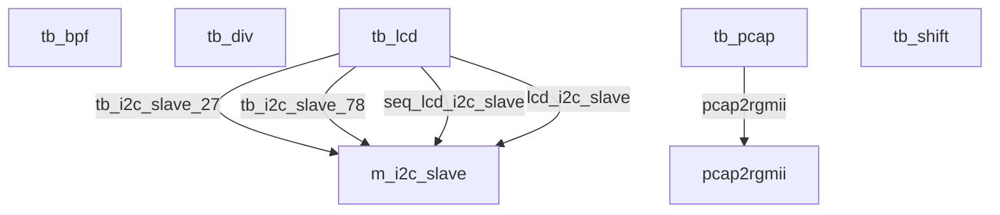

# RTL Module Connection Diagram

**Top module candidates:** `tb_bpf`, `tb_div`, `tb_lcd`, `tb_pcap`, `tb_shift`

## Instance Connection Details

### tb_lcd -> m_i2c_slave (instance `tb_i2c_slave_27`)

| Child Port | Connected Signal |
|---|---|
| `clk` | `eclk` |
| `reset` | `reset` |
| `scl` | `tb_scl` |
| `sda` | `tb_sda` |

### tb_lcd -> m_i2c_slave (instance `tb_i2c_slave_78`)

| Child Port | Connected Signal |
|---|---|
| `clk` | `eclk` |
| `reset` | `reset` |
| `scl` | `tb_scl` |
| `sda` | `tb_sda` |

### tb_lcd -> m_i2c_slave (instance `seq_lcd_i2c_slave`)

| Child Port | Connected Signal |
|---|---|
| `clk` | `eclk` |
| `reset` | `reset` |
| `scl` | `seq_lcd_scl` |
| `sda` | `seq_lcd_sda` |

### tb_lcd -> m_i2c_slave (instance `lcd_i2c_slave`)

| Child Port | Connected Signal |
|---|---|
| `clk` | `eclk` |
| `reset` | `reset` |
| `scl` | `lcd_scl` |
| `sda` | `lcd_sda` |

### tb_pcap -> pcap2rgmii (instance `pcap2rgmii`)

| Child Port | Connected Signal |
|---|---|
| `reset` | `reset` |
| `rx_clk` | `rx_clk` |
| `rxd` | `rxd` |
| `rx_dv` | `rx_dv` |
| `rx_er` | `rx_er` |
| `sop` | `sop` |
| `eop` | `eop` |
| `eth_speed` | `eth_speed` |
| `len` | `len` |
| `ipg_len` | `ipg_len` |
| `gen_err` | `gen_err` |
| `start` | `start` |
| `done` | `done` |
| `fname` | `fname` |
